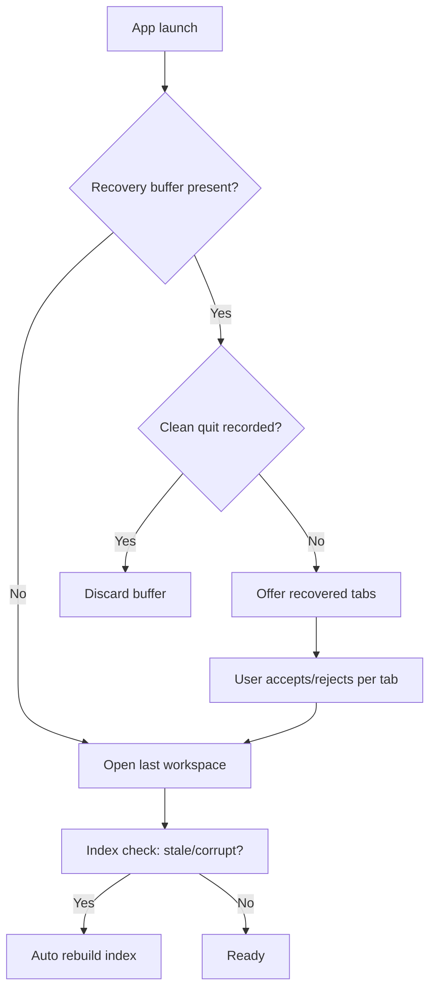
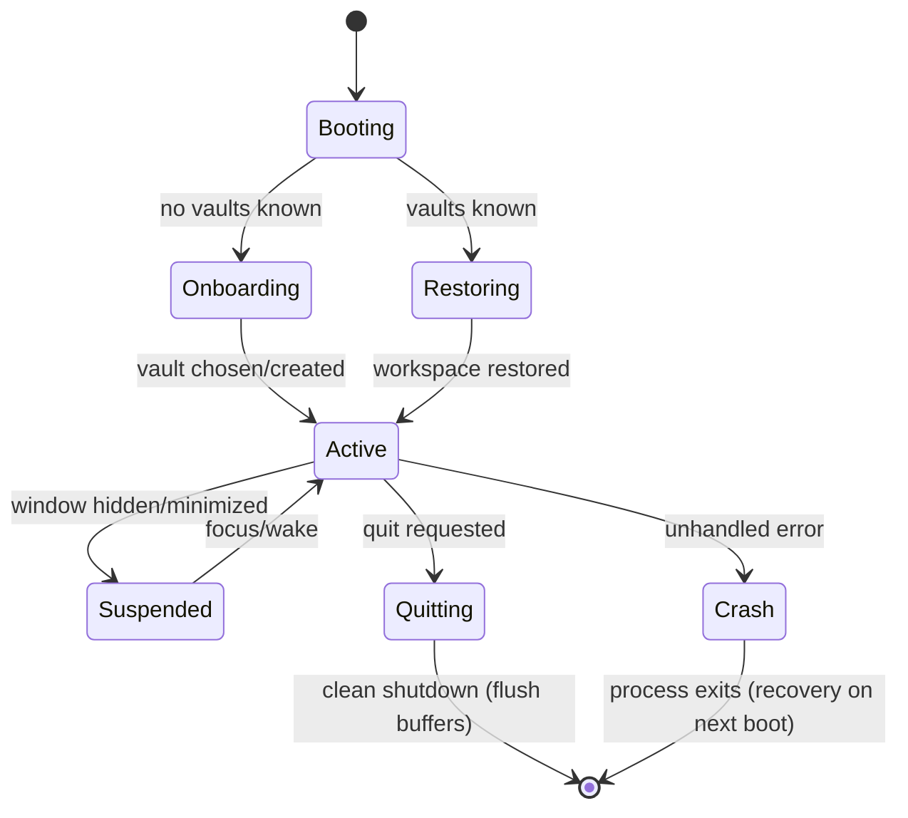
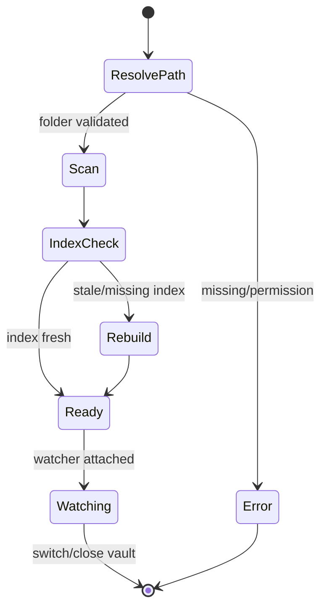
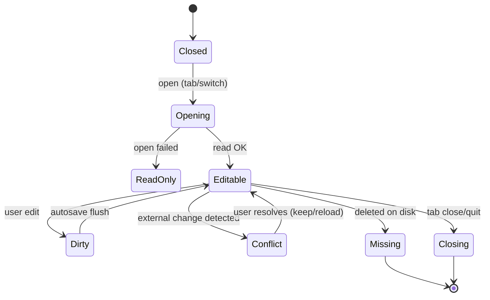
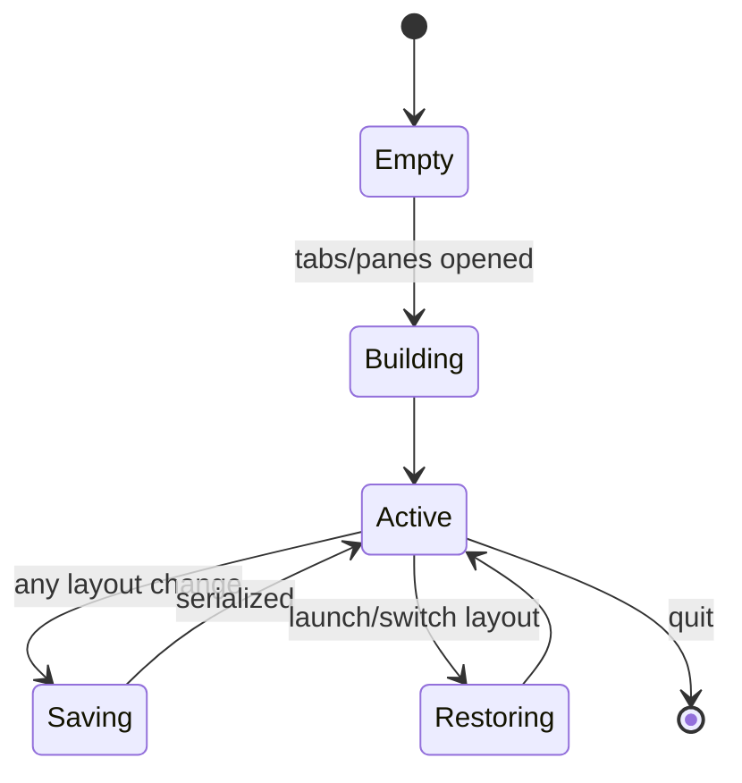
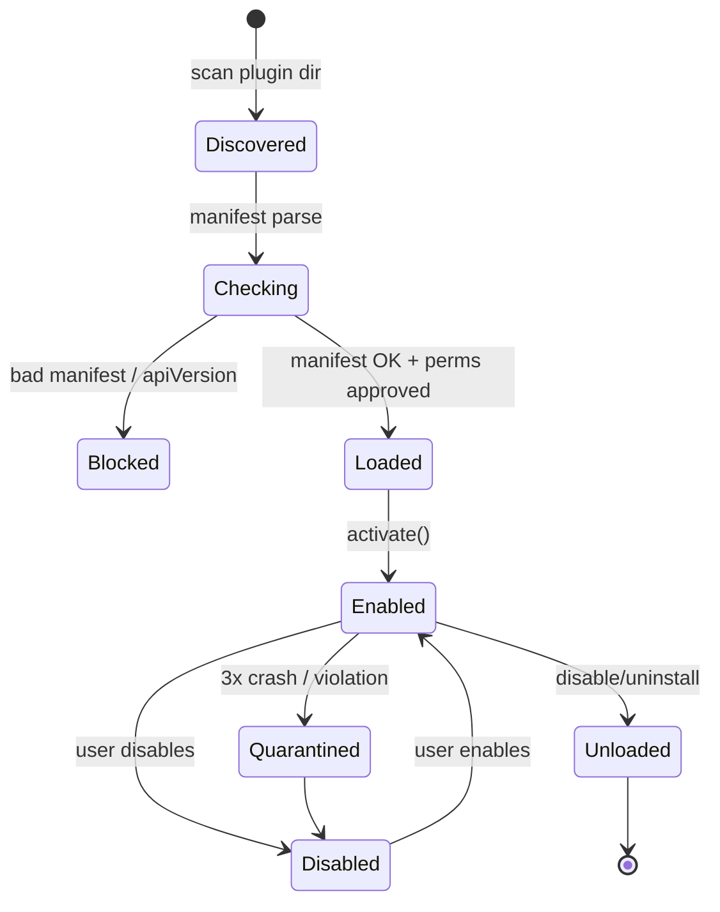
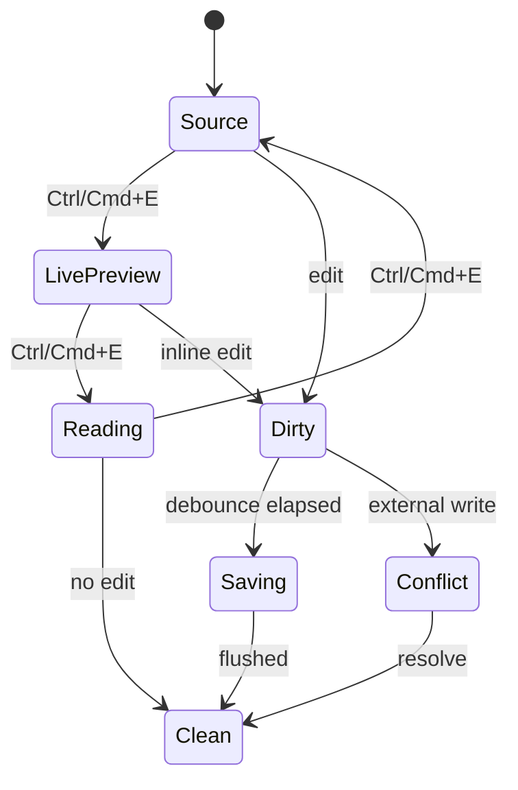
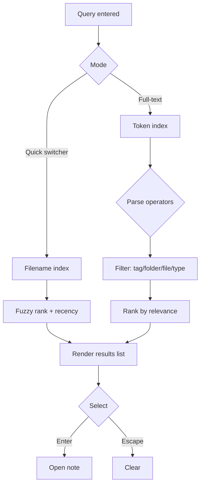
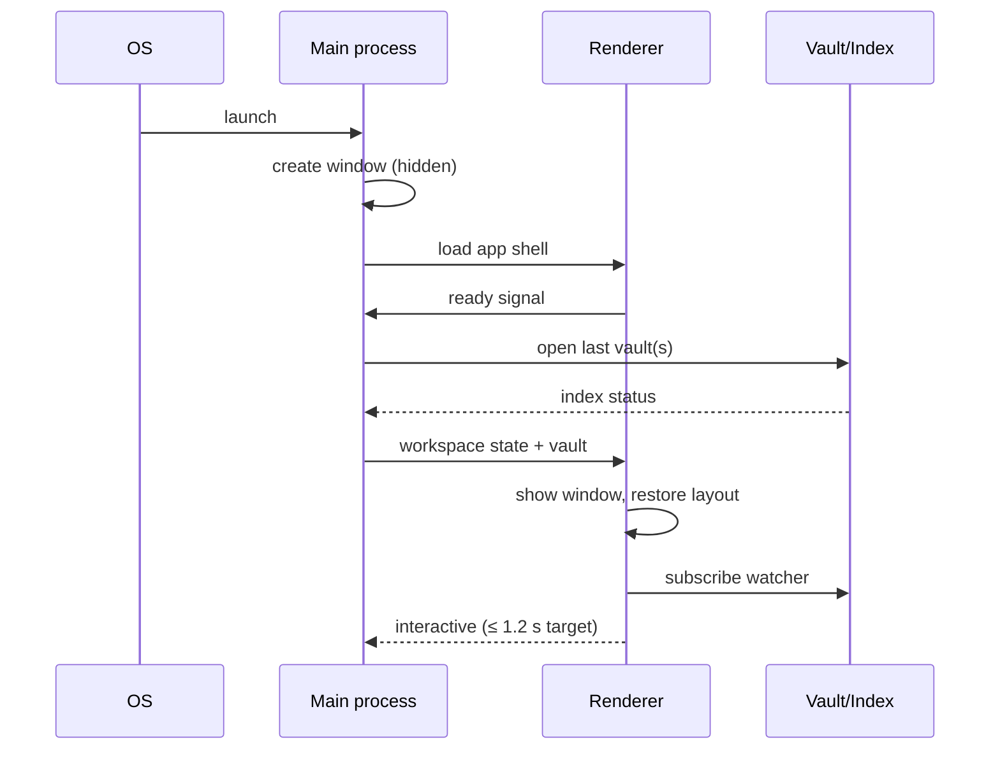
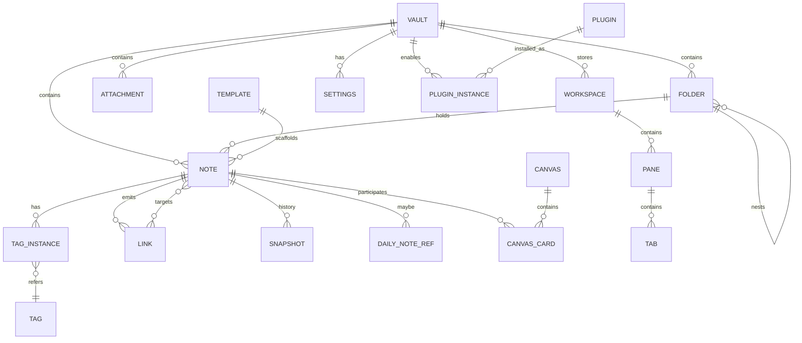

# Locus — Product Requirements Document

**Document version:** 1.0
**Status:** Draft for review
**Date:** 2026-08-03
**Owner:** Product
**Doc classification:** RFC-quality specification — requirements use RFC 2119 keywords (`MUST`, `MUST NOT`, `SHOULD`, `SHOULD NOT`, `MAY`). Every requirement is written to be **testable, measurable, and unambiguous**.

---

## Table of Contents

1. [Executive Summary](#1-executive-summary)
2. [Conventions & Terminology](#2-conventions--terminology)
3. [User Personas](#3-user-personas)
4. [User Stories](#4-user-stories)
5. [Functional Requirements](#5-functional-requirements)
6. [File Compatibility & Markdown Behavior](#6-file-compatibility--markdown-behavior)
7. [Non-Functional Requirements](#7-non-functional-requirements)
8. [Error Handling](#8-error-handling)
9. [UX Design](#9-ux-design)
10. [Design System](#10-design-system)
11. [Keyboard Navigation Specification](#11-keyboard-navigation-specification)
12. [Information Architecture](#12-information-architecture)
13. [State Diagrams](#13-state-diagrams)
14. [Technical Architecture](#14-technical-architecture)
15. [Architecture Decision Records (ADR)](#15-architecture-decision-records-adr)
16. [Security Model](#16-security-model)
17. [Data Model](#17-data-model)
18. [Plugin API Design](#18-plugin-api-design)
19. [Roadmap](#19-roadmap)
20. [Risks](#20-risks)
21. [Competitive Analysis](#21-competitive-analysis)
22. [Success Metrics](#22-success-metrics)
23. [Testing Strategy](#23-testing-strategy)
24. [Engineering Backlog & Build Order](#24-engineering-backlog--build-order)
25. [Locus Manifesto](#25-locus-manifesto)

---

# 1. Executive Summary

## 1.1 Vision

Locus is a fast, local-first Markdown knowledge management application for people who take thinking seriously. The user's knowledge lives in **plain folders and `.md` files on disk** — never in a proprietary database. Locus is the quiet workspace: it gets out of the way, loads instantly, works offline, and obeys the keyboard. It is the tool users trust with a lifetime of notes because the notes are theirs, in an open format, forever.

## 1.2 Mission

Build the best open Markdown knowledge workspace for developers, students, researchers, writers, and engineers — measured by startup speed, durability of the file format, depth of keyboard-driven workflows, and total user control. Locus commits to three absolute rules:

1. **Markdown is the source of truth.** Every note is a plain-text `.md` file.
2. **Local-first, offline by default.** No account required. No cloud required. The app works fully without a network connection.
3. **No vendor lock-in.** Open an existing folder of notes and use it. Leave at any time without data migration. Your files are never rewritten into a closed format.

## 1.3 Target Audience

| Segment | Who they are | Why Locus |
|---|---|---|
| Computer Science students | Course notes, lecture summaries, study graphs | Fast capture, wikilinks for connected ideas, math, code blocks |
| Software engineers | Engineering notes, ADRs, design docs, runbooks | Markdown + git compatibility, keyboard-first, instant search |
| Researchers | Literature notes, Zotero-adjacent workflows, citations | Backlinks, tags, search, portable files, privacy |
| Writers | Long-form drafts, research bibles, plotting | Distraction-free editing, focus mode, export |
| Knowledge workers | Second brain, meetings, projects, journals | Reliability, daily notes, template speed |

## 1.4 Problems Being Solved

| # | Problem | Current experience | How Locus solves it |
|---|---|---|---|
| P1 | Notes trapped in proprietary formats | Users fear abandoning tools that hold years of data | Plain `.md` files; the tool is disposable, the data is not |
| P2 | Knowledge that doesn't connect | Notes accumulate as isolated files | Wiki links, backlinks, graph view |
| P3 | Slow tools for large libraries | Search and startup degrade with 10k–100k notes | Performance budgets (§7) enforced as first-class requirements |
| P4 | Mouse-driven UIs interrupt flow | Users lift hands from the keyboard to do trivial tasks | Every action reachable from the keyboard (§11) |
| P5 | Privacy erosion by defaults | Tools phone home, cloud-sync by default | Offline by default; no telemetry without explicit opt-in |
| P6 | Cloud outages and lock-in | Service downtime blocks access to notes | Local files work regardless of connectivity |
| P7 | Format anxiety | Fear that advanced features corrupt or obscure the Markdown | Strict Markdown conformance (§6); unsupported syntax degrades gracefully |

## 1.5 Product Goals

- **G1:** Cold startup to usable editor in ≤ 1.2 seconds on mid-range hardware.
- **G2:** Full-text search across a 100,000-note vault in ≤ 150 ms.
- **G3:** Every core interaction available without a mouse (100% keyboard parity for core features).
- **G4:** Zero data lock-in — a vault is usable in any text editor or git client at all times.
- **G5:** Offline-first: 100% of v1 features work with no network connection.
- **G6:** Idle memory ≤ 400 MB; steady-state memory ≤ 1 GB on a 100k-note vault.
- **G7:** 99.9% crash-free session rate (measured over 30-day windows).

## 1.6 Non-Goals (v1 explicit exclusions)

| # | Non-goal | Rationale |
|---|---|---|
| N1 | Mobile/tablet app | Desktop-first focus; mobile is a future phase |
| N2 | Proprietary database for notes | Violates the core principle; never planned |
| N3 | Built-in cloud sync | Post-v1; optional, E2E-encrypted, opt-in only |
| N4 | Real-time multi-user collaboration | Post-1.0; high complexity, low priority for target users |
| N5 | WYSIWYG (block-based) editor | Markdown-centric editing; live preview renders *from* Markdown |
| N6 | Native PDF annotation | Roadmap-only (§19, Phase 3) |
| N7 | Publish-to-web | Future roadmap only |
| N8 | iOS/Android keyboard ecosystems | Not applicable at v1 |
| N9 | Email client / calendar app | Out of scope entirely |

---

# 2. Conventions & Terminology

## 2.1 RFC 2119 Keyword Definitions

- **MUST** — the requirement is an absolute, testable obligation. Failure to comply is a release-blocking defect.
- **MUST NOT** — the requirement is an absolute prohibition. Violation is a release-blocking defect.
- **SHOULD** — a recommended obligation; deviations require documented, approved justification.
- **SHOULD NOT** — a recommendation against a behavior; deviations require documented, approved justification.
- **MAY** — optional; behavior is at the implementer's discretion but MUST NOT conflict with any MUST/SHOULD.

## 2.2 Testability Mandate

Every MUST/SHOULD requirement in this document MUST be verifiable by at least one of the following, and MUST be associated with one or more acceptance criteria in §5 or §7:

- An automated unit or integration test.
- An end-to-end test.
- A measurable performance benchmark with a numeric threshold.
- A manual QA checklist step (identified as such).

Requirements without a verification method MUST NOT be accepted into the build backlog.

## 2.3 Terminology / Glossary

| Term | Definition |
|---|---|
| **Vault** | A top-level folder on disk containing the user's notes, configured as a Locus vault. The vault root is the boundary for indexing, search, and links. |
| **Note** | A `.md` file inside a vault. The single unit of content in Locus. |
| **Attachment** | A non-Markdown file referenced by notes (images, PDFs, binaries). |
| **Wiki link** | The `[[Target]]` link syntax. May include an alias (`[[Target|Alias]]`) and a heading or block anchor (`[[Page#heading]]`, `[[Page^block]]`). |
| **Backlink** | A reference to a note, surfaced in the target note. |
| **Linked mention** | An explicit wiki link to a note. |
| **Unlinked mention** | A plain-text occurrence of a note's title (or an alias) that is not a wiki link. |
| **Live preview** | A rendering mode in which rich content renders inline in the editor while the underlying Markdown source remains editable. |
| **Source mode** | A rendering mode showing only raw Markdown text. |
| **Reading mode** | A rendering mode showing only the rendered document. |
| **Workspace** | The persisted arrangement of panes, tabs, split ratios, and window geometry. |
| **Canvas** | An infinite, node-based spatial workspace (post-MVP). |
| **Whiteboard** | A freeform drawing / mind-mapping surface (roadmap). |
| **Frontmatter** | YAML block delimited by `---` at the top of a note, used for metadata. |
| **Callout** | An admonition block: `> [!info]`, `> [!warning]`, `> [!danger]`, or custom. |
| **Plugin** | A third-party extension distributed as a signed package, executed in a sandbox. |
| **Command** | A named, keyboard-invokable action registered globally (e.g., "Create daily note"). |
| **Index** | The internal, derived search index. Always rebuildable from source files; never authoritative. |

## 2.4 Document Scope & Audience

This PRD is the authoritative specification for building Locus v1 (Phase 1 MVP and Phase 2). It is written for:

- **Engineering** — to implement without ambiguity (§5, §6, §7, §8, §14–§18, §24).
- **Product & Design** — to validate behavior and experience (§3, §4, §9, §10, §11, §12).
- **QA** — to derive test plans (§23).
- **Future AI build agents** — the engineering backlog (§24) is dependency-ordered so an agent can execute sections in sequence.

## 2.5 Assumptions & Open Questions (tracked)

| ID | Assumption / Question | Owner | Status |
|---|---|---|---|
| AQ-01 | App name "Locus" is cleared for trademark use in target markets. | Legal | OPEN |
| AQ-02 | Windows, macOS, and Linux are v1 platforms; installers via MSI, DMG, and AppImage/snap/deb. | Product | Assumed |
| AQ-03 | Post-v1 sync, if built, is E2E-encrypted and fully optional; this document does not specify it. | Product | Assumed |
| AQ-04 | Telemetry is opt-in, anonymized, and shipped disabled by default. | Product | Assumed |
| AQ-05 | Plugin marketplace moderation model (store review vs. signed-publisher trust) is undecided; sandboxing is mandatory either way. | Security | OPEN |
| AQ-06 | DOCX/PDF export fidelity targets: PDF MUST match rendered HTML closely; DOCX is lossy for Mermaid/Callouts (see §5 FR-28). | Product | Assumed |
| AQ-07 | Minimum supported OS versions: Windows 10 (1909+), macOS 12+, Ubuntu 20.04+ / Fedora 36+. | Engineering | OPEN |

# 3. User Personas

## 3.0 Persona Format

Each persona describes goals, frustrations, workflows, and daily usage. Personas are primary inputs to §4 (User Stories) and §9 (UX). Personas are design tools, not legal persons; they MUST NOT be treated as requirements.

---

## 3.1 Persona A — "Maya," Computer Science Student (21)

**Context:** Third-year BSc Computer Science student. Runs Arch Linux on a ThinkPad with 16 GB RAM. Takes notes on a stylus-free laptop; types fast (~90 WPM). Studies algorithms, OS, and machine-learning courses concurrently.

### Goals
- Keep lecture notes organized per course and topic.
- Connect concepts across courses (e.g., graph theory ↔ distributed systems).
- Review for exams quickly using tags and backlinks.
- Embed code snippets and LaTeX math that render reliably.

### Frustrations
- Previous notes app (Notion) became slow after ~2,000 blocks and broke offline on campus.
- Importing Anki flashcards by hand is tedious; wants a link-friendly note graph.
- Hates that lecture PDFs and images clutter his course folders.

### Workflows
- Opens laptop, runs `locus`, types a hotkey → creates "Daily Note," pastes lecture snippets.
- Tags each note `#cs/os`, `#cs/algos`. Links related lectures via `[[lecture-9]]`.
- End of week: opens graph view, reviews which lectures have no connections, fills gaps.
- Exam season: uses backlinks from "cheat-sheet" note to aggregate all related material.

### Daily Usage
- ~3 hours/day during term. Peak capture during lectures (live typing). Offline on campus Wi-Fi outages. Uses `ctrl+P` command palette heavily; barely touches the mouse.

---

## 3.2 Persona B — "Dev," Software Engineer (34)

**Context:** Staff backend engineer at a mid-size SaaS company. Works in VS Code 8+ hours/day, uses Linux at work and macOS at home. Maintains a personal "digital garden" of ~4,000 notes spanning 6 years.

### Goals
- Store engineering ADRs, runbooks, design notes, and interview prep as plain Markdown so everything is grep-able and git-versioned.
- Keep personal notes and work notes in separate vaults.
- Automate note creation with templates and shell scripts.
- Move fast: prefers everything via keyboard, minimal chrome.

### Frustrations
- Obsidian's vault works well but feels heavy; memory footprint conflicts with IDE + browsers + Docker.
- Proprietary plugin ecosystem makes him wary of lock-in and of upgrade breakage.
- Wants a plugin system he can write in TypeScript and trust.

### Workflows
- Creates a daily note with a template containing standup bullet points.
- Uses `git init` on the vault root; commits nightly. Relies on Locus not mangling the files.
- Uses regex search to find stale TODOs across the vault.
- Writes an ADR in Locus, exports to PDF for a review doc, then commits both.

### Daily Usage
- 30–60 minutes/day of dedicated note time; quick captures throughout the day. Runs 2 vaults. Values a 200 ms search over a 2 s search. Uses source mode for most editing.

---

## 3.3 Persona C — "Priya," Postdoctoral Researcher (38)

**Context:** Neuroscientist. Maintains a literature-notes system with Zotero for citations and a notes vault of ~8,000 files (paper summaries, methods, lab meeting notes). Works primarily on Windows, occasional Linux compute cluster.

### Goals
- Build a paper graph: which papers cite/relate to which, via backlinks.
- Tag notes by method, brain region, and status (`#status/read`, `#status/analyzed`).
- Keep notes interoperable with LaTeX papers (she pastes into Overleaf).
- Preserve decades of research notes in a durable format.

### Frustrations
- Scared of vendor lock-in after a previous tool (Evernote) made export painful.
- Wants privacy: her lab notes are confidential; no cloud sync, no telemetry.
- Mermaid for experimental workflow diagrams, KaTeX for statistical formulas.
- Excel-like tables in notes must survive round-trips.

### Workflows
- Reads a paper, creates a note from a "Paper Summary" template with frontmatter fields (`title`, `doi`, `authors`).
- Links related papers via `[[2024-smith-et-al]]`.
- Monthly: reviews the graph, prunes unlinked orphan notes.
- Exports selected notes to Markdown+PDF for lab review.

### Daily Usage
- ~1.5 hours/day. Batch-processing papers in the evening. Offline by default in the lab; sensitive data never touches a network. Uses tag explorer and saved searches.

---

## 3.4 Persona D — "Ari," Novelist & Essayist (45)

**Context:** Working fiction writer with a completed novel and an active essay column. Prefers macOS. Writes long-form (~80k-word manuscripts) plus a "bible" of world-building notes (~2,000 files).

### Goals
- Distraction-free long-form writing with minimal chrome (focus mode).
- Organize a research/plotting bible with characters, locations, timeline.
- Quick, reliable export to DOCX for editors (who use Word).
- Never lose a draft; wants local snapshots and easy recovery.

### Frustrations
- Word processors are sluggish and ugly; Scrivener feels clunky.
- Markdown export to DOCX from other tools mangled footnotes and italics.
- Anxiety about losing manuscripts: wants automatic backups and version history without any cloud requirement.

### Workflows
- Writes first drafts in focus mode with typewriter scrolling and a word-count target in the status bar.
- Keeps character sheets as notes linked to scene notes via wikilinks.
- Uses `#draft`, `#revision` tags to track progress.
- Exports chapters to DOCX at the end of the day; nightly snapshot keeps her calm.

### Daily Usage
- 2–4 hours/day. Mornings: new pages. Afternoons: revision. Uses daily notes for writer's journal. Prefers reading mode for proofing; never touches settings.

---

## 3.5 Persona E — "Sam," Knowledge Worker / PM (29)

**Context:** Product manager at a design agency. Manages 12 projects, takes meeting notes, keeps a "second brain." Works on Windows laptop. Non-technical but comfortable with Markdown basics.

### Goals
- Capture meeting notes, decisions, and action items fast.
- Link project notes so decisions trace back to meetings and docs.
- Reuse templates for one-pagers and kickoff docs.
- Trust the tool with work data; values privacy and reliability.

### Frustrations
- Corporate tools (Confluence, Notion) impose structure; she wants lightweight, folder-based organization.
- Fear that notes vanish when a SaaS shuts down (previous tool did exactly that).
- Wants spell-friendly tables, callouts for decisions/risks, and daily notes that log each day's actions.

### Workflows
- In meetings: types bullets under `> [!action]` callouts. Links `[[project-x]]` in each meeting note.
- After meetings: command palette → "Add to Project Summary," pulling backlinks.
- Weekly: reviews backlinks on each project home note to compose status reports.
- Uses saved search "unresolved actions" across the vault.

### Daily Usage
- ~1 hour/day plus live note-taking in 3–4 meetings/week. Uses mostly default theme, light mode. Values simplicity over power-user features.

---

## 3.6 Cross-Persona Synthesis

| Dimension | Common thread |
|---|---|
| **Speed** | All personas punish latency at startup and search; fast typing response is non-negotiable. |
| **Format trust** | All value plain `.md` on disk; the file is the contract. |
| **Keyboard** | A, B, C, D all describe mouse-free workflows; E is keyboard-adjacent. |
| **Privacy** | B, C, D, E either require or strongly prefer no cloud and no telemetry. |
| **Longevity** | C and E have been burned by vendor lock-in; durability is a buying criterion. |
| **Depth** | C, D need advanced rendering (Mermaid, KaTeX, footnotes); E needs callouts and templates. |

# 4. User Stories

## 4.1 Story Format & Prioritization

Stories are written in the standard form: **"As a `<persona>`, I want `<capability>` so that `<benefit>`."** Each story is tagged with a priority and an MVP flag, and mapped to its functional requirement ID (§5).

| Priority | Meaning | Backlog gate |
|---|---|---|
| **MUST** | v1 release-blocking; defines the MVP | Must ship Phase 1 |
| **SHOULD** | Strongly desired for v1 or Phase 2; high value | Phase 1/2 |
| **NICE** | Valuable but not load-bearing | Phase 2/3 |
| **FUTURE** | Explicitly deferred beyond v1.0 | Post-1.0 |

Stories in this section are design intent. Precise, testable behavior for each mapped feature is specified in §5. Where a story conflicts with a §5 requirement, §5 wins.

## 4.2 Vaults & File Management

| ID | Priority | MVP | Story | FR |
|---|---|---|---|---|
| US-001 | MUST | Yes | As a student, I want to open any existing folder as a vault so that I never have to migrate my existing notes. | FR-01 |
| US-002 | MUST | Yes | As an engineer, I want to create a new empty vault so that I can start a clean workspace. | FR-01 |
| US-003 | MUST | Yes | As a knowledge worker, I want to switch between multiple vaults so that my work and personal notes stay separate. | FR-01 |
| US-004 | MUST | Yes | As a writer, I want my recent vaults listed at startup so that I can reopen my novel's vault in one click. | FR-01 |
| US-005 | SHOULD | Yes | As a researcher, I want Locus to never modify my files without permission so that my data stays pristine. | FR-01 |
| US-006 | SHOULD | No | As an engineer, I want to remove a vault from the recent list without deleting the folder so that my disk is untouched. | FR-01 |
| US-007 | NICE | No | As a researcher, I want vault-level settings (folders to exclude) so that huge generated directories are ignored. | FR-01 |
| US-008 | FUTURE | No | As an engineer, I want to clone a git-hosted vault from within Locus so that I can bootstrap from a repo. | FR-01 |

## 4.3 File Explorer & Navigation

| ID | Priority | MVP | Story | FR |
|---|---|---|---|---|
| US-009 | MUST | Yes | As a student, I want a tree of my folders and files so that I can navigate my vault quickly. | FR-02 |
| US-010 | MUST | Yes | As a writer, I want to create new notes and folders from the explorer so that my manuscript structure grows organically. | FR-02 |
| US-011 | MUST | Yes | As a knowledge worker, I want to rename a note and have all links to it updated so that my graph stays intact. | FR-02 |
| US-012 | MUST | Yes | As an engineer, I want to delete and move files with confirmation so that I can tidy without losing work. | FR-02 |
| US-013 | MUST | Yes | As a student, I want to drag and drop notes between folders so that reorganizing is tactile and fast. | FR-02 |
| US-014 | SHOULD | Yes | As a writer, I want to favorite a small set of notes so that my most-used files are always one click away. | FR-02 |
| US-015 | SHOULD | Yes | As an engineer, I want the explorer to sort by name or modification date so that recent work floats to the top. | FR-02 |
| US-016 | SHOULD | Yes | As a knowledge worker, I want to search and filter the explorer by filename so that I can find files without leaving the pane. | FR-02 |
| US-017 | SHOULD | No | As a researcher, I want to duplicate a note so that I can branch a summary from a paper. | FR-02 |
| US-018 | NICE | No | As a student, I want collapse/expand all folders so that large vaults stay scannable. | FR-02 |
| US-019 | FUTURE | No | As a writer, I want to drag external files from the OS into the explorer so that images and PDFs import automatically. | FR-02 |

## 4.4 Markdown Editor

| ID | Priority | MVP | Story | FR |
|---|---|---|---|---|
| US-020 | MUST | Yes | As a writer, I want a distraction-free source view so that I can type long-form text without chrome. | FR-03 |
| US-021 | MUST | Yes | As a student, I want live preview so that headings, math, and code render as I type. | FR-03 |
| US-022 | MUST | Yes | As a writer, I want reading mode so that I can proof my document fully rendered. | FR-03 |
| US-023 | MUST | Yes | As an engineer, I want to open multiple notes in tabs so that I can jump between code and docs. | FR-03 |
| US-024 | MUST | Yes | As a researcher, I want to split the editor vertically and horizontally so that I can compare two papers. | FR-03 |
| US-025 | MUST | Yes | As a student, I want LaTeX math (inline and block) to render correctly so that my formulas look right. | FR-03 |
| US-026 | MUST | Yes | As an engineer, I want fenced code blocks with syntax highlighting so that snippets are readable. | FR-03 |
| US-027 | MUST | Yes | As a writer, I want auto-save so that a crash never costs me more than a few seconds. | FR-03 |
| US-028 | MUST | Yes | As a knowledge worker, I want tables with rich editing so that I don't hand-align pipes. | FR-03 |
| US-029 | SHOULD | Yes | As a writer, I want footnotes to render as superscripts with a popover so that I can check sources without scrolling. | FR-03 |
| US-030 | SHOULD | Yes | As a student, I want task lists with clickable checkboxes that update the source so that I can track to-dos. | FR-03 |
| US-031 | SHOULD | Yes | As a writer, I want headings to get a navigation outline so that I can jump around a long manuscript. | FR-03 |
| US-032 | SHOULD | Yes | As a knowledge worker, I want blockquotes, horizontal rules, and HTML blocks to render faithfully. | FR-03 |
| US-033 | SHOULD | Yes | As a researcher, I want embedded images to render inline so that figures sit in context. | FR-03 |
| US-034 | SHOULD | No | As a writer, I want a typewriter scrolling mode so that my cursor stays centered on long pages. | FR-03 |
| US-035 | SHOULD | No | As a writer, I want word-wrap toggles and a focus mode that dims everything but the current paragraph. | FR-03 |
| US-036 | NICE | No | As an engineer, I want Vim keybindings so that I never leave my editing flow. | FR-03 |

## 4.5 Wiki Links

| ID | Priority | MVP | Story | FR |
|---|---|---|---|---|
| US-037 | MUST | Yes | As a student, I want to write `[[Page]]` and have it auto-complete so that I can link ideas as I type. | FR-04 |
| US-038 | MUST | Yes | As a knowledge worker, I want alias syntax `[[Page|Alias]]` so that links read naturally in prose. | FR-04 |
| US-039 | MUST | Yes | As a researcher, I want `[[Folder/Page]]` links so that I can reference files in subfolders. | FR-04 |
| US-040 | MUST | Yes | As a writer, I want `[[Page#heading]]` and `[[Page^block]]` anchors so that I can link to specific sections. | FR-04 |
| US-041 | SHOULD | Yes | As a student, I want a quick action to "create the missing page" when a link has no target. | FR-04 |

## 4.6 Backlinks

| ID | Priority | MVP | Story | FR |
|---|---|---|---|---|
| US-042 | MUST | Yes | As a student, I want backlinks so that I can discover connected ideas I forgot about. | FR-05 |
| US-043 | MUST | Yes | As a researcher, I want linked mentions separated from unlinked mentions so that I can decide which to formalize. | FR-05 |
| US-044 | MUST | Yes | As a knowledge worker, I want a backlinks panel showing every note that references the current note. | FR-05 |
| US-045 | SHOULD | Yes | As an engineer, I want one-click promotion of an unlinked mention into a real link. | FR-05 |
| US-046 | NICE | No | As a writer, I want backlink counts shown in search results so that I can gauge a note's importance. | FR-05 |

## 4.7 Graph View

| ID | Priority | MVP | Story | FR |
|---|---|---|---|---|
| US-047 | MUST | Yes | As a student, I want an interactive graph of notes and links so that I can see my knowledge's shape. | FR-06 |
| US-048 | MUST | Yes | As a researcher, I want zoom and pan so that even a huge paper graph is navigable. | FR-06 |
| US-049 | MUST | Yes | As a knowledge worker, I want to click a node to open its note so that the graph is a navigation surface. | FR-06 |
| US-050 | SHOULD | Yes | As a researcher, I want filter controls (tag, folder, link-depth) so that I can isolate subgraphs. | FR-06 |
| US-051 | SHOULD | Yes | As a student, I want color groups by folder or tag so that clusters are visually distinct. | FR-06 |
| US-052 | NICE | No | As an engineer, I want community detection so that tightly-linked clusters surface automatically. | FR-06 |
| US-053 | FUTURE | No | As a writer, I want local graphs (neighborhood of one note) so that I can zoom into a topic. | FR-06 |

## 4.8 Tags

| ID | Priority | MVP | Story | FR |
|---|---|---|---|---|
| US-054 | MUST | Yes | As a researcher, I want nested tags like `#status/read` so that my taxonomy is hierarchical. | FR-07 |
| US-055 | MUST | Yes | As a student, I want a tag explorer listing every tag with counts so that I can browse by topic. | FR-07 |
| US-056 | MUST | Yes | As a knowledge worker, I want to filter notes by tag so that I can assemble a topical view. | FR-07 |
| US-057 | MUST | Yes | As a writer, I want tag auto-complete so that I don't invent misspelled tags. | FR-07 |
| US-058 | SHOULD | Yes | As an engineer, I want tags from YAML frontmatter merged with inline tags so that metadata and inline tagging agree. | FR-07 |
| US-059 | NICE | No | As a researcher, I want tag renames applied vault-wide so that my taxonomy stays consistent. | FR-07 |

## 4.9 Search

| ID | Priority | MVP | Story | FR |
|---|---|---|---|---|
| US-060 | MUST | Yes | As an engineer, I want full-text search across the vault so that I can find anything instantly. | FR-08 |
| US-061 | MUST | Yes | As a student, I want filename-first search so that opening a known file is near-instant. | FR-08 |
| US-062 | MUST | Yes | As a researcher, I want boolean operators (AND/OR/NOT) so that I can express precise queries. | FR-08 |
| US-063 | MUST | Yes | As a writer, I want results with highlighted snippets so that I can judge relevance before opening. | FR-08 |
| US-064 | SHOULD | Yes | As an engineer, I want case-sensitive and regex toggles so that I can find exact identifiers. | FR-08 |
| US-065 | SHOULD | Yes | As a knowledge worker, I want folder and file-type filters so that I can scope searches. | FR-08 |
| US-066 | SHOULD | Yes | As a researcher, I want to save frequent searches so that recurring queries are one click. | FR-08 |
| US-067 | SHOULD | Yes | As an engineer, I want search-in-note (Ctrl+F) with highlights so that I can skim a long file. | FR-08 |
| US-068 | NICE | No | As a student, I want fuzzy filename matching so that slight typos still resolve. | FR-08 |
| US-069 | NICE | No | As a researcher, I want search operators for `tag:`, `file:`, `path:` so that advanced queries compose. | FR-08 |

## 4.10 Daily Notes & Calendar

| ID | Priority | MVP | Story | FR |
|---|---|---|---|---|
| US-070 | MUST | Yes | As a knowledge worker, I want a daily note created for today so that I can log the day without setup. | FR-09 |
| US-071 | MUST | Yes | As a student, I want the daily note auto-named by date so that journal entries sort naturally. | FR-09 |
| US-072 | MUST | Yes | As a writer, I want to jump to yesterday's or tomorrow's daily note so that I can time-travel my journal. | FR-09 |
| US-073 | MUST | Yes | As an engineer, I want daily notes to use my chosen template so that each day starts consistently. | FR-09 |
| US-074 | SHOULD | Yes | As a knowledge worker, I want a calendar picker to open any past daily note so that I can revisit history. | FR-09 |
| US-075 | NICE | No | As a writer, I want a weekly review note auto-generated from the week's dailies. | FR-09 |

## 4.11 Templates

| ID | Priority | MVP | Story | FR |
|---|---|---|---|---|
| US-076 | MUST | Yes | As a knowledge worker, I want to insert a template's contents into a note so that I never start from a blank page. | FR-10 |
| US-077 | MUST | Yes | As a researcher, I want templates with variables (title, date, folder) so that each use is personalized. | FR-10 |
| US-078 | MUST | Yes | As a writer, I want templates to support relative dates (yesterday, +3d) so that planning docs self-update. | FR-10 |
| US-079 | MUST | Yes | As an engineer, I want custom commands in templates so that notes can trigger actions on creation. | FR-10 |
| US-080 | MUST | Yes | As a student, I want a default template folder and a picker so that templates are easy to manage. | FR-10 |
| US-081 | NICE | No | As a knowledge worker, I want template hotkeys so that recurring note types are two keystrokes away. | FR-10 |

## 4.12 Command Palette

| ID | Priority | MVP | Story | FR |
|---|---|---|---|---|
| US-082 | MUST | Yes | As an engineer, I want a command palette that runs every app command so that I never need a mouse. | FR-11 |
| US-083 | MUST | Yes | As a student, I want fuzzy matching in the palette so that abbreviations still resolve. | FR-11 |
| US-084 | MUST | Yes | As a knowledge worker, I want to see each command's keyboard shortcut so that I can learn them by doing. | FR-11 |
| US-085 | MUST | Yes | As a writer, I want file navigation from the palette so that opening any note is keyboard-only. | FR-11 |
| US-086 | SHOULD | Yes | As an engineer, I want recently-used commands ranked first so that my flow accelerates. | FR-11 |

## 4.13 Keyboard Shortcuts

| ID | Priority | MVP | Story | FR |
|---|---|---|---|---|
| US-087 | MUST | Yes | As an engineer, I want all core commands bound by default so that the app is usable mouse-free on day one. | FR-12 |
| US-088 | MUST | Yes | As a researcher, I want to customize every shortcut so that my muscle memory rules. | FR-12 |
| US-089 | MUST | Yes | As a student, I want shortcut conflicts resolved deterministically (latest binding wins, warn on clash) so that nothing silently breaks. | FR-12 |
| US-090 | SHOULD | Yes | As a knowledge worker, I want preset keymap profiles (e.g., VS Code-like, Notion-like) so that I can transfer my habits. | FR-12 |

## 4.14 Themes & Appearance

| ID | Priority | MVP | Story | FR |
|---|---|---|---|---|
| US-091 | MUST | Yes | As a writer, I want a light and a dark theme so that I can write comfortably in any light. | FR-13 |
| US-092 | MUST | Yes | As an engineer, I want a single semantic token set so that themes are consistent and not patched ad hoc. | FR-13 |
| US-093 | SHOULD | Yes | As a researcher, I want custom CSS overrides so that I can fine-tune the look without waiting for releases. | FR-13 |
| US-094 | SHOULD | Yes | As a student, I want theme switching to respect the OS setting by default so that it "just works." | FR-13 |
| US-095 | NICE | No | As a writer, I want community themes so that I can pick from a library of looks. | FR-13 |

## 4.15 Plugin System

| ID | Priority | MVP | Story | FR |
|---|---|---|---|---|
| US-096 | MUST | No | As an engineer, I want a plugin API with a clear manifest so that I can extend Locus safely. | FR-14 |
| US-097 | MUST | No | As a researcher, I want plugins to run sandboxed with declared permissions so that I can trust community code. | FR-14 |
| US-098 | MUST | No | As an engineer, I want plugins to register commands so that extensions join the palette. | FR-14 |
| US-099 | MUST | No | As a knowledge worker, I want a plugin marketplace with version compatibility checks so that installs don't break. | FR-14 |
| US-100 | SHOULD | No | As an engineer, I want plugins to expose settings surfaces so that I can configure them in-app. | FR-14 |
| US-101 | SHOULD | No | As a student, I want one-click enable/disable so that I can quarantine a misbehaving plugin. | FR-14 |
| US-102 | NICE | No | As a researcher, I want a way to write plugins without restarting so that my iteration loop is fast. | FR-14 |

## 4.16 Workspace & Tabs

| ID | Priority | MVP | Story | FR |
|---|---|---|---|---|
| US-103 | MUST | Yes | As an engineer, I want tabs with drag reordering so that I can arrange my open notes. | FR-15 |
| US-104 | MUST | Yes | As a writer, I want split panes that persist so that my side-by-side reading survives restarts. | FR-15 |
| US-105 | MUST | Yes | As a researcher, I want the workspace layout saved automatically so that I resume where I left off. | FR-15 |
| US-106 | MUST | Yes | As a student, I want pinned tabs so that core notes never close accidentally. | FR-15 |
| US-107 | SHOULD | Yes | As an engineer, I want to detach a pane into a floating window so that I can use a second monitor. | FR-15 |
| US-108 | SHOULD | Yes | As a knowledge worker, I want named workspace layouts that I can switch between so that "research" and "writing" modes differ. | FR-15 |
| US-109 | NICE | No | As a writer, I want a restore-session dialog after an abnormal exit so that I can choose what comes back. | FR-15 |

## 4.17 Canvas

| ID | Priority | MVP | Story | FR |
|---|---|---|---|---|
| US-110 | MUST | No | As a researcher, I want an infinite canvas to lay out paper summaries spatially so that I can think visually. | FR-16 |
| US-111 | MUST | No | As a student, I want Markdown cards and images on the canvas so that material types mix freely. | FR-16 |
| US-112 | SHOULD | No | As an engineer, I want cards connected with arrows so that dependencies are explicit. | FR-16 |
| US-113 | SHOULD | No | As a knowledge worker, I want canvas group frames so that clusters of cards stay organized. | FR-16 |

## 4.18 PDF, Images, Attachments

| ID | Priority | MVP | Story | FR |
|---|---|---|---|---|
| US-114 | MUST | Yes | As a researcher, I want PDFs to open in a built-in viewer so that I can read papers without another app. | FR-18 |
| US-115 | MUST | Yes | As a student, I want to paste a screenshot and have it saved into the vault so that capture is instant. | FR-19 |
| US-116 | MUST | Yes | As a writer, I want drag-and-drop images into a note so that figures embed with a relative path. | FR-19 |
| US-117 | MUST | Yes | As a knowledge worker, I want attachments stored in a configurable asset folder so that my vault stays tidy. | FR-20 |
| US-118 | MUST | Yes | As an engineer, I want image links to resolve via relative paths so that the vault stays portable across machines. | FR-20 |
| US-119 | SHOULD | No | As a writer, I want image resizing and captions so that figures are presentation-ready. | FR-19 |

## 4.19 Advanced Markdown: Tables, Mermaid, Callouts

| ID | Priority | MVP | Story | FR |
|---|---|---|---|---|
| US-120 | SHOULD | Yes | As a researcher, I want live Mermaid diagram rendering so that my flowcharts render instantly. | FR-22 |
| US-121 | SHOULD | Yes | As a knowledge worker, I want callouts (info/warning/danger/custom) so that decisions and risks stand out. | FR-23 |
| US-122 | NICE | No | As an engineer, I want a visual table editor so that editing complex tables isn't pipe surgery. | FR-21 |
| US-123 | NICE | No | As a writer, I want definition lists and GFM admonitions to render so that prose keeps its structure. | FR-03 |
| US-124 | NICE | No | As a student, I want Mermaid edits to update live with a parsed-error indicator when the diagram breaks. | FR-22 |

## 4.20 Outline & Word Statistics

| ID | Priority | MVP | Story | FR |
|---|---|---|---|---|
| US-125 | MUST | Yes | As a writer, I want an outline of the current note's headings so that I can jump to any section. | FR-24 |
| US-126 | MUST | Yes | As a writer, I want a live word count with a target so that I can pace my drafting. | FR-25 |
| US-127 | SHOULD | Yes | As a researcher, I want reading time, characters, and paragraph counts so that I can gauge effort. | FR-25 |
| US-128 | SHOULD | Yes | As a student, I want outline items to scroll the editor into view when clicked so that navigation is direct. | FR-24 |

## 4.21 Version History & Recovery

| ID | Priority | MVP | Story | FR |
|---|---|---|---|---|
| US-129 | MUST | No | As a writer, I want automatic local snapshots so that I can roll back a bad edit. | FR-26 |
| US-130 | MUST | No | As an engineer, I want a diff view between snapshot and current so that I can see exactly what changed. | FR-26 |
| US-131 | MUST | Yes | As a knowledge worker, I want deleted notes to go to a vault-local trash so that accidental deletes are reversible. | FR-27 |
| US-132 | MUST | Yes | As a writer, I want crash recovery that restores unsaved edits so that a crash is an inconvenience, not a tragedy. | FR-27 |
| US-133 | SHOULD | No | As a researcher, I want snapshots to be file-based (git-friendly) so that they don't create a proprietary store. | FR-26 |

## 4.22 Export & Import

| ID | Priority | MVP | Story | FR |
|---|---|---|---|---|
| US-134 | MUST | Yes | As a writer, I want to export a note to PDF so that editors can read my drafts. | FR-28 |
| US-135 | MUST | Yes | As a writer, I want export to DOCX so that Word-using editors can accept my manuscript. | FR-28 |
| US-136 | MUST | Yes | As an engineer, I want export to Markdown and HTML so that distribution is universal. | FR-28 |
| US-137 | MUST | Yes | As a student, I want to import an existing Markdown folder so that my current notes come in as-is. | FR-29 |
| US-138 | SHOULD | No | As a researcher, I want to import an Obsidian vault so that switching costs stay low. | FR-29 |
| US-139 | SHOULD | No | As a knowledge worker, I want to import Notion and Evernote exports so that migration paths exist. | FR-29 |
| US-140 | NICE | No | As an engineer, I want batch export of a folder so that I can ship a whole manual at once. | FR-28 |

## 4.23 Cross-Cutting & Platform Stories

| ID | Priority | MVP | Story | FR |
|---|---|---|---|---|
| US-141 | MUST | Yes | As an engineer, I want Locus to launch in under 1.5 seconds so that note-taking is as fast as opening a browser tab. | §7 |
| US-142 | MUST | Yes | As a researcher, I want Locus to work fully offline so that my lab notes never depend on a network. | §7 |
| US-143 | MUST | Yes | As a knowledge worker, I want Locus to never send my data anywhere unless I opt in so that my privacy is a default. | §16 |
| US-144 | MUST | Yes | As a writer, I want the exact same behavior on Windows, macOS, and Linux so that switching machines is seamless. | §7 |
| US-145 | SHOULD | No | As an engineer, I want a public plugin-API compatibility report so that I can plan upgrades confidently. | FR-14 |

**Story count:** 145 stories across 23 areas; 90 tagged MUST/SHOULD for v1 coverage, 55 NICE/FUTURE.

# 5. Functional Requirements

## 5.1 Feature Template

Every feature in this section uses the identical template below. **No feature may be accepted into the backlog without all 13 fields populated.** Fields are normative: functional requirements (FR), acceptance criteria (AC), and edge cases are testable obligations; performance and accessibility requirements bind regardless of platform.

```
Feature ID          : unique identifier (FR-XX)
Priority            : MUST / SHOULD / NICE (as defined in §4.1)
MVP?                : Yes / No
Description         : one-paragraph summary of the feature
Problem             : the user problem this feature solves (traced to §1.4 / §3)
User Story          : primary story/stories (traced to §4)
Functional Requirements : numbered FR-XX.n using MUST/SHOULD/MAY
Edge Cases          : enumerated behaviors for boundary conditions
Acceptance Criteria : numbered AC-XX.n; each MUST be pass/fail testable
Performance Requirements : numeric budgets (cross-ref §7)
Accessibility Requirements : cross-ref §7.2 / §11
Dependencies        : other FRs / system components this feature depends on
Future Extensions   : post-MVP increments (traced to §19)
```

---

## 5.2 FR-01 — Vault Management

- **Priority:** MUST
- **MVP?:** Yes

**Description:** Locus operates on one or more **vaults**. A vault is a plain folder on disk treated as the boundary for indexing, search, wikilink resolution, and settings. Vaults are discovered via a recent-vaults registry stored in the app's user-data directory (never inside the vault). Locus MUST treat the vault folder as user-owned: it MUST NOT create hidden stores inside the vault without explicit opt-in.

**Problem:** P1 (format lock-in), P3 (slow large libraries). Users must be able to use their existing folder of `.md` files immediately, without migration or proprietary stores.

**User Story:** US-001, US-002, US-003, US-004, US-005, US-006, US-007.

**Functional Requirements:**
- FR-01.1 MUST: Provide "Open Folder as Vault" that selects any local folder (including hidden/network-mounted folders) and creates a vault.
- FR-01.2 MUST: Provide "Create Vault" that creates a new empty folder with an optional starter `.md` file and sets it as active.
- FR-01.3 MUST: Support multiple vaults concurrently. Each vault maintains independent index, settings, and open-tab state.
- FR-01.4 MUST: Persist a recent-vaults list (most-recently-used first, cap 25 entries) in the app user-data dir; display it on the vault switcher.
- FR-01.5 MUST: Provide a vault switcher (keyboard-invokable, §11) listing all known vaults and allowing instant switch.
- FR-01.6 MUST NOT: Modify, move, rewrite, or re-encode any user file during vault open unless the user performs an explicit edit.
- FR-01.7 SHOULD: On first open of a vault with no `.locus` marker file, offer to write one (default: do not write) — see AQ-05.
- FR-01.8 SHOULD: Support per-vault settings stored in the app user-data dir keyed by vault path, so the vault folder stays clean.
- FR-01.9 MAY: Support excluding subfolders (`.git`, `node_modules`) from indexing via per-vault ignore rules.

**Edge Cases:**
- EC-01.a: Vault path is a drive root or user home — allowed, but Locus MUST warn before indexing a folder with > 500,000 files.
- EC-01.b: Two vaults nested inside one another — MUST be rejected with a clear error; inner path cannot be a second vault.
- EC-01.c: Vault folder is on a removable drive that is later unmounted — Locus MUST surface the vault as "unavailable," not crash.
- EC-01.d: Opening a vault containing files with unsupported encodings — see §8.6 (invalid UTF-8).
- EC-01.e: Case-insensitive filesystem (Windows/macOS) vs. case-sensitive (Linux): vault paths MUST be compared case-insensitively for link resolution on case-insensitive filesystems.

**Acceptance Criteria:**
- AC-01.1: Opening a folder of ≥ 1,000 `.md` files produces an index usable for search within the §7 search budget.
- AC-01.2: Opening a folder with zero `.md` files succeeds with an empty vault and an onboarding hint (no error).
- AC-01.3: No file inside a freshly opened vault is modified; verified by hashing all files before/after open (byte-identical).
- AC-01.4: Switching between 2 open vaults completes within the §7 vault-switch budget and preserves per-vault open tabs.
- AC-01.5: After creating a vault, its folder exists on disk and contains exactly the starter file (no hidden files).

**Performance Requirements:** Open/index 100k notes ≤ 8 s one-time (incremental thereafter, §7); vault switch ≤ 800 ms.

**Accessibility Requirements:** Vault switcher reachable by keyboard (§11); contrast of vault list items meets WCAG AA.

**Dependencies:** Electron dialog module (folder picker); filesystem watcher (FR-02/§14); user-data persistence.

**Future Extensions:** git-clone bootstrap (US-008); per-vault profile sync (post-1.0, §19); cloud-connect (explicitly non-goal at v1, §1.6).

---

## 5.3 FR-02 — File Explorer

- **Priority:** MUST
- **MVP?:** Yes

**Description:** The Explorer is a sidebar tree of the active vault's folders and files. It is the primary navigation surface alongside search. It reflects the real filesystem: what you see is what is on disk, in real time. Excluded folders (§FR-01.9) are hidden.

**Problem:** P3 (large libraries), P4 (mouse-driven UIs). Users need fast, correct, keyboard-reachable navigation and file operations without risk to their files.

**User Story:** US-009–US-019.

**Functional Requirements:**
- FR-02.1 MUST: Render a lazy-loaded folder tree (subfolders load on expand, not at startup).
- FR-02.2 MUST: Support create note, create folder, rename, delete, move, duplicate, and copy-path operations, all keyboard-invokable.
- FR-02.3 MUST: On rename/move of a `.md` file, rewrite wiki links elsewhere in the vault that target that file by path (§FR-04), subject to user-confirmed scope ("Update 12 links?").
- FR-02.4 MUST: Delete moves files to the vault-local trash (see FR-27) rather than permanent deletion.
- FR-02.5 MUST: Reflect external filesystem changes within 1 s (watcher §14), without a manual refresh, and without clobbering concurrent edits.
- FR-02.6 MUST: Support drag-and-drop of notes between folders (and onto folders); dropped notes resolve links as in FR-02.3.
- FR-02.7 MUST: Support favorites: a pinned list independent of folder structure.
- FR-02.8 MUST: Sort by name (default) or modified time, ascending/descending; per-vault preference persisted.
- FR-02.9 MUST: Provide an explorer filter (filename substring) that hides non-matching files live.
- FR-02.10 SHOULD: Provide reveal-in-OS option.
- FR-02.11 SHOULD: Distinguish missing files (broken link targets) with a distinct style.

**Edge Cases:**
- EC-02.a: Rename to a name that collides with an existing file — MUST fail with a message, never silently overwrite.
- EC-02.b: Two files with identical names in different folders that share a wikilink target — resolution order: exact path > shortest unique path > ambiguous (see FR-04.EC).
- EC-02.c: Moving a folder containing the open note — open note follows the move; links rewrite for descendants.
- EC-02.d: Watcher event during an in-progress user rename — last-writer-wins on the app side; no duplicate tree nodes.
- EC-02.e: File deleted on disk while open in a tab — see §8.2.
- EC-02.f: Explorer filter yields zero matches — show an inline empty state, not a blank pane (§10.9).

**Acceptance Criteria:**
- AC-02.1: Tree renders a 100k-file vault with expansion of any folder in ≤ 150 ms after expanding.
- AC-02.2: Renaming a note updates exactly the links selected; a link-count confirmation dialog appears with an accurate count.
- AC-02.3: Deleting a note places it in the trash; restoring restores content and links.
- AC-02.4: External creation of a file in a watched folder appears in the tree within 1 s without user action.
- AC-02.5: Dragging a note onto a folder moves the file and rewrites affected links.

**Performance Requirements:** Tree expand ≤ 150 ms; watcher reaction ≤ 1 s; rename/link-rewrite of 1k links ≤ 500 ms.

**Accessibility Requirements:** Full keyboard tree navigation (arrows, Home/End, type-to-select); drag-drop has a keyboard alternative (§11).

**Dependencies:** Filesystem watcher; wikilink resolution (FR-04); trash (FR-27).

**Future Extensions:** OS file drag-in (US-019); folder-level tags; git status badges.

---

## 5.4 FR-03 — Markdown Editor

- **Priority:** MUST
- **MVP?:** Yes

**Description:** The editor is the heart of Locus: a CodeMirror 6–based Markdown editor with three modes — **Source**, **Live Preview** (Markdown renders inline, still editable), and **Reading** (rendered only). It supports the full Markdown surface of §6, auto-save, tabs, splits, and an outline.

**Problem:** P4 (keyboard-first), P7 (format anxiety). Users write long-form and technical content in Markdown and need it to feel native, fast, and faithful.

**User Story:** US-020–US-036.

**Functional Requirements:**
- FR-03.1 MUST: Provide Source / Live Preview / Reading modes, switchable per-tab, via keyboard (`Ctrl/Cmd+E` cycles modes).
- FR-03.2 MUST: Auto-save edits to disk. Strategy: debounce 800 ms after last keystroke; flush on blur, tab switch, and app quit. Document must remain valid during save; save failures MUST surface non-destructively (§8.8).
- FR-03.3 MUST: Render, live, the Markdown constructs of §6: headings, bold/italic, lists, task lists, tables, blockquotes, footnotes, code fences (with syntax highlighting), LaTeX (KaTeX), Mermaid, images, links, internal links, callouts, horizontal rules, HTML blocks, and definition lists.
- FR-03.4 MUST: Keep the rendered view and the source in sync bidirectionally (edits to source re-render; checkbox toggles in Live Preview update source).
- FR-03.5 MUST: Support multiple tabs; tabs retain per-note mode and scroll position.
- FR-03.6 MUST: Support vertical and horizontal splits; each pane has independent scroll and cursor.
- FR-03.7 MUST: Provide find-in-note (Ctrl/Cmd+F) with highlighted matches, replace, and regex/case toggles.
- FR-03.8 MUST: Support paste of images/screenshots → saved per FR-19 and inserted as a relative-path image.
- FR-03.9 SHOULD: Provide focus mode (dim everything but active block) and typewriter scrolling (cursor vertically centered).
- FR-03.10 SHOULD: Provide an optional Vim keymap.
- FR-03.11 SHOULD: Show a subtle inline indicator when the note has unsaved or external changes (§8.2).
- FR-03.12 MUST NOT: Reformat or reflow a note's source on open or save (byte preservation except for the user's own edits and explicit commands).

**Edge Cases:**
- EC-03.a: Opening a file with Windows vs Unix line endings — MUST preserve original line endings on save (CRLF stays CRLF).
- EC-03.b: Extremely long note (100k+ lines) — editor MUST remain interactive (§7 budgets), virtualization for preview.
- EC-03.c: Two tabs open on the same note — MUST warn and lock second writer; edits merged to one source of truth.
- EC-03.d: Invalid UTF-8 or BOM handling — see §8.6.
- EC-03.e: Very long unbroken line — MUST wrap or horizontal-scroll gracefully without layout thrash.
- EC-03.f: Copy-paste from rich sources (web) — MUST paste plain text or Markdown, never HTML formatting.
- EC-03.g: Autosave while file was modified externally — detect conflict, keep both versions (§8.2).

**Acceptance Criteria:**
- AC-03.1: Keystroke-to-visible-render latency ≤ 50 ms P99 on a 10k-line note (typing latency budget, §7).
- AC-03.2: Editing in Source mode reflects in Live Preview within 50 ms of the keystroke.
- AC-03.3: A crash or quit mid-typing recovers text that is ≤ 800 ms old per the debounce (via FR-27 recovery).
- AC-03.4: Toggling a checkbox in Live Preview writes the corresponding `- [ ]` → `- [x]` in source at the correct position.
- AC-03.5: Saving a CRLF file preserves CRLF; a LF file preserves LF.
- AC-03.6: Rendering a note containing every §6 construct produces no unhandled errors and renders each construct correctly per §6 acceptance.

**Performance Requirements:** Typing latency ≤ 50 ms P99; 10k-line open ≤ 150 ms; render update ≤ 50 ms; memory per 10k-line note ≤ 40 MB.

**Accessibility Requirements:** WCAG AA focus visibility; code/preview text scales with user zoom; editor fonts respect system settings (§7.2, §11).

**Dependencies:** CodeMirror 6 (ADR-003); Markdown parser + renderer (ADR-004, §6); KaTeX; Mermaid; image pipeline (FR-19).

**Future Extensions:** Vim bindings (US-036), inline style pickers, block handles, editor-based templates insertion, spoken input.

## 5.5 FR-04 — Wiki Links

- **Priority:** MUST
- **MVP?:** Yes

**Description:** `[[...]]` internal links connecting notes. Supported forms: `[[Page]]`, `[[Page|Alias]]`, `[[Folder/Page]]`, `[[Page#heading]]`, `[[Page^block]]`, and shortest-unambiguous-path resolution. Links resolve at render time and are the backbone of backlinks (FR-05) and the graph (FR-06).

**Problem:** P2 (knowledge that doesn't connect). Users need a fast, forgiving way to link ideas.

**User Story:** US-037–US-041.

**Functional Requirements:**
- FR-04.1 MUST: Parse `[[Target]]` syntax in Source and Live Preview, including embedded pipes (`|`) for aliases.
- FR-04.2 MUST: Provide auto-complete while typing `[[` listing vault notes (fuzzy, keyboard navigable, §11), inserted as the shortest unique path.
- FR-04.3 MUST: Resolve `[[Folder/Page]]` against the vault root; also resolve relative-to-current-file paths as a fallback.
- FR-04.4 MUST: Resolve `[[Page#heading]]` to the nearest heading text match and `[[Page^block]]` to the nearest block by block-id.
- FR-04.5 MUST: Render links as clickable; `Ctrl/Cmd+click` opens target (in current tab); `Ctrl/Cmd+Shift+click` opens in split.
- FR-04.6 MUST: Resolve ambiguity deterministically: (1) exact case-sensitive path, (2) unique case-insensitive path, (3) single match ignoring folder, else ambiguous → render as "multiple matches," list on hover.
- FR-04.7 MUST: When a link target does not exist, render it visually distinct (broken link style) and offer "Create note" from the hover menu (US-041).
- FR-04.8 SHOULD: Preview the target note's first lines on hover (≤ 120 ms delay).
- FR-04.9 SHOULD: Insert link text using the note's title (from frontmatter `title` or filename) and a `|` alias when it differs from what's typed.

**Edge Cases:**
- EC-04.a: Target filename contains `|`, `#`, `[`, `]` — MUST document escaping (use alias form or %-style escape; see §6).
- EC-04.b: Heading renamed — heading links become stale; Locus MUST mark them and re-resolve by fuzzy heading match.
- EC-04.c: Link to a note in the trash — resolves to the live copy only; trashed targets count as missing.
- EC-04.d: `[[Page]]` where `Page` exists in two folders — ambiguity rule EC-04/FR-04.6 applies; the graph/backlinks show both.
- EC-04.e: Circular links — MUST render without infinite recursion in backlinks/graph.

**Acceptance Criteria:**
- AC-04.1: Typing `[[a` shows a fuzzy-matched candidate list in ≤ 50 ms on a 100k-note vault.
- AC-04.2: `[[Folder/Page]]` and `[[Page]]` resolve identically when `Page` is unique.
- AC-04.3: A link to a nonexistent note renders broken-styled and offers "Create note."
- AC-04.4: Renaming a note rewrites all vault links per FR-02.3 within the §7 budget.

**Performance Requirements:** Auto-complete ≤ 50 ms; resolution cached per vault; link rewrite of 1k links ≤ 500 ms.

**Accessibility Requirements:** Link focus indicators; hover preview has keyboard activation.

**Dependencies:** Index (FR-08 infra); rename pipeline (FR-02.3); editor (FR-03).

**Future Extensions:** Unlinked-mention suggestion (FR-05), embeds `![[Page]]` (post-MVP), dataview-style queries.

---

## 5.6 FR-05 — Backlinks

- **Priority:** MUST
- **MVP?:** Yes

**Description:** A panel on the right side of a note showing every place that references the current note. **Linked mentions** are explicit `[[...]]` links; **unlinked mentions** are plain-text occurrences of the note's title or declared aliases that are not yet links.

**Problem:** P2 (knowledge that doesn't connect). Backlinks let users discover latent relationships and promote informal mentions into first-class links.

**User Story:** US-042–US-046.

**Functional Requirements:**
- FR-05.1 MUST: For the active note, list all vault notes containing a wikilink to it (linked mentions), with a context snippet of the linking line.
- FR-05.2 MUST: List unlinked mentions: plain-text occurrences of the note title or any of its aliases (from frontmatter `aliases`) not inside a link. Show a similarity match threshold; tune to minimize noise.
- FR-05.3 MUST: Group the panel into "Linked mentions" and "Unlinked mentions" sections with counts.
- FR-05.4 MUST: Support click-to-open and one-click "Create link" on an unlinked mention that rewrites the plain text into `[[Note|Alias]]`.
- FR-05.5 MUST: Refresh the panel within 1 s of any edit affecting link state.
- FR-05.6 SHOULD: Compute backlinks from the search index (fast) rather than scanning all files at view time.
- FR-05.7 SHOULD: Show unlinked mention matches ranked by confidence.

**Edge Cases:**
- EC-05.a: A title that is a common English word ("Run") — unlinked-mention matching MUST apply a minimum-length and case heuristic to avoid a flood of false positives.
- EC-05.b: Self-links — a note linking to itself MUST NOT appear in its own backlinks.
- EC-05.c: Aliased links `[[Page|Alias]]` — still counted as linked mentions of `Page`.
- EC-05.d: File with 10k+ links to the same note — panel MUST paginate (500 items/page) without jank.
- EC-05.e: Title changed — unlinked mentions re-key on the new title/aliases automatically.

**Acceptance Criteria:**
- AC-05.1: Opening a note shows linked + unlinked mentions within the §7 search latency budget.
- AC-05.2: Promoting an unlinked mention writes a valid `[[Note]]` and the mention moves to the linked section on next refresh (≤ 1 s).
- AC-05.3: Common-word titles generate no more than the configured max unlinked-mention matches (default 200) without user tuning.
- AC-05.4: Backlink counts are accurate against a fixture vault with a known link graph.

**Performance Requirements:** Panel build ≤ 150 ms (index-backed); live refresh ≤ 1 s.

**Accessibility Requirements:** Panel navigable by keyboard; section landmarks announced.

**Dependencies:** Search index (FR-08); link parsing (FR-04); note title/alias extraction (frontmatter).

**Future Extensions:** Backlink counts in search (§4.6), backlink filtering, global graph-based "related notes."

---

## 5.7 FR-06 — Graph View

- **Priority:** MUST
- **MVP?:** Yes

**Description:** An interactive, canvas-based visualization of the vault's notes and links. Nodes = notes, edges = wikilinks. Supports pan, zoom, click-to-open, filters, and color groups.

**Problem:** P2 (knowledge that doesn't connect). The graph makes the shape of a user's knowledge visible and discoverable.

**User Story:** US-047–US-053.

**Functional Requirements:**
- FR-06.1 MUST: Render the full vault graph (nodes = notes, edges = bidirectional wikilinks) with force-directed layout.
- FR-06.2 MUST: Support pan (drag) and zoom (wheel/pinch), with a "reset view" command.
- FR-06.3 MUST: Open a note by clicking its node (current tab) and by `Ctrl/Cmd+click` in a split.
- FR-06.4 MUST: Show the active note and its direct neighbors highlighted; dim the rest (focus mode) while preserving overview.
- FR-06.5 MUST: Support filters: by tag, by folder, and by minimum link depth from the active note.
- FR-06.6 MUST: Support color groups: nodes colored by folder or by tag (user-selectable; default by folder).
- FR-06.7 SHOULD: Reveal community clusters via modularity-based community detection (toggle).
- FR-06.8 SHOULD: Persist graph settings (filters, color-by, layout seed) per vault.
- FR-06.9 MAY: Support a "local graph" mode showing only N-deep neighbors (post-MVP, US-053).

**Edge Cases:**
- EC-06.a: Vault with zero links — show a helpful empty state with a "start linking" hint (§10.9), not a blank canvas.
- EC-06.b: 100k nodes — must remain interactable per §7 budgets; decouple layout from input thread.
- EC-06.c: Isolated notes (no links) — render as gray edge-less nodes at the periphery; include by default.
- EC-06.d: Broken links — render as dashed edges to a "missing" placeholder.
- EC-06.e: Filter removes every visible node — show inline empty state.

**Acceptance Criteria:**
- AC-06.1: Graph of 10k notes + 50k links renders initial layout ≤ 2 s and is interactive (pan/zoom 60 fps) after layout.
- AC-06.2: Click-to-open navigates to the note in ≤ 150 ms.
- AC-06.3: Filtering by tag/folder updates the visible node set in ≤ 200 ms for a 10k graph.
- AC-06.4: Color-by-folder assigns consistent colors; legend updates accordingly.
- AC-06.5: Zero-link vault shows the empty state, not an error.

**Performance Requirements:** 100k-note render ≤ 2 s initial; 60 fps pan/zoom on 10k; filter updates ≤ 200 ms.

**Accessibility Requirements:** Graph MUST offer a keyboard navigable node list fallback (tree/table of nodes) so graph interactions are never the only path (§11).

**Dependencies:** Index (FR-08); link graph extraction (FR-04); community detection lib.

**Future Extensions:** Local graph, node clustering, 3D mode, graph-based search start, canvas interop (FR-16).

---

## 5.8 FR-07 — Tags

- **Priority:** MUST
- **MVP?:** Yes

**Description:** Hierarchical tagging via inline `#nested/tag` syntax and YAML frontmatter `tags:`. A tag explorer lists tags with counts and supports filtering.

**Problem:** P2 (knowledge that doesn't connect). Tags provide a lightweight taxonomy orthogonal to folders.

**User Story:** US-054–US-059.

**Functional Requirements:**
- FR-07.1 MUST: Parse inline `#tag` and nested `#parent/child` in note text (but not inside code spans/fences or URLs).
- FR-07.2 MUST: Merge frontmatter `tags` (list or comma string) with inline tags; de-duplicate; expose both sources in UI.
- FR-07.3 MUST: Provide a tag explorer (sidebar panel) listing all tags as a nested tree with note counts; click to filter.
- FR-07.4 MUST: Filter notes by tag from the explorer, from search (`tag:` operator), and from the command palette.
- FR-07.5 MUST: Auto-complete `#ta...` in the editor to existing tags (full path `#parent/child`).
- FR-07.6 SHOULD: Support tag rename across the vault (rewrites `#old` → `#new` in all notes, with confirmation).
- FR-07.7 SHOULD: Show tag pills on note hover/preview.
- FR-07.8 MAY: Support tag colors per tag (display-only, not stored in notes).

**Edge Cases:**
- EC-07.a: Tag with trailing punctuation (`#tag.`) — MUST treat `#tag` as the tag, not include the period.
- EC-07.b: `#` in heading or Markdown atx `###` — MUST NOT treat heading `#` prefixes as tags.
- EC-07.c: Tag inside code fence or inline code — MUST NOT be indexed as a tag.
- EC-07.d: Case sensitivity — tags are case-sensitive; `#Study` ≠ `#study` (documented behavior).
- EC-07.e: Tag rename collides with an existing tag — MUST merge (append counts) with confirmation.

**Acceptance Criteria:**
- AC-07.1: A note with `#a/b` inline and `tags: ["a"]` in frontmatter appears under both `a` and `a/b` in the explorer.
- AC-07.2: Filtering by `#a/b` returns exactly the fixture notes containing that tag.
- AC-07.3: Renaming `#a/b` → `#a/c` rewrites all occurrences vault-wide and updates counts.
- AC-07.4: Code-fence `#notatag` text is not counted as a tag.

**Performance Requirements:** Explorer render ≤ 100 ms for 10k tags; tag filter ≤ 150 ms.

**Accessibility Requirements:** Explorer keyboard navigation; tag counts exposed as text (not color-only).

**Dependencies:** Index (FR-08); editor syntax (FR-03); frontmatter parser (§6).

**Future Extensions:** Tag colors, tag-based auto-grouping in graph, hierarchical tag filtering in search.

## 5.9 FR-08 — Search

- **Priority:** MUST
- **MVP?:** Yes

**Description:** Two-tier search: (1) **Quick switcher** — filename/title-first, fuzzy, for opening notes; (2) **Full-text search** — content search with boolean operators, regex, case toggles, and filters, backed by a derived index. The index is a cache; it MUST be rebuildable from source and MUST NOT be the source of truth.

**Problem:** P3 (slow tools for large libraries). Search is the fastest path to knowledge; it must be instant and precise.

**User Story:** US-060–US-069.

**Functional Requirements:**
- FR-08.1 MUST: Provide a quick switcher (Ctrl/Cmd+O) matching filenames/titles fuzzily, ranked by recency + usage; Enter opens.
- FR-08.2 MUST: Provide full-text search over note content and frontmatter, returning results with highlighted snippets.
- FR-08.3 MUST: Support boolean operators: `AND`, `OR`, `NOT` (and `-` for NOT), parenthesized grouping.
- FR-08.4 MUST: Support phrase search via double quotes (`"exact phrase"`).
- FR-08.5 MUST: Support operators: `tag:`, `file:`, `path:`, `title:`, and `-` negations thereof.
- FR-08.6 MUST: Provide toggles for case-sensitivity and regex mode; regex errors MUST surface as inline validation, not crashes.
- FR-08.7 MUST: Filter by folder and by file type (`*.md` only at v1, extensions extensible).
- FR-08.8 MUST: Support saved searches (named queries persisted per vault; invocable from palette).
- FR-08.9 MUST: Keep the index updated incrementally via the watcher (≤ 1 s staleness for searchable results).
- FR-08.10 MUST: Include a find-in-note mode (Ctrl/Cmd+F) separate from vault search (FR-03.7).
- FR-08.11 SHOULD: Rank results by link-degree and recency for relevance.
- FR-08.12 SHOULD: Match substring as well as word-prefix; provide stemming toggle (off by default).
- FR-08.13 SHOULD: Support `?` and `*` wildcards in non-regex mode.

**Edge Cases:**
- EC-08.a: Query with unbalanced quotes or parens — MUST parse leniently (treat as literal) with a hint, never crash.
- EC-08.b: Regex timeout — MUST cap evaluation (default 50 ms) and return partial results.
- EC-08.c: 100k-note vault with 10+ million indexed tokens — index MUST support the §7 budgets via chunked/tokenized storage.
- EC-08.d: Case-insensitive filesystem vs. case-sensitive — searches default case-insensitive; regex/case toggle overrides.
- EC-08.e: Index corrupted or out of date — MUST detect and rebuild automatically (≤ 8 s, §7) with a non-blocking notice.
- EC-08.f: Search while indexing is in progress — MUST return results from the partial index and mark "indexing…" status.

**Acceptance Criteria:**
- AC-08.1: Full-text query returns results across a 100k-note vault in ≤ 150 ms (P95).
- AC-08.2: Quick switcher returns a fuzzy filename match in ≤ 50 ms.
- AC-08.3: Boolean query `alpha AND (beta OR -gamma)` returns exactly the fixture set.
- AC-08.4: A malformed regex shows inline error text and no crash.
- AC-08.5: Editing a note makes its new content searchable within 1 s.
- AC-08.6: Saved searches restore exact query + filters on reopen.

**Performance Requirements:** See §7 search budgets; index build 100k notes ≤ 8 s; incremental ≤ 500 ms per changed file.

**Accessibility Requirements:** Results navigable by keyboard; snippet highlights include text decoration (not color-only) for contrast §7.2.

**Dependencies:** Index engine (ADR-005); watcher; frontmatter parser; link graph (for ranking).

**Future Extensions:** Fuzzy full-text (Lucene-style), semantic search (post-1.0), search inside PDFs (post-MVP).

---

## 5.10 FR-09 — Daily Notes

- **Priority:** MUST
- **MVP?:** Yes

**Description:** A first-class journaling workflow: one note per calendar day, auto-named and auto-located, created on demand or automatically at app start, optionally pre-filled from a template (FR-10), and reachable via date navigation and a calendar picker.

**Problem:** P2 (connect ideas over time). Daily notes anchor transient thoughts and, via links, become the timeline of a second brain.

**User Story:** US-070–US-075.

**Functional Requirements:**
- FR-09.1 MUST: "Open today's note" command (Ctrl/Cmd+J default) that creates it if missing and opens it.
- FR-09.2 MUST: Name files by a configurable date pattern (default `YYYY-MM-DD`), in a configurable folder (default vault root).
- FR-09.3 MUST: Pre-fill new daily notes from the configured daily-note template, resolving template variables (FR-10) for the target date.
- FR-09.4 MUST: Provide "previous day / next day" navigation (opens that day's note, creating on demand).
- FR-09.5 SHOULD: Provide a calendar picker; selecting a date opens that day's note.
- FR-09.6 SHOULD: Optionally auto-create today's note at vault open (setting, default off).
- FR-09.7 SHOULD: Link daily notes to each other (prev/next) using frontmatter or wikilinks when configured.

**Edge Cases:**
- EC-09.a: Date note already exists — MUST open it, never overwrite.
- EC-09.b: Template missing — create an empty note with a notice, never fail.
- EC-09.c: Timezone change mid-day — "today" re-evaluates at open time; existing notes keep their date names.
- EC-09.d: Manual file with same date name created externally — treat as the daily note.
- EC-09.e: Custom date pattern collision (e.g., two notes same date) — resolve to existing; never duplicate silently.

**Acceptance Criteria:**
- AC-09.1: Invoking the command on an empty vault creates `<folder>/<YYYY-MM-DD>.md` with template content and opens it.
- AC-09.2: Next-day navigation creates and opens the following date's note.
- AC-09.3: Re-invoking on the same day reopens the existing note without changes.
- AC-09.4: A missing template produces an empty note plus a visible notice.

**Performance Requirements:** Creation + open ≤ 200 ms.

**Accessibility Requirements:** Date picker keyboard-operable (calendar grid, arrows).

**Dependencies:** Templates (FR-10); file creation (FR-02).

**Future Extensions:** Weekly review aggregation (US-075), daily-note backlink summaries, habit tracking.

---

## 5.11 FR-10 — Templates

- **Priority:** MUST
- **MVP?:** Yes

**Description:** Reusable note skeletons stored as `.md` files (in a configurable `Templates` folder, default vault `/.locus-templates` or user-chosen). Templates support variables, date math, and optional custom commands, and are applied to new notes, daily notes, and via insert.

**Problem:** P4 (keyboard-first), workflow speed. Templates remove repetitive setup so capture is instant.

**User Story:** US-076–US-081.

**Functional Requirements:**
- FR-10.1 MUST: Provide "New note from template" listing templates; selection inserts the rendered template.
- FR-10.2 MUST: Support a template variable syntax, at minimum: `{{title}}`, `{{date}}`, `{{time}}`, `{{date:YYYY-MM-DD}}` (strftime-style formats).
- FR-10.3 MUST: Support relative date math: `{{date:+1d}}`, `{{date:-3w}}` resolved at insert time.
- FR-10.4 MUST: Support `{{folder}}` (current folder) and `{{note}}` (current note name) for insertion contexts.
- FR-10.5 SHOULD: Support frontmatter in templates: `{{title}}` and `{{date}}` injected into template frontmatter.
- FR-10.6 SHOULD: Support template-defined commands (custom command blocks) that run named actions on creation (e.g., add to a MOC). Sandboxed per §16.
- FR-10.7 SHOULD: Provide a template picker in the command palette with keyboard navigation.
- FR-10.8 MAY: Provide per-template target folder.

**Edge Cases:**
- EC-10.a: Unknown variable — leave literal `{{unknown}}` in output with a warning in the picker preview.
- EC-10.b: Template file is empty — create empty note, no error.
- EC-10.c: Recursive `{{title}}` inside `{{title}}` — MUST NOT recurse; single-pass substitution only.
- EC-10.d: Invalid date format string — fall back to ISO date with a warning.
- EC-10.e: Template folder missing — picker shows empty state, creation still works.

**Acceptance Criteria:**
- AC-10.1: Inserting a template renders all variables with correct resolved values for the current date/time.
- AC-10.2: `{{date:+1d}}` resolves to tomorrow's date in the configured format.
- AC-10.3: Unknown variables remain literal and are flagged in the preview.
- AC-10.4: A daily note (FR-09) created from a template contains resolved values matching its date.

**Performance Requirements:** Template render + insert ≤ 100 ms.

**Accessibility Requirements:** Picker fully keyboard navigable.

**Dependencies:** Editor insert (FR-03); daily notes (FR-09); frontmatter parsing.

**Future Extensions:** Template marketplace, conditional blocks, snippet libraries.

---

## 5.12 FR-11 — Command Palette

- **Priority:** MUST
- **MVP?:** Yes

**Description:** A modal fuzzy-finder that executes any registered command, including plugin commands, file navigation, and settings toggles. It is the universal keyboard gateway (§11).

**Problem:** P4 (keyboard-first). The palette makes every feature mouse-free and discoverable.

**User Story:** US-082–US-086.

**Functional Requirements:**
- FR-11.1 MUST: Open/close with `Ctrl/Cmd+P`; Escape closes; focus returns to previous element.
- FR-11.2 MUST: Index every built-in command and every plugin-registered command (FR-14), each with an ID, title, optional category, and icon.
- FR-11.3 MUST: Fuzzy-match queries against command titles (and aliases), showing matched characters.
- FR-11.4 MUST: Show each command's keyboard shortcut (if any); pressing it is equivalent to executing the command.
- FR-11.5 MUST: Support "file mode" (default when no command matches): opening a note becomes a first-class result.
- FR-11.6 MUST: Rank recently-used commands higher (per-vault usage history, decayed over time).
- FR-11.7 MUST: Support executing commands with arguments when the command declares an argument schema (e.g., "Create note with title").
- FR-11.8 SHOULD: Provide an "actions on selection" row (create note, create daily, search for selection).
- FR-11.9 SHOULD: Support command palette within the canvas and graph panes for contextual commands.

**Edge Cases:**
- EC-11.a: 2,000+ commands (plugins) — palette MUST virtualize the list; open + type ≤ 50 ms.
- EC-11.b: Command that toggles UI — palette MUST close before the command runs.
- EC-11.c: Plugin command throws — see §8.9 plugin failure policy; never take down the palette.
- EC-11.d: Typing a file path verbatim — resolves to the file and opens it.
- EC-11.e: IME composition (e.g., Chinese input) — MUST NOT trigger commands mid-composition.

**Acceptance Criteria:**
- AC-11.1: Palette opens in ≤ 100 ms and fuzzy type-ahead updates in ≤ 50 ms.
- AC-11.2: Every command in §5 has a registered palette entry; verified by an automated registry audit.
- AC-11.3: Executing "Create daily note" from the palette performs the identical behavior as its shortcut.
- AC-11.4: A crashing plugin command shows an error toast and leaves the palette functional.

**Performance Requirements:** Open ≤ 100 ms; keystroke-to-results ≤ 50 ms; 2k commands supported.

**Accessibility Requirements:** Palette is a role="dialog"; arrow-key navigation; results announced.

**Dependencies:** Command registry (core); plugin API (FR-14); search index (for file mode).

**Future Extensions:** Command icons/colors, palette sections, natural-language command search.

## 5.13 FR-12 — Keyboard Shortcuts

- **Priority:** MUST
- **MVP?:** Yes

**Description:** A fully customizable keymap. Every command in the command registry is bindable; default bindings cover all core actions; conflicts are resolved deterministically with warnings. (§11 specifies navigation.)

**Problem:** P4 (keyboard-first). Users' muscle memory must transfer, and no interaction should require a mouse.

**User Story:** US-087–US-090.

**Functional Requirements:**
- FR-12.1 MUST: Ship a default keymap covering every MUST feature (see §11.3 default table).
- FR-12.2 MUST: Allow rebinding any command to a chord (single key, modifier combos, and multi-key chords).
- FR-12.3 MUST: Detect conflicts on assignment: last binding wins with an explicit warning; conflict list surfaced in the shortcuts UI.
- FR-12.4 MUST: Support keymap profiles (bundled: "Default," "VS Code-like," "Notion-like"; custom: import/export JSON).
- FR-12.5 MUST: Persist per-vault keymaps; precedence: user profile > vault profile > default.
- FR-12.6 MUST: Respect global OS/system shortcut reservations (e.g., OS-defined `Ctrl+Alt+Del`) and never shadow them in a way that breaks the OS.
- FR-12.7 SHOULD: Record per-command usage to power palette ranking (FR-11.6).
- FR-12.8 SHOULD: Provide search/filter in the shortcuts settings UI.

**Edge Cases:**
- EC-12.a: User binds a chord already used by a core command — warning + last-wins.
- EC-12.b: Dead-key / IME combinations — chords MUST NOT fire during IME composition.
- EC-12.c: Command not rebindable (e.g., reserved OS sequences) — surfaced as read-only.
- EC-12.d: Keymap import with invalid JSON or unknown command IDs — rejected with precise errors; file not applied.
- EC-12.e: Shift-deleted binding — revert to default for that command only.

**Acceptance Criteria:**
- AC-12.1: Rebinding `Toggle preview` to `Ctrl/Cmd+Shift+E` takes effect immediately and persists across restarts.
- AC-12.2: Binding two commands to the same chord triggers the conflict warning; the newer binding executes.
- AC-12.3: Importing a valid keymap applies it; importing invalid JSON fails with a message and changes nothing.
- AC-12.4: Every shortcut shown in the palette (§11.4) matches the effective keymap.

**Performance Requirements:** Keymap lookup ≤ 1 ms (hashmap, no string matching per keypress).

**Accessibility Requirements:** All bindings printable in settings; keyboard-only operation verified in §23.

**Dependencies:** Command registry (FR-11); settings persistence.

**Future Extensions:** Chord sequences, per-context (editor vs. graph) keymaps.

---

## 5.14 FR-13 — Themes & Appearance

- **Priority:** MUST
- **MVP?:** Yes

**Description:** A token-driven theming system (design tokens per §10) with built-in **Light** and **Dark** themes, OS-follow default, user CSS overrides, and post-MVP community themes. All UI consumes semantic tokens; no hard-coded colors in components. Styling is implemented with **Tailwind CSS v4** mapped to the token set (ADR-007, §10).

**Problem:** P4/P5 (control & comfort). Users spend hours staring at the app; they must control its look, and it must respect system settings.

**User Story:** US-091–US-095.

**Functional Requirements:**
- FR-13.1 MUST: Provide Light and Dark themes built from the §10 semantic token sets (warm-neutral "editorial" palette per designmd.md).
- FR-13.2 MUST: Default to following the OS light/dark setting; user override persists.
- FR-13.3 MUST: Apply the active theme to editor, preview, sidebar, graph, canvas, dialogs, and rendered Markdown (including code blocks and callouts).
- FR-13.4 MUST: Support user CSS overrides (custom snippet) applied on top of tokens, with a live-reload toggle.
- FR-13.5 MUST: Keep the Markdown **content** area theme-consistent while honoring per-`<pre>`/`<code>` syntax highlighting palettes.
- FR-13.6 SHOULD: Provide a theme preview switcher in settings.
- FR-13.7 MAY: Support community themes as packages (same packaging as plugins, §19 Phase 2).
- FR-13.8 MUST NOT: Let user CSS escape the renderer sandbox (§16).

**Edge Cases:**
- EC-13.a: User CSS breaks layout — overrides MUST be scope-limited to documented CSS variables; app chrome remains functional.
- EC-13.b: OS theme changes while running — app updates live.
- EC-13.c: Theme switch during an open graph — colors update without re-layout.
- EC-13.d: Invalid CSS snippet — rejected with an error line, previous snippet retained.
- EC-13.e: Accent color overrides must maintain AA contrast against both light and dark surfaces (validation tool in settings).

**Acceptance Criteria:**
- AC-13.1: Switching light→dark changes all surfaces and Markdown rendering without a restart and without layout shift.
- AC-13.2: OS theme change propagates in ≤ 2 s.
- AC-13.3: All text colors meet WCAG AA against their surfaces in both shipped themes (automated check).
- AC-13.4: A valid CSS override file applies live; an invalid one is rejected with diagnostics.
- AC-13.5: Components reference only semantic tokens (static code-audit rule; no `#hex` literals in components).

**Performance Requirements:** Theme switch ≤ 100 ms (token swap, no full re-render of unchanged nodes).

**Accessibility Requirements:** Contrast compliance §7.2; reduced-motion respected (§10.4).

**Dependencies:** Design tokens (§10); Tailwind v4 (ADR-007); renderer (FR-03).

**Future Extensions:** Community theme store, per-plugin theming, accent picker.

---

## 5.15 FR-14 — Plugin System

- **Priority:** SHOULD
- **MVP?:** No (Phase 2)

**Description:** A safe extension architecture. Plugins are packages with a manifest declaring permissions, API version, and metadata; they run sandboxed (context-isolated), interact via a typed API (§18), can register commands/events/settings/UI, and are distributed via a marketplace with version-compatibility checks.

**Problem:** Extensibility (core principle). Users must extend Locus safely without endangering their data.

**User Story:** US-096–US-102, US-145.

**Functional Requirements:**
- FR-14.1 MUST: Load plugins from a per-user plugin directory; each plugin requires a manifest (`manifest.json`) declaring `id`, `version`, `apiVersion`, `name`, `permissions`, `main`.
- FR-14.2 MUST: Execute plugin code in a sandboxed context (Electron context isolation + `sandbox: true` renderer or a Worker isolate; §16) with no default filesystem or network access.
- FR-14.3 MUST: Enforce a permission model: plugin requests permissions (e.g., `vault:read`, `vault:write`, `network`, `clipboard`); user must approve on install and on upgrade when the set grows.
- FR-14.4 MUST: Provide a typed API surface (§18): commands, events, settings, UI extensions, markdown post-processors, file read/write (scoped to vault), and a `fetch`-style proxy only with `network` permission.
- FR-14.5 MUST: Register plugin commands into the command palette automatically (FR-11).
- FR-14.6 MUST: Enforce plugin runtime limits: per-call timeouts (default 5 s CPU), memory cap (default 256 MB), and crash containment (one plugin crash does not take down the app).
- FR-14.7 MUST: Provide enable/disable without uninstall, plus a startup safety mode (launch with plugins disabled) after a crash attributed to a plugin.
- FR-14.8 MUST: Version-check plugins against `apiVersion`; incompatible plugins are blocked with a clear message until upgraded.
- FR-14.9 MUST: Support a marketplace: browse, install, update, uninstall; integrity via signature checks (signature + pinned hash).
- FR-14.10 SHOULD: Support settings surfaces declared by plugins, rendered from a JSON schema.
- FR-14.11 SHOULD: Provide an install report showing permission diffs before applying upgrades.
- FR-14.12 SHOULD: Allow local plugin development with a hot-reload dev mode (no restart), clearly marked as unsafe for production vaults.

**Edge Cases:**
- EC-14.a: Plugin throws during load — skipped, logged, app continues; error surfaced in plugin manager.
- EC-14.b: Plugin requests more permissions on update — upgrade blocked until approval.
- EC-14.c: Two plugins conflict on a command ID — deterministic rule: last-installed wins, conflict reported.
- EC-14.d: Malicious plugin attempts direct `require('fs')` — sandbox MUST deny; the attempt is logged as a security event (§16).
- EC-14.e: Marketplace offline — installed plugins keep working; installs/updates show offline state.
- EC-14.f: Plugin corrupts a note on write — API writes MUST be atomic and validated; a hook (`beforeWrite`) MAY veto.

**Acceptance Criteria:**
- AC-14.1: A fixture plugin declaring `vault:read` can read, but any `fs`-level access attempt is denied by the sandbox.
- AC-14.2: A plugin with an incompatible `apiVersion` is blocked at load with an explanatory message.
- AC-14.3: Crashing a plugin (fixture) leaves the app and other plugins functional.
- AC-14.4: Installing a plugin with expanded permissions triggers approval; denying it aborts the install.
- AC-14.5: Plugin commands appear in the palette within 1 s of enable.
- AC-14.6: A plugin that exceeds the CPU timeout is terminated and reported.

**Performance Requirements:** Plugin load ≤ 200 ms each, parallelized; steady-state overhead of 10 installed plugins ≤ 2% CPU idle.

**Accessibility Requirements:** Plugin settings rendered with accessible controls (labels, focus, contrast).

**Dependencies:** Electron security model (§16); command registry; marketplace infra.

**Future Extensions:** Plugin stores, themes-as-packages, remote plugin dev, plugin telemetry sandbox.

---

## 5.16 FR-15 — Workspace & Tabs

- **Priority:** MUST
- **MVP?:** Yes

**Description:** The workspace model: tabs, split panes, pinned tabs, floating windows, and persisted layout. The layout state (which note in which pane, split ratios, window geometry) is saved to the app user-data dir, never into the vault.

**Problem:** P4 (keyboard-first), workflow continuity. Knowledge workers keep several notes in view and expect to resume exactly where they left off.

**User Story:** US-103–US-109.

**Functional Requirements:**
- FR-15.1 MUST: Support multiple tabs per pane; drag to reorder tabs and move tabs between panes.
- FR-15.2 MUST: Support vertical and horizontal splits; each pane hosts its own tab stack.
- FR-15.3 MUST: Support pinned tabs (persist across sessions, immune to "close others").
- FR-15.4 MUST: Auto-save the workspace layout (panes, tabs, splits, window bounds, active note) on change and on quit.
- FR-15.5 MUST: Restore the workspace on launch; restore MUST be resilient to missing files (§8.2 shows placeholder).
- FR-15.6 MUST: Support detaching a pane into a floating window (second monitor), and re-docking.
- FR-15.7 SHOULD: Support named workspace layouts (switchable snapshots).
- FR-15.8 SHOULD: On abnormal exit (crash), show a restore dialog offering the recovered workspace (§8.10).
- FR-15.9 SHOULD: Provide close-others, close-saved, reopen-closed-tab (stack per session).
- FR-15.10 MUST: Keep keyboard focus management consistent (§11).

**Edge Cases:**
- EC-15.a: Layout references a deleted note — placeholder tab; close or navigate to alternative.
- EC-15.b: Two windows editing the same note — second window gets read-only lock with a notice (single-writer).
- EC-15.c: Floating window closed via OS — docked state restored.
- EC-15.d: Ultra-wide split with 8+ panes — allowed, but minimum pane width enforced (≥ 200 px) to prevent unusable slivers.
- EC-15.e: Restore on a different screen layout — window bounds clamped to visible work area.

**Acceptance Criteria:**
- AC-15.1: Quitting and relaunching restores panes, tabs, splits, and active note exactly (verified by state hash).
- AC-15.2: Detach→drag→re-dock preserves the note's scroll position.
- AC-15.3: Pinned tabs survive "close others" and restart.
- AC-15.4: After a fixture crash, the restore dialog offers the recovered layout.
- AC-15.5: Workspace state is stored outside the vault (verified: no workspace files inside vault).

**Performance Requirements:** Workspace restore ≤ 200 ms after app start; tab switch ≤ 50 ms.

**Accessibility Requirements:** Pane/tab focus order defined (§11); floating window parity with main window.

**Dependencies:** Editor (FR-03); window management (Electron); settings persistence.

**Future Extensions:** Workspace templates, multiple main windows, tab groups.

## 5.17 FR-16 — Canvas

- **Priority:** MUST
- **MVP?:** No (Phase 2)

**Description:** An infinite, pan/zoom spatial canvas holding **cards** (Markdown notes or inline Markdown snippets), **images**, **PDFs**, **group frames**, and **connections** (arrows). Canvas state is stored as a `.md` file (or a small companion JSON embedded in frontmatter) so it remains portable.

**Problem:** P2 (connect ideas spatially). Some users think in maps, not outlines; the canvas is the spatial complement to the graph.

**User Story:** US-110–US-113.

**Functional Requirements:**
- FR-16.1 MUST: Provide an infinite pan/zoom surface (60 fps on 10k elements, §7).
- FR-16.2 MUST: Support cards that either embed an existing note (live, updates with it) or hold inline Markdown.
- FR-16.3 MUST: Support inserting images and PDFs as cards.
- FR-16.4 MUST: Support connections (directional arrows) between cards; connections MAY carry labels.
- FR-16.5 MUST: Support group frames (resizable boxes that visually contain a set of cards).
- FR-16.6 MUST: Persist canvas layout as a dedicated `.md`/JSON companion file in the vault (see §9.4) so it survives export.
- FR-16.7 MUST: Provide a minimap and zoom-to-fit controls.
- FR-16.8 SHOULD: Support keyboard creation, arrow-drawing, and element selection (§11).
- FR-16.9 SHOULD: Support drag-drop of notes from the explorer onto the canvas.
- FR-16.10 MAY: Convert a card into a real note and vice versa.

**Edge Cases:**
- EC-16.a: Embedded note is deleted — card shows a broken placeholder with "recreate."
- EC-16.b: Canvas file is hand-edited/corrupted — recover gracefully (§8.1), never lose user data silently.
- EC-16.c: 50k cards — virtualization required; off-screen cards culled.
- EC-16.d: Circular connections — allowed; rendering must not recurse.
- EC-16.e: Two users editing the same canvas file via external tools — last-writer-wins with a conflict notice.

**Acceptance Criteria:**
- AC-16.1: A canvas with 10k cards pans/zooms at 60 fps.
- AC-16.2: Editing an embedded note reflects in the card within 1 s.
- AC-16.3: Canvas layout round-trips through the `.md` storage format byte-stable (parse → save → parse → identical).
- AC-16.4: Deleting an embedded note shows the placeholder; restoring the note re-links.

**Performance Requirements:** 10k-element pan/zoom 60 fps; layout load ≤ 1 s for 10k.

**Accessibility Requirements:** Canvas exposes a text list of cards (keyboard navigable) as an alternative surface (§11).

**Dependencies:** Note model (§17); storage format (§9.4); image/PDF cards (FR-18/FR-19).

**Future Extensions:** Canvas↔graph bidirectional, canvas search, nested canvases.

---

## 5.18 FR-17 — Whiteboard

- **Priority:** NICE
- **MVP?:** No (Phase 3 / roadmap)

**Description:** A freeform surface for brainstorming: freehand drawing (stylus/mouse/trackpad), shapes, text, sticky notes, and mind-map layout of canvas cards. Roadmap-only at v1.

**Problem:** Brainstorming is not strictly text; a sketching surface covers ideation flows that Markdown can't.

**User Story:** (roadmap; no v1 stories) — see §19.

**Functional Requirements:**
- FR-17.1 MUST: Provide a vector-based drawing surface with pen, highlighter, shapes, text, and eraser tools.
- FR-17.2 MUST: Persist drawings as a vault file (SVG or JSON companion).
- FR-17.3 SHOULD: Import canvas elements and convert to/from cards.
- FR-17.4 SHOULD: Support pressure sensitivity where the OS exposes it.
- FR-17.5 SHOULD: Support mind-map auto-layout from an outline.

**Edge Cases:**
- EC-17.a: Large drawings (10 MB SVG) — stream/render on demand, no UI block.
- EC-17.b: Stylus vs. mouse input — unify pointer events.

**Acceptance Criteria:**
- AC-17.1: A 5k-element drawing loads ≤ 1 s and zooms at 30+ fps.
- AC-17.2: Drawing exports to SVG losslessly.

**Performance Requirements:** See AC-17.1.

**Accessibility Requirements:** Keyboard-drawing alternative (card grid), high-contrast tools.

**Dependencies:** Canvas (FR-16); PDF/image pipeline.

**Future Extensions:** Collaboration, ink-to-text, whiteboard templates.

---

## 5.19 FR-18 — PDF Support

- **Priority:** MUST
- **MVP?:** Yes (viewer); annotations roadmap

**Description:** A built-in PDF viewer for attachments. At v1: open, scroll, zoom, outline/TOC, search text, and embed PDFs in notes and canvas. Annotations are explicitly roadmap (Phase 3).

**Problem:** Researchers live in PDFs; a built-in viewer keeps the vault self-contained.

**User Story:** US-114, (US-110/112 canvas usage).

**Functional Requirements:**
- FR-18.1 MUST: Open PDFs stored in the vault in an in-app viewer (Chromium's PDF viewer or a WASM renderer) with sidebar list.
- FR-18.2 MUST: Support scroll, zoom (fit-width/fit-page), and page navigation.
- FR-18.3 MUST: Support PDF text search with highlighted matches.
- FR-18.4 MUST: Support opening the PDF in the system viewer via a command.
- FR-18.5 SHOULD: Extract a text layer for search; OCR is out of scope at v1.
- FR-18.6 SHOULD: Support embedding a PDF as a card in the canvas (FR-16).
- FR-18.7 MAY: Support a "copy citation" quick action (copies filename + path).

**Edge Cases:**
- EC-18.a: Corrupted PDF — open fails gracefully with a message, offer "Open in system viewer."
- EC-18.b: Password-protected PDF — prompt for password; unsupported in v1 with a clear note.
- EC-18.c: Huge PDF (1 GB) — stream pages; never load fully into memory.
- EC-18.d: PDF with no text layer — search returns "no text layer" notice, viewing still works.

**Acceptance Criteria:**
- AC-18.1: A 500-page PDF opens ≤ 2 s and scrolls at 60 fps.
- AC-18.2: Text search finds matches with visible highlights.
- AC-18.3: Corrupted PDF shows an error state without crashing.
- AC-18.4: The PDF's text is searchable from vault search if indexing is enabled (post-MVP).

**Performance Requirements:** Open ≤ 2 s (500 pages); scroll 60 fps.

**Accessibility Requirements:** Viewer keyboard-navigable; text scale; focus visibility.

**Dependencies:** Attachment handling (FR-20); canvas (FR-16).

**Future Extensions:** Annotations (highlight/comment/note), OCR, PDF export of note → annotated PDF (§19 Phase 3).

---

## 5.20 FR-19 — Images

- **Priority:** MUST
- **MVP?:** Yes

**Description:** Images (paste, drag-drop, or insertion) are copied into the vault's asset folder, referenced by **relative path**, and rendered inline. Support resizing and optional captions.

**Problem:** Notes need figures; capture must be instant and the vault portable.

**User Story:** US-115–US-119.

**Functional Requirements:**
- FR-19.1 MUST: Pasted clipboard images (PNG/JPEG/GIF/WebP) are saved into the asset folder and inserted as ``.
- FR-19.2 MUST: Dragged images are copied (not moved by default) into the vault and referenced relatively.
- FR-19.3 MUST: Insert with an auto-generated filename (timestamped) that never collides.
- FR-19.4 MUST: Render images inline in Live Preview/Reading at their natural size with proportional resize handles.
- FR-19.5 SHOULD: Support explicit size syntax `` or `{width=300}` (documented in §6).
- FR-19.6 SHOULD: Support captions via HTML `<figure>/<figcaption>` or image-attribute syntax.
- FR-19.7 MUST: Warn (non-blocking) when an image link target is missing.

**Edge Cases:**
- EC-19.a: Clipboard contains a file reference (not an image) — paste the file as attachment (FR-20).
- EC-19.b: Dragging an image already inside the vault — link in place, do not copy.
- EC-19.c: Image path contains spaces/unicode — percent-encode per §6 rules.
- EC-19.d: GIF/WebP animation — render animated, do not freeze.
- EC-19.e: Very large image (100 MB) — downscale a preview thumbnail, link original; editor stays responsive.

**Acceptance Criteria:**
- AC-19.1: Pasting a screenshot creates the file in the asset folder and inserts a working relative link.
- AC-19.2: Moving the whole vault folder preserves image links (relative-path verified).
- AC-19.3: Resizing updates only the size attribute, never the file.
- AC-19.4: Missing image target renders a visible placeholder without console errors.

**Performance Requirements:** Insert ≤ 200 ms; render of 50-image note ≤ 500 ms.

**Accessibility Requirements:** Alt text present in generated Markdown; images keyboard-accessible.

**Dependencies:** Asset folder config (FR-20); editor (FR-03); Markdown renderer (§6).

**Future Extensions:** Image paste-with-compression toggle, EXIF stripping on import (privacy), lightbox.

---

## 5.21 FR-20 — Attachments

- **Priority:** MUST
- **MVP?:** Yes

**Description:** Non-Markdown files (images, PDFs, binaries) live in a configurable asset folder (default `attachments/` under vault root) and are referenced by relative path. Locus must resolve them portably.

**Problem:** Notes reference external assets; organization must be automatic and portable.

**User Story:** US-117, US-118.

**Functional Requirements:**
- FR-20.1 MUST: Configure a default asset folder per vault (default `<vault>/attachments`); changing it offers to move existing assets.
- FR-20.2 MUST: Resolve relative links to attachments against (1) the note's folder, then (2) the asset folder, then (3) vault root.
- FR-20.3 MUST: Copy newly imported assets into the asset folder by default (configurable).
- FR-20.4 MUST: Detect and display missing-attachment state for broken links.
- FR-20.5 SHOULD: Show attachments in the explorer under an "Attachments" virtual folder.
- FR-20.6 SHOULD: Sanitize asset filenames (strip illegal characters per OS) on import.
- FR-20.7 MUST NOT: Rewrite or re-encode binary files (byte preservation).

**Edge Cases:**
- EC-20.a: Asset folder renamed — links resolve via fallback (FR-20.2) with a notice.
- EC-20.b: Two notes link to the same asset — single physical copy; no duplication.
- EC-20.c: Asset path traversal (`../../..`) — resolved within vault root only; outside-vault paths blocked (§16).
- EC-20.d: Non-UTF-8 filename on disk — display using OS decode, keep byte-path intact.

**Acceptance Criteria:**
- AC-20.1: Importing `foo.pdf` places it in the asset folder and writes a relative link that resolves after vault move.
- AC-20.2: A missing asset shows a distinct broken state in editor and canvas.
- AC-20.3: No binary asset is modified on import (hash before/after identical).
- AC-20.4: Path-traversal link attempts outside the vault are blocked and logged.

**Performance Requirements:** Asset resolution ≤ 10 ms (cached).

**Accessibility Requirements:** Attachment states exposed as text, not color only.

**Dependencies:** Filesystem (FR-02); security (§16).

**Future Extensions:** Asset dedup, alt-text extraction, attachment search.

## 5.22 FR-21 — Tables

- **Priority:** NICE
- **MVP?:** No

**Description:** Beyond GFM table rendering, provide a visual table editor that manages pipe alignment, cell navigation, and column operations without hand-editing raw pipes. Rendering is MUST; the visual editor is NICE.

**Problem:** Hand-aligning GFM tables is tedious and error-prone; users with data-heavy notes need structure without markup pain.

**User Story:** US-120–US-124.

**Functional Requirements:**
- FR-21.1 MUST: Render GFM tables (§6) with header, alignment, and optional HTML escape handling.
- FR-21.2 SHOULD: Provide a visual table editor: grid navigation, tab/enter to move cells, insert/delete row and column, and column alignment.
- FR-21.3 SHOULD: Auto-align pipes when exiting a table edit (configurable off).
- FR-21.4 SHOULD: Support pasting TSV/CSV into a table region → converts to GFM table.
- FR-21.5 SHOULD: Support copying a table as TSV and as Markdown.
- FR-21.6 MAY: Support `|` cell-escape (`\|`) in edit mode.

**Edge Cases:**
- EC-21.a: Table with misaligned pipes and empty cells — renderer MUST parse per GFM regardless of spacing.
- EC-21.b: Editing a table that contains inline code with pipes — MUST NOT treat `\|` inside code as a separator.
- EC-21.c: Huge table (100+ columns) — horizontal scroll; no column squeeze.

**Acceptance Criteria:**
- AC-21.1: A GFM table with arbitrary spacing renders identically to the GFM spec reference.
- AC-21.2: Paste of a 3-column TSV produces a valid 3-column GFM table.
- AC-21.3: Inserting a row via the editor updates the source with correct pipe alignment.

**Performance Requirements:** Table render ≤ 5 ms per 100 cells.

**Accessibility Requirements:** Table cells focusable and screen-reader labeled with header context.

**Dependencies:** Markdown renderer (§6); editor (FR-03).

**Future Extensions:** Table sorting, formulas, CSV import wizard.

---

## 5.23 FR-22 — Mermaid

- **Priority:** SHOULD
- **MVP?:** Yes (rendering)

**Description:** Live rendering of Mermaid diagrams in code blocks tagged `mermaid`, with error indication and copy-source affordances.

**Problem:** Diagrams belong in notes; users must see them render without leaving the app.

**User Story:** US-120, US-124.

**Functional Requirements:**
- FR-22.1 MUST: Detect fenced code blocks with `mermaid` language and render them as SVG diagrams.
- FR-22.2 MUST: Re-render live as the source changes (debounced ≤ 500 ms).
- FR-22.3 MUST: Show a distinct inline error state (with the parse error line/column) when the diagram is invalid, while preserving the source text.
- FR-22.4 MUST: Render all v1 Mermaid chart types: flowcharts, sequence, class, state, gantt, pie, ER, journey, mindmap, timeline.
- FR-22.5 SHOULD: Provide copy-diagram-source and open-in-Mermaid-live-editor actions.
- FR-22.6 SHOULD: Theme Mermaid to the active theme's palette.

**Edge Cases:**
- EC-22.a: Mermaid + KaTeX inside the same note — both render, no cross-contamination.
- EC-22.b: Malicious/self-referential diagram (deep recursion) — render timeout ≤ 2 s, show error, no hang.
- EC-22.c: Diagram inside a code fence in a blockquote — renders in place.
- EC-22.d: Security — Mermaid renders client-side only; diagrams MUST NOT execute arbitrary code (§16).

**Acceptance Criteria:**
- AC-22.1: A valid flowchart renders as SVG in ≤ 1 s.
- AC-22.2: Typing an invalid diagram shows the inline error within 600 ms and does not break the editor.
- AC-22.3: Each v1 chart type renders without error on a fixture suite.
- AC-22.4: Export to PDF/HTML includes rendered diagrams.

**Performance Requirements:** Render ≤ 1 s per diagram; concurrent 20-diagram note ≤ 3 s total.

**Accessibility Requirements:** Diagrams expose their source text; SVG has role="img" and the source as fallback text.

**Dependencies:** Renderer (§6); security sandbox (§16).

**Future Extensions:** Mermaid live-editor interop, diagram zoom/capture.

---

## 5.24 FR-23 — Callouts

- **Priority:** SHOULD
- **MVP?:** Yes

**Description:** Admonition blocks via `> [!type]` syntax with built-in types (`note`, `info`, `tip`, `warning`, `danger`, `success`, `question`, `example`) and user-defined custom types. Support titles, folding, and nesting.

**Problem:** Key information (decisions, risks, warnings) must stand out in plain Markdown that degrades gracefully in any renderer.

**User Story:** US-121.

**Functional Requirements:**
- FR-23.1 MUST: Parse `> [!type]` followed by blockquote lines as a callout of that type.
- FR-23.2 MUST: Render built-in callout types with distinct icons and colors from the theme token set.
- FR-23.3 MUST: Support custom types via a user-defined mapping (`type name → icon/color`), with unknown types defaulting to `note`.
- FR-23.4 MUST: Support a callout title override on the `[!type]` line: `> [!warning] Custom title`.
- FR-23.5 SHOULD: Support folding (`> [!warning]+` expanded / `> [!warning]-` collapsed) and nesting.
- FR-23.6 MUST NOT: Alter the underlying source text when rendering (Markdown remains valid everywhere).

**Edge Cases:**
- EC-23.a: Callout containing a nested code fence or table — MUST render its interior correctly.
- EC-23.b: `[!type]` with lowercase/whitespace — normalize to lowercase, trim.
- EC-23.c: Callout that is actually a normal blockquote with a bracket first line — only treat as callout when the `[!` pattern matches exactly at line start.
- EC-23.d: Custom type name collides with built-in — user override wins, documented.

**Acceptance Criteria:**
- AC-23.1: Each built-in callout renders with its distinct icon + accessible color, AA-verified.
- AC-23.2: `> [!warning] Title` shows the custom title.
- AC-23.3: Folding a callout persists per-session state without touching source.
- AC-23.4: Unsupported callout types render as `note` without errors.

**Performance Requirements:** Render ≤ 10 ms per callout.

**Accessibility Requirements:** Callout role="note"/"alert" as appropriate; icon + text (never icon-only meaning).

**Dependencies:** Renderer (§6); design tokens (§10).

**Future Extensions:** Callout-specific config, Obsidian-callout compatibility toggle.

---

## 5.25 FR-24 — Outline View

- **Priority:** MUST
- **MVP?:** Yes

**Description:** A collapsible list of the active note's headings (H1–H6) in a sidebar panel; click to navigate; reflects current heading during scroll.

**Problem:** Long documents need a map; readers need fast navigation.

**User Story:** US-125, US-128.

**Functional Requirements:**
- FR-24.1 MUST: Build the outline from the note's headings, including Setext (`===`/`---`) headings.
- FR-24.2 MUST: Show the heading hierarchy with indentation and a live "current heading" indicator synced to scroll.
- FR-24.3 MUST: Click a heading scrolls the editor/preview to it and focuses it.
- FR-24.4 MUST: Update the outline live as headings are edited (debounced ≤ 300 ms).
- FR-24.5 SHOULD: Support collapse/expand per level and jump-from-command ("Go to heading" in palette).
- FR-24.6 SHOULD: Render headings from frontmatter `title` as an H1-equivalent pseudo-heading when enabled.

**Edge Cases:**
- EC-24.a: Document with 1,000 headings — outline virtualized.
- EC-24.b: Duplicate heading text — include source line numbers to disambiguate.
- EC-24.c: Heading inside a code block or fenced block — MUST NOT be treated as a heading.

**Acceptance Criteria:**
- AC-24.1: A 2,000-heading document renders an outline in ≤ 200 ms.
- AC-24.2: Clicking outline item N scrolls the document to heading N and marks it current.
- AC-24.3: Typing a new heading appears in the outline within 300 ms.
- AC-24.4: Code-fence `# not-a-heading` is excluded.

**Performance Requirements:** Build ≤ 200 ms (2k headings); live update ≤ 300 ms.

**Accessibility Requirements:** Outline is a list with heading levels exposed.

**Dependencies:** Editor parse (FR-03); panel infra (§10).

**Future Extensions:** Outline drag-reorder (reorders source), multi-note outlines.

---

## 5.26 FR-25 — Word Statistics

- **Priority:** MUST
- **MVP?:** Yes

**Description:** Live document statistics in the status bar: word count, characters, paragraphs, reading time; optional per-note target with progress.

**Problem:** Writers need progress feedback; researchers need quick length gauges.

**User Story:** US-126, US-127.

**Functional Requirements:**
- FR-25.1 MUST: Compute and display word count, character count, and paragraph count for the active note, updating live (debounced ≤ 500 ms).
- FR-25.2 MUST: Estimate reading time (words / 220 WPM) and display it.
- FR-25.3 MUST: Count **content** words: exclude code fences, YAML frontmatter (configurable), and Markdown syntax markers.
- FR-25.4 SHOULD: Support a per-note word target (stored in frontmatter or file properties) with a progress indicator.
- FR-25.5 SHOULD: Show selected-text count when a selection exists.

**Edge Cases:**
- EC-25.a: Empty note — all counts zero, no error.
- EC-25.b: CJK text (no spaces) — count per character when no whitespace; documented heuristic.
- EC-25.c: Note with a 10 MB code fence — counts computed off the code path; no jank.
- EC-25.d: Frontmatter-only note — counts zero unless frontmatter inclusion is enabled.

**Acceptance Criteria:**
- AC-25.1: Counts match a fixture note within 1% of the reference implementation.
- AC-25.2: Reading time updates when words change.
- AC-25.3: Code-fence contents excluded by default.
- AC-25.4: Selecting 10 words shows "10 words selected."

**Performance Requirements:** Update ≤ 500 ms debounce; ≤ 5 ms compute for 10k words.

**Accessibility Requirements:** Counts exposed as text in status bar.

**Dependencies:** Editor (FR-03); parser (§6).

**Future Extensions:** Session writing goals, per-document stats panels.

---

## 5.27 FR-26 — Version History

- **Priority:** MUST
- **MVP?:** No (Phase 2)

**Description:** Local, file-based snapshots of notes with a diff viewer and restore. Snapshots are stored in a `.locus/history` folder inside the vault (or app user-data, configurable), as plain text snapshots — never a proprietary store.

**Problem:** Users lose work to bad edits and want to rewind without a cloud dependency.

**User Story:** US-129, US-130, US-133.

**Functional Requirements:**
- FR-26.1 MUST: Take snapshots automatically: on save, at most one per 5 minutes per note (dedup by content hash).
- FR-26.2 MUST: Store snapshots as plain-text copies keyed by note path + timestamp; configurable retention (default 30 days / 200 snapshots per note).
- FR-26.3 MUST: Provide a timeline UI listing snapshot times for the active note.
- FR-26.4 MUST: Provide a diff view (unified and split) between any two snapshots or a snapshot and current.
- FR-26.5 MUST: Restore a snapshot by writing its content back to the file (with confirm + auto-snapshot of the pre-restore state).
- FR-26.6 MUST: Preserve snapshot integrity (hash verification on read; corrupt snapshot skipped and reported).
- FR-26.7 SHOULD: Notify the user when retention pruning removes old snapshots.

**Edge Cases:**
- EC-26.a: Snapshot storage fills disk — prune oldest first, warn at threshold (§8.8).
- EC-26.b: Note renamed — history follows the note via path-move tracking.
- EC-26.c: Restore overrides newer manual edits — always confirm and snapshot first.
- EC-26.d: Snapshot files hand-deleted — history degrades gracefully.
- EC-26.e: Huge note (10 MB) — snapshot compressed (deflate) on write.

**Acceptance Criteria:**
- AC-26.1: Editing a note 10 times over 20 minutes produces ≥ 4 and ≤ 20 snapshots.
- AC-26.2: Diff between snapshots shows exactly the changed lines.
- AC-26.3: Restore writes the snapshot content and records a pre-restore snapshot.
- AC-26.4: A corrupted snapshot file is skipped with a notice and never blocks the timeline.

**Performance Requirements:** Snapshot write ≤ 50 ms (debounced); diff of 10k lines ≤ 500 ms.

**Accessibility Requirements:** Timeline keyboard-navigable; diff readable in high contrast.

**Dependencies:** File system; editor; retention config.

**Future Extensions:** Snapshot search, binary diff, snapshot of folders, git backend.

---

## 5.28 FR-27 — File Recovery

- **Priority:** MUST
- **MVP?:** Yes (trash); No (auto-recovery)

**Description:** Two recovery layers: (1) a vault-local **trash** for deleted notes/attachments with restore; (2) **auto-recovery** of unsaved edits after crash. Both are plain-file based and user-visible.

**Problem:** Deleting and crashing are the two biggest causes of data loss; both must be recoverable.

**User Story:** US-131, US-132.

**Functional Requirements:**
- FR-27.1 MUST: Send deletions to a vault-local trash location (configurable; default `.locus/trash` inside vault), preserving original relative path and modification time.
- FR-27.2 MUST: Provide a Trash panel listing deleted items with original location, delete time, and Restore / Delete-forever actions.
- FR-27.3 MUST: Restore recreates the file at its original path (or a chosen path on conflict) and re-links references when applicable.
- FR-27.4 MUST: Persist an editor recovery buffer (debounced ≤ 1 s) in the app user-data dir; on abnormal exit, offer recovery on next launch.
- FR-27.5 MUST: On clean quit, clear the recovery buffer.
- FR-27.6 MUST: Auto-recovery restores the last-synced buffer without overwriting a newer on-disk file (conflict → open both).
- FR-27.7 SHOULD: Empty trash on a configurable schedule (default: never automatic).

**Edge Cases:**
- EC-27.a: Trash location on same volume to allow instant move (cross-volume → copy).
- EC-27.b: Restore collides with an existing file — offer "rename copy" or "overwrite (snapshot first)."
- EC-27.c: Crash during write of the recovery buffer — checksummed writes; a torn buffer is discarded with a notice.
- EC-27.d: Trash grows unbounded — size warning at threshold, user-controlled purge.
- EC-27.e: Deleted note had backlinks — backlinks show "deleted" until restored.

**Acceptance Criteria:**
- AC-27.1: Deleting a note moves it to trash (verified by file move, not delete) and it appears in the Trash panel.
- AC-27.2: Restore recreates the file with identical content at its original path.
- AC-27.3: After a fixture crash (kill process), relaunch offers the recovery buffer; accepting restores unsaved text.
- AC-27.4: Clean quit leaves no recovery prompt.
- AC-27.5: A torn recovery buffer is detected and discarded without prompting.

**Performance Requirements:** Delete/restore ≤ 100 ms; recovery buffer write ≤ 50 ms.

**Accessibility Requirements:** Trash panel and restore dialog keyboard-operable.

**Dependencies:** File ops (FR-02); watcher; backlinks (FR-05).

**Future Extensions:** Auto-backup folders, cloud restore, trash for canvases.

---

## 5.29 FR-28 — Export

- **Priority:** MUST
- **MVP?:** Yes (Markdown/PDF/HTML); No (DOCX)

**Description:** Export the active note, selection, or folder to Markdown, PDF, HTML, and DOCX. PDF and HTML render from the same engine as Reading mode (single renderer, §14). DOCX is a post-MVP, lossy-flagging export.

**Problem:** Notes must leave the app in open, usable formats for editors, reviewers, and archives.

**User Story:** US-134–US-136, US-140.

**Functional Requirements:**
- FR-28.1 MUST: Export a note to Markdown (byte-identical to source), PDF, and HTML.
- FR-28.2 MUST: PDF export: A4/Letter, margins, page numbers, headers/footers, font scaling; print-to-PDF via the rendering engine.
- FR-28.3 MUST: HTML export: single self-contained file with inline CSS (no external deps) and rendered Mermaid/Katex embedded.
- FR-28.4 MUST: Include in exports the rendered equivalents of Mermaid, KaTeX, callouts, tables, and code highlighting.
- FR-28.5 SHOULD: Export a folder as a batch (zip for multiple files).
- FR-28.6 SHOULD: Export selection as a partial document.
- FR-28.7 SHOULD: Preserve frontmatter as a hidden/optional section in PDF/HTML (off by default) and keep it in Markdown export.
- FR-28.8 MAY: DOCX export with a fidelity matrix (see AQ-06): footnotes/italics/tables lossless; Mermaid/callouts exported as images/boxes with a "reduced fidelity" warning.

**Edge Cases:**
- EC-28.a: Note with remote images — prompt to embed or skip (privacy).
- EC-28.b: Export to an existing filename — auto-suffix, never overwrite silently.
- EC-28.c: Very long note → PDF pagination — no truncation; paginate correctly.
- EC-28.d: Math with unsupported glyphs in PDF — fallback font substitution documented.
- EC-28.e: Batch export with one failing file — complete others, report the failure list.

**Acceptance Criteria:**
- AC-28.1: PDF export of a fixture note (headings, code, math, mermaid, callouts) renders all constructs correctly.
- AC-28.2: HTML export opens standalone in a browser with no console errors and inline assets.
- AC-28.3: Markdown export is byte-identical to source.
- AC-28.4: A 200-page note exports to PDF without truncation.
- AC-28.5: DOCX export reports reduced-fidelity constructs in the summary dialog.

**Performance Requirements:** Single-note PDF export ≤ 3 s; HTML ≤ 1 s; batch 100 notes ≤ 60 s.

**Accessibility Requirements:** Generated PDF/HTML include heading landmarks and alt text.

**Dependencies:** Renderer (§6); file dialog; zipper.

**Future Extensions:** PDF templates, export presets, EPUB export.

---

## 5.30 FR-29 — Import

- **Priority:** MUST
- **MVP?:** Yes (Markdown folder); No (Obsidian/Notion/Evernote)

**Description:** Import existing Markdown folders losslessly, and provide structured importers for Obsidian vaults, Notion exports, and Evernote exports.

**Problem:** Users arrive with existing notes; onboarding must be zero-friction and lossless.

**User Story:** US-137–US-139.

**Functional Requirements:**
- FR-29.1 MUST: "Open as vault" (FR-01) doubles as Markdown-folder import: no conversion, files used in place.
- FR-29.2 MUST: Import a Markdown folder as a copy into the vault (source untouched), preserving structure.
- FR-29.3 SHOULD: Import an Obsidian vault: convert wikilinks, `![[embeds]]` (to images/notes), and Obsidian-specific syntax to Locus-compatible equivalents, reporting a conversion summary.
- FR-29.4 SHOULD: Import Notion export (ZIP of Markdown + assets): rewire asset paths and page links; report unresolved links.
- FR-29.5 SHOULD: Import Evernote ENEX: extract notes, tags, attachments, and note links.
- FR-29.6 MUST: Run imports in a preview step (file count, size, conversion warnings) before committing; allow cancel.
- FR-29.7 MUST NOT: Silently drop content — every dropped/unsupported construct is listed in the import report.

**Edge Cases:**
- EC-29.a: Import ZIP with path traversal filenames — sanitized and flagged (§16).
- EC-29.b: Imported notes with unsupported syntax (§6.4) — rendered per fallback policy, reported.
- EC-29.c: ENEX with base64 attachments — decoded to files.
- EC-29.d: Obsidian vault with proprietary-only features (canvas JSON) — imported as companion files, flagged.
- EC-29.e: Import interrupted — resumes idempotently (no duplicate notes).

**Acceptance Criteria:**
- AC-29.1: Markdown-folder import copies all files byte-identically and preserves tree.
- AC-29.2: Obsidian import converts fixture wikilinks correctly and produces an accurate conversion summary.
- AC-29.3: Notion ZIP import rewires all asset paths; unresolved links are enumerated.
- AC-29.4: Import report lists every dropped construct; none dropped silently.
- AC-29.5: Cancel during import leaves the destination unchanged.

**Performance Requirements:** Import 10k files ≤ 30 s; report generation ≤ 5 s.

**Accessibility Requirements:** Import dialogs and reports keyboard-operable.

**Dependencies:** File ops (FR-02); §6 syntax handling; ZIP/ENEX parsers.

**Future Extensions:** Joplin/other importers, drag-and-drop import, migration health dashboard.

---

## 5.31 FR-30 — Onboarding & First Run

- **Priority:** SHOULD
- **MVP?:** Yes

**Description:** First-run experience: choose "Open folder," "Create vault," or "Try with sample vault." Minimal, skip-able; teaches the command palette.

**Problem:** Zero-friction adoption; users must reach a working state in seconds.

**User Story:** (cross-cutting; US-001/US-002 context).

**Functional Requirements:**
- FR-30.1 MUST: First run presents a 3-option chooser; each path leads to a working state.
- FR-30.2 MUST: Offer an optional sample vault with 5 linked notes demonstrating wikilinks, tags, callouts, Mermaid, and KaTeX.
- FR-30.3 MUST: Offer a one-time, skip-able "Command palette: Ctrl/Cmd+P" tip.
- FR-30.4 MUST NOT: Require an account, network, or telemetry opt-in to use the app.
- FR-30.5 SHOULD: Show the keyboard shortcut cheat sheet in a help menu (F1).

**Edge Cases:**
- EC-30.a: User closes onboarding — return to vault switcher, onboarding re-offered next launch until a vault exists.
- EC-30.b: Sample vault already exists — do not duplicate.
- EC-30.c: No OS theme — default light.

**Acceptance Criteria:**
- AC-30.1: First launch to editable note ≤ 30 s on the sample-vault path.
- AC-30.2: App is fully usable with no network connection and no account.
- AC-30.3: Onboarding can be dismissed and re-entered from settings.

**Performance Requirements:** Sample-vault creation ≤ 1 s.

**Accessibility Requirements:** Onboarding keyboard-operable; no time-limited steps.

**Dependencies:** FR-01, FR-11.

**Future Extensions:** Per-role onboarding flows, guided migration from prior tools.

# 6. File Compatibility & Markdown Behavior

## 6.1 Conformance Targets

- **CommonMark 0.31.2** — MUST pass the full spec test suite (652 passing assertions) with zero regressions per release.
- **GitHub Flavored Markdown (GFM)** — MUST implement the GFM spec extensions: tables, task lists, strikethrough, autolinks, and disabled raw HTML where GFM specifies. Tracked via the GFM spec test suite.
- The rendering engine MUST expose a conformance test job in CI that runs both suites on every merge (§23.5).

## 6.2 Supported Constructs Matrix

| Construct | Syntax | Behavior | MVP |
|---|---|---|---|
| Headings | `#`–`######`, Setext `=`/`-` | Outline, anchor targets, auto-ids | Yes |
| Emphasis | `*`/`_`, `**`, `***` | Per CommonMark (intraword `_` rules) | Yes |
| Lists | ordered, unordered, nested | Correct continuation & loose/tight | Yes |
| Task lists | `- [ ]`, `- [x]` | Interactive checkbox (FR-03.4) | Yes |
| Tables | GFM pipe tables | Aligned render, optional visual editor | Yes |
| Blockquotes | `>` | Nested; callout detection (FR-23) | Yes |
| Horizontal rules | `***`, `---`, `___` | Rendered | Yes |
| Code spans | `` ` `` | Inline code | Yes |
| Code fences | ```` ```lang ```` | Syntax highlight; `mermaid` → diagram | Yes |
| Footnotes | `[^1]` / `[^1]:` | Superscript + popover; `[^1]-` inline (GFM/CSE) | Yes |
| Links | `[text](url)`, autolinks, reference links | Render + click | Yes |
| Internal links | `[[...]]` | Wikilinks (FR-04) | Yes |
| Images | `` | Inline + size syntax (FR-19) | Yes |
| HTML blocks | raw `<div>`, `<span>`, etc. | Rendered per HTML block rules; sanitized (§16) | Yes |
| Inline HTML | `<br>`, `<em>` etc. | Allowed subset, sanitized | Yes |
| Math | `$...$`, `$$...$$` (KaTeX) | Inline/block render; no evaluation | Yes |
| Mermaid | ```` ```mermaid ```` | Diagram render (FR-22) | Yes |
| Callouts | `> [!type]` | Admonitions (FR-23) | Yes |
| Definition lists | `Term` / `: definition` | Rendered (PHP-Markdown-extra syntax) | NICE |
| Strikethrough | `~~text~~` | GFM | Yes |
| YAML frontmatter | `---` block at top | Parsed, not rendered; drives title/aliases/tags (§9.5) | Yes |
| Embed | `![[note]]`, `![[image.png]]` | Note embeds post-MVP; image embeds via FR-04/19 | Future |

## 6.3 Frontmatter Schema (canonical subset)

- MUST parse YAML frontmatter delimited by a leading `---\n` … `---\n` before any other content.
- Canonical keys (extensible, never required): `title`, `aliases` (list), `tags` (list), `date`, `created`, `updated`, `id`, `cssclasses`, `target` (FR-25).
- Unknown keys MUST be preserved verbatim on save (byte-preservation, FR-03.12).
- A note's **display title** resolves: frontmatter `title` → first H1 → filename (stripped of extension), in that order.

## 6.4 Unsupported Syntax Fallback Policy

1. **Unknown/unsupported syntax** MUST NOT break rendering; it MUST fall back to its raw source representation.
2. Locus MUST render *at minimum* as plain text whatever it does not recognize, preserving the user's bytes.
3. On encountering vendor-specific syntax that Locus does not support (e.g., Obsidian-specific embeds it cannot honor), Locus MUST render it as a **visible inline notice** (e.g., an amber "unsupported embed" chip) — never silently drop it.
4. Importers (§5.30) MUST log every fallback case to the import report.
5. This policy guarantees **format anxiety relief (P7)**: any note opened in any renderer stays readable.

## 6.5 Link & Path Rules

- Relative paths resolve: note's folder → asset folder → vault root (FR-20.2).
- URLs/paths with spaces or non-ASCII MUST be percent-encoded in Markdown and decoded for display.
- Path traversal outside the vault root MUST be blocked (§16).

# 7. Non-Functional Requirements

## 7.1 Performance Budgets (normative)

All budgets measured on a **reference machine**: Intel i5-12400, 16 GB RAM, NVMe SSD, Windows 11 (and equivalent macOS/Linux). P95 unless stated.

| ID | Budget | Target | Feature |
|---|---|---|---|
| PF-01 | Cold start → interactive editor | ≤ 1.2 s | §14 |
| PF-02 | Warm start (app already resident) | ≤ 300 ms | §14 |
| PF-03 | Vault switch (100k notes) | ≤ 800 ms | FR-01 |
| PF-04 | Open 10k-line note | ≤ 150 ms | FR-03 |
| PF-05 | Editor typing latency (P99) | ≤ 50 ms | FR-03 |
| PF-06 | Full-text search, 100k notes | ≤ 150 ms | FR-08 |
| PF-07 | Quick-switcher fuzzy match | ≤ 50 ms | FR-08 |
| PF-08 | Vault full re-index (100k) | ≤ 8 s (once); incremental ≤ 500 ms/file | FR-08 |
| PF-09 | Graph render 10k nodes / 50k edges | ≤ 2 s layout; 60 fps pan/zoom | FR-06 |
| PF-10 | Graph render 100k nodes | ≤ 4 s; ≥ 30 fps pan/zoom | FR-06 |
| PF-11 | Workspace restore after start | ≤ 200 ms | FR-15 |
| PF-12 | Plugin load (each, parallel) | ≤ 200 ms | FR-14 |
| PF-13 | Command palette open/type-ahead | ≤ 100 ms / ≤ 50 ms | FR-11 |
| PF-14 | Theme switch | ≤ 100 ms | FR-13 |
| PF-15 | PDF open (500 pages) | ≤ 2 s; 60 fps scroll | FR-18 |
| PF-16 | Canvas pan/zoom (10k elements) | 60 fps | FR-16 |
| PF-17 | Watcher reaction to external change | ≤ 1 s | FR-02 |
| PF-18 | Rename with 1k link rewrites | ≤ 500 ms | FR-02 |
| PF-19 | Export note → PDF | ≤ 3 s | FR-28 |
| PF-20 | Template render + insert | ≤ 100 ms | FR-10 |

## 7.2 Memory, CPU, Disk

| ID | Budget |
|---|---|
| PF-21 | Idle memory (empty vault, no notes open): ≤ 400 MB |
| PF-22 | Steady-state memory, 100k-note vault + 5 open tabs: ≤ 1 GB |
| PF-23 | Per 10k-line note overhead: ≤ 40 MB |
| PF-24 | Idle CPU: ≤ 2% |
| PF-25 | Background indexing burst: ≤ 20% for ≤ 30 s, then back to idle |
| PF-26 | Plugin overhead (10 installed, idle): ≤ 2% CPU |
| PF-27 | Index disk footprint: ≤ 5% of vault size, capped at 500 MB |
| PF-28 | Snapshot/trash/recovery disk: user-configurable cap (default 2 GB), enforced with warnings |
| PF-29 | Battery: no background polling; watcher uses OS-level FS events only (no timer scans) |

## 7.3 Accessibility (WCAG 2.2 AA)

- **AA-01:** All text meets 4.5:1 (normal) / 3:1 (large) contrast in Light and Dark themes (automated check in CI).
- **AA-02:** Full keyboard operability of every feature (§11) with visible focus indicators (3:1 contrast ring).
- **AA-03:** Respect `prefers-reduced-motion`: disable pan/zoom easing, typewriter scroll, and graph transitions.
- **AA-04:** Text scaling: editor and UI must remain functional at 200% zoom.
- **AA-05:** Screen-reader labels on all interactive controls; landmark regions for sidebar/editor/panels.
- **AA-06:** No time-limited interactions; no color-only information (color always paired with icon/text).
- **AA-07:** Custom themes MUST be validated against AA contrast rules before activation (blocking with warning, §10.7).

## 7.4 Reliability

- **RL-01:** Crash-free session rate ≥ 99.9% over 30-day windows.
- **RL-02:** No data loss in any single crash scenario (verified by §23 fault-injection tests).
- **RL-03:** Graceful handling of all §8 error classes with no uncaught exceptions surfacing to the user.
- **RL-04:** Update mechanism (Phase 2) with rollback on failed launch.

## 7.5 Scalability

- **SC-01:** Vaults up to 100,000 notes and 10 GB total are the supported reference target.
- **SC-02:** Search index supports up to 50M indexed tokens within §7 budgets.
- **SC-03:** Beyond reference targets, app MUST degrade gracefully (warn on open, continue with degraded graph/outline) — never crash or freeze.
- **SC-04:** Up to 20 plugins, 500 open tabs, 50 MB single note supported.

## 7.6 Security Baseline

- **SB-01:** All Markdown/HTML rendering sanitized; no script execution from note content (§16).
- **SB-02:** CSP enforced on all renderer surfaces (§16).
- **SB-03:** No telemetry/network activity by default; network opt-in (§22).
- **SB-04:** Path traversal and symlink escapes blocked (§16).
- **SB-05:** Plugins sandboxed with permission model (§16, FR-14).

## 7.7 Cross-Platform Parity

- **CP-01:** Feature-complete parity on Windows, macOS, Linux for all MVP features (verified by §23 E2E matrix).
- **CP-02:** Native file dialogs, path handling, and clipboard semantics per platform.
- **CP-03:** Installers: MSI (Windows), DMG (macOS, signed), AppImage/deb/snap (Linux).

# 8. Error Handling

## 8.0 General Policy

- Every error class below has a defined **user-facing behavior**, a **log** entry, and (where applicable) a **recovery path**.
- Errors MUST be non-blocking by default: show an inline notice or toast, never a silent failure or a hard crash.
- Error messages MUST state what happened, why, and the next action in plain language; MUST NOT expose stack traces to end users (stack goes to logs, opt-in diagnostics).
- A global unhandled-exception handler MUST prevent app termination where safe, and MUST trigger the crash-recovery flow (§8.9) when the process cannot continue.

## 8.1 Corrupted Markdown / Note Files

- **Detection:** a note that fails to parse as Markdown (e.g., binary junk, truncated file, absurd nesting depth > 1,000).
- **Behavior:** open the note in a "recovered" editor state; render what parses and show a yellow banner: "This file could not be fully parsed. Content shown is partial." Provide "Open as plain text" and "Back up copy" actions.
- **Recovery:** never write back a lossy interpretation; save only explicit user edits. The original bytes remain recoverable via backup copy or FR-26/27.

## 8.2 Deleted Files (open note disappears)

- **Detection:** watcher/OS event or failed read for an open note.
- **Behavior:** keep the tab with a "File deleted" banner; editor becomes read-only for the deleted path; offer "Recreate from buffer," "Open Trash," or "Close."
- **Recovery:** buffer restore path writes the file back (conflict-safe per FR-27.6).

## 8.3 Permission Errors

- **Detection:** EACCES/EPERM on open, write, rename, delete, or watcher subscription.
- **Behavior:** inline notice naming the exact operation and path; retry with elevation **never** automatic. For watch failures, poll at a reduced interval (≤ 5 s) and notify.
- **Recovery:** user fixes permissions or relocates; the affected action re-queues.

## 8.4 Symbolic Links

- **Policy:** symlinks inside the vault resolve to real files; symlinks pointing **outside** the vault are shown but **not indexed, not followed for links, not writable** (SS-05).
- **Behavior:** an attempt to open or write through an escaping symlink is blocked with a security notice.
- **Logging:** all blocked escapes recorded as security events (§16).

## 8.5 Duplicate Filenames

- **Detection:** create/rename collides with an existing name on a case-insensitive filesystem (FR-02.2).
- **Behavior:** the operation fails with a precise message listing the collision path; the user chooses a new name or "Open existing."
- **Special case:** two distinct files that differ only in case on Linux — both are real; Locus MUST display both and warn on link ambiguity.

## 8.6 Invalid UTF-8 / Encoding

- **Detection:** a file contains byte sequences invalid under UTF-8.
- **Behavior:** open with replacement characters (`�`) visible and a banner: "This file is not valid UTF-8. Some characters may display incorrectly. Saving will preserve the original bytes unless you edit them." Offer "Inspect bytes."
- **Rule:** Locus MUST NOT silently re-encode; if the user saves without editing those regions, the original invalid bytes MUST be preserved (lossless round-trip). BOMs are preserved and normalized only with explicit consent.

## 8.7 Disk Full / Quota

- **Detection:** ENOSPC/EDQUOT on any write (note save, snapshot, trash, index).
- **Behavior:** block further writes; show a modal notice with current drive usage; auto-prune oldest snapshots when configured; the editor keeps the in-memory buffer and retries save every 30 s; buffer flush to an alternate temp path if available.
- **Recovery:** once space frees, pending saves flush; user is told what was saved and what remains buffered.

## 8.8 Save Failures

- **Detection:** any write error not covered by §8.3/§8.7.
- **Behavior:** non-destructive banner "Changes not saved to disk yet"; buffer retained; retry on next edit and on interval (30 s); never lose the buffer on quit without a final attempt and a warning dialog.

## 8.9 Plugin Failures

- **Policy:** plugin faults are contained (§16, FR-14.6). Load errors skip the plugin; runtime errors are caught; CPU/memory caps enforced; crash containment isolates the plugin isolate.
- **Behavior:** a failing plugin shows a "Plugin 'X' stopped. Reload?" notice and is quarantined (disabled) after repeated failure (3× within a session).
- **Security events:** sandbox escapes and permission violations are logged and surfaced in the plugin manager.

## 8.10 Crashes

- **Detection:** process-level uncaught exceptions, renderer crash, or OOM.
- **Behavior:** on relaunch, the crash-recovery flow (§8.11) runs; a non-intrusive crash report dialog appears **only if the user opted into diagnostics** (§22). Never prompt for telemetry on a fresh install.
- **Hardening:** each writer uses atomic writes (write temp + rename); journaled recovery buffer (FR-27.4).

## 8.11 Recovery Flow (summary)



## 8.12 Index Corruption

- **Detection:** index checksum/version mismatch or inconsistent counts on load.
- **Behavior:** rebuild from source automatically (PF-08 budget); show a subtle "Index rebuilding…" status; continue app use against the partial index (§8 EC-08.f).

# 9. UX Design

## 9.0 Experience Principles

1. **Keyboard-first:** every action has a keyboard path (§11); the mouse is optional.
2. **Calm and editorial:** warm neutrals, serif-led headings, generous spacing — the "Locus Editorial" aesthetic per §10 and designmd.md.
3. **Content is king:** chrome recedes; the note is the brightest thing on screen.
4. **No dead ends:** every state has a next action and a way back.
5. **The file is the UI:** what the user sees mirrors the filesystem.

## 9.1 Screen Inventory & Primary Layout

```
┌────────────┬──────────────────────────────┬────────────┐
│  Sidebar   │   Editor / Preview (tabs +   │   Panels   │
│  (Explorer │   splits, modes, focus)      │ (Backlinks,│
│  · Favorites│                              │  Outline,  │
│  · Tags    │                              │  Search,   │
│  · Graph   │                              │  Calendar) │
└────────────┴──────────────────────────────┴────────────┘
   Status bar: word count · reading time · save state · keymap hints
```

- **Sidebar (left, resizable, collapsible):** Explorer tree, Favorites, Tags, Graph entry, Daily Notes. Tabs within the sidebar switch sections (keyboard: `Ctrl/Cmd+1..4`).
- **Editor area (center):** tab bar + editor/preview panes; split handles; focus-mode overlay.
- **Right panel (toggleable):** contextual panel — Backlinks, Outline, Search results, Word stats, Calendar.
- **Status bar (bottom):** current note stats, autosave state, mode, encoding, keymap.

## 9.2 Key Screens & Flows

### 9.2.1 Vault Switcher (onboarding + switch)
Opens at launch with no active vault. Lists recent vaults (max 25), "Open folder as vault," "Create vault," "Try sample vault." Keyboard: type-to-filter; Enter opens. Open question: two-pane picker with folder preview (NICE).

### 9.2.2 Explorer
Tree with lazy loading. Right-click or `Ctrl/Cmd+Enter` context menu (keyboard-reachable). Drag-drop reorder. Favorites rail. Filter box (fuzzy). Collapse-all. Shows modified/dirty badges.

### 9.2.3 Editor (three modes)
- **Source:** monospace, syntax-highlighted Markdown; foldable headings/code.
- **Live Preview:** CodeMirror decorations render rich blocks inline; editable.
- **Reading:** full render, page-like; typography-led (serif body option).
- Mode switch: `Ctrl/Cmd+E` cycles. Per-tab persistence.

### 9.2.4 Search & Quick Switcher
- Quick switcher (`Ctrl/Cmd+O`): filename fuzzy, keyboard-only, Enter opens, arrows navigate.
- Vault search (`Ctrl/Cmd+Shift+F`): full-text panel with query box, toggles (regex/case), operator hints, filter chips (folder/tag/file), results list with snippets, saved-search menu.

### 9.2.5 Backlinks Panel
Right panel, two sections (Linked / Unlinked) with counts; snippet hover preview; one-click promote (FR-05.4).

### 9.2.6 Graph View
Full-pane canvas; toolbar (focus/expand, filters, color-by, community, reset). Click node → open note; drag to pan; scroll/pinch to zoom; node list fallback for a11y (§11).

### 9.2.7 Command Palette
Modal centered, dimmed scrim; input + fuzzy results; footer shows "↑↓ navigate · Enter run · Esc close"; command args inline. Opens at `Ctrl/Cmd+P`.

### 9.2.8 Settings
Organized in a tabbed modal (see §12.3): General · Editor · Appearance (theme/CSS) · Shortcuts · Vault · Plugins · About. Live-search filter across sections. Keyboard-reachable end-to-end.

### 9.2.9 Canvas & Whiteboard (Phase 2/3)
Full-pane infinite surface; floating toolbar; minimap; card/connection tools (§FR-16/17).

## 9.3 Interaction Flow — Capture a Screenshot Into a Note

1. User focuses editor (`Ctrl/Cmd+L` ensures editor focus).
2. Presses `Ctrl/Cmd+V`; clipboard holds an image.
3. Locus writes PNG to `<asset-folder>/Pasted-<timestamp>.png` (FR-19.1).
4. Inserts `` at cursor.
5. Editor shows inline image; status bar confirms "Image saved." Undo (`Ctrl/Cmd+Z`) removes both the file and the link.

## 9.4 Interaction Flow — Link Two Notes

1. Type `[[` → autocomplete list appears (FR-04.2).
2. Continue typing to filter; `↑↓` select; `Enter` insert `[[Target]]`.
3. Target doesn't exist → inline broken-link style; `Ctrl/Cmd+Enter` or hover action → "Create note" → creates and opens; link now resolves.
4. Backlinks panel on the target updates within 1 s.

## 9.5 Interaction Flow — Rename a Note Safely

1. Explorer → `F2` (rename).
2. Inline editor; type new name; Enter commits.
3. Locus scans vault, finds 12 links → dialog: "Update 12 links to this note's new name? [Update all] [Skip]" (FR-02.3).
4. On update, all links rewritten (≤ 500 ms per §7); status bar confirms count.

## 9.6 Empty / Loading / Error State Patterns (see §10.9–10.11)

Every panel and screen has an explicit empty state with a primary next action (e.g., zero search hits → "Run a different query" + operator help). Loading is skeleton-based (no spinners for < 200 ms operations). Errors are inline, recoverable, and never blank.

# 10. Design System

## 10.0 Source of Truth

The visual system is **Locus Editorial** — a calm, high-trust editorial aesthetic adapted from the `designmd.md` token spec (Claude Calm Editorial) supplied with this project. It is implemented as **Tailwind CSS v4 design tokens** (`@theme` in the app's global CSS, ADR-007). **No component may use hard-coded colors, fonts, radii, or spacing.** All UI consumes semantic tokens.

## 10.1 Color Tokens

Light theme (default) — derived from designmd.md:

| Token | Value | Usage |
|---|---|---|
| `--locus-bg` | `#FAF9F5` | App background (warm paper) |
| `--locus-surface` | `#FFFFFF` | Cards, panels, editor surface |
| `--locus-ink` | `#141413` | Primary text (on surface) |
| `--locus-ink-secondary` | `#30302E` | Navigation/secondary text |
| `--locus-ink-muted` | `#6A6861` | Helper text, metadata |
| `--locus-border` | `#D1CFC5` | Default borders/dividers |
| `--locus-border-soft` | `#D9775733` | Subtle elevated-card border |
| `--locus-primary` | `#141413` | Primary buttons, active states |
| `--locus-primary-contrast` | `#FAF9F5` | Text on primary |
| `--locus-accent` | `#000000` | Strongest emphasis (cursor, ultra-bold) |
| `--locus-error` | `#B42318` | Destructive/validation |
| `--locus-warning` | `#9A6700` | Warning states (callout) |
| `--locus-info` | `#0B5CAD` | Info states (callout) |
| `--locus-success` | `#1F7A3D` | Success states (callout) |

Dark theme mirrors the same semantics on dark surfaces; contrast MUST meet §7.3 AA-01 (automated check).

## 10.2 Typography

Two families (bundled; license-cleared open substitutes per AQ-01 — see §10.13):

- **Locus Serif** (editorial headings + reading-mode prose): light weight (330), large leading. *Candidate open substitute: Source Serif 4 / Newsreader.*
- **Locus Sans** (UI, navigation, code labels): weights 330/400/600. *Candidate open substitute: Inter / Source Sans 3.*

| Style | Family | Size | Weight | Line-height | Tracking | Use |
|---|---|---|---|---|---|---|
| Display | Serif | 44px | 330 | 1.2 | 0 | App empty-state heroes |
| H-lg | Serif | 35px | 330 | 1.2 | 0 | Panel headers |
| H-md | Serif | 27px | 330 | 1.33 | 0 | Dialog titles |
| H-sm | Sans | 22px | 330 | 1.18 | 0 | Section headers |
| Body-lg | Serif | 17px | 330 | 1.6 | 0 | Reading-mode prose |
| Body-md | Sans | 17px | 400 | 1.5 | 0 | UI body, note content UI |
| Body-sm | Sans | 15px | 400 | 1.45 | 0 | Secondary text |
| Label-lg | Sans | 17px | 600 | 1.2 | 0 | Primary buttons |
| Label-md | Sans | 15px | 600 | 1.2 | 0 | Buttons, inputs |
| Label-sm | Sans | 12px | 600 | 1.2 | +0.02em | Tabs, chips, tags |
| Caption | Sans | 13px | 400 | 1.35 | 0 | Footers, helper text |

Monospace (code): a bundled mono stack (e.g., JetBrains Mono / IBM Plex Mono) with identical weight/color tokens as ink.

## 10.3 Spacing Scale

Base unit 8 px. `xs=8`, `sm=16`, `md=24`, `lg=32`, `xl=82`, `gutter=24`, `section=82`. Panel padding `md(24)`; card padding `lg(32)`; compact toolbars `sm(16)`. Rhythm MUST be built from this scale; no ad-hoc values.

## 10.4 Motion

- Durations ≤ 150 ms for micro-interactions (hover, focus, tab switch); ≤ 300 ms for panels.
- Easing: `ease-out` for entrances, `ease-in-out` for state changes; no bounce.
- **`prefers-reduced-motion` MUST disable all transform/animation** (AA-03). Graph force-simulation may degrade to static layout.

## 10.5 Radii & Elevation

| Token | Value | Use |
|---|---|---|
| `--radius-sm` | 4px | Chips, small controls |
| `--radius-md` | 10px | Inputs, buttons, tabs |
| `--radius-lg` | 24px | Cards, dialogs, palette |
| `--radius-full` | 9999px | Pills, tags |

Elevation is **border + tonal**, not shadow-dominant (designmd.md §Elevation). Use `--locus-border-soft` + 1px border for elevated cards; shadows only on floating windows/palette (1 level, diffuse).

## 10.6 Icon System

- Single stroke-based icon set (e.g., Lucide-style, bundled as components), 16/20/24 px sizes, `currentColor`.
- Icons are **decorative by default** (aria-hidden) and always paired with text or tooltip for meaning (§7.3 AA-06).
- Status icons (save state, broken link, sync) use the status color tokens.

## 10.7 Keyboard Focus & Active States

- Focus ring: 2px outline in `--locus-ink` at 3:1 contrast on the surface, offset 2px (AA-02).
- Active/pressed: shift to `--locus-ink-secondary` or a subtle tonal fill (no dramatic motion, designmd.md).
- Focus MUST be visible in both themes and never removed by `:focus-visible` suppression.

## 10.8 Dark / Light Mode

- Token swap at the root (`data-theme="dark"`); Tailwind v4 `@theme` variants + `dark` custom variant driven by `data-theme`.
- Default: follow OS (`prefers-color-scheme`); user override persists (FR-13.2).
- Graph/canvas colors re-theme on switch without re-layout (FR-13 EC-c).

## 10.9 Empty States

Every panel MUST define an empty state with: an icon, a one-line explanation, and a primary next action (button or shortcut). Examples:
- Explorer (empty vault) → "Create your first note (`Ctrl/Cmd+N`)".
- Search (no hits) → "No matches — try `tag:` or fewer words."
- Graph (no links) → "Add a `[[link]]` to start your graph."
- Backlinks (none) → "No mentions yet. Links will appear here."
- Trash (empty) → "Nothing here. Deleted notes land here."

## 10.10 Loading States

- Operations < 200 ms: no indicator (instant).
- 200 ms–2 s: skeleton placeholders (tree rows, snippet lines).
- > 2 s: skeleton + progress text ("Indexing… 4,200/100,000") and a non-blocking cancel where possible.
- No unbounded spinners without a status message.

## 10.11 Error States

- Inline banner pattern (yellow for warnings, red for errors) with icon + message + action ("Retry," "Back up copy," "Open as text").
- Toast pattern for transient confirmations (≤ 4 s, dismissible, role="status").
- Dialogs only for decisions that need a blocking choice (§8.7 disk full, §9.5 link rewrite).
- All error text matches §8.0 tone (what / why / next action).

## 10.12 Responsive / Window Behavior

- Minimum window 800×600; layout adapts: sidebar collapses to icon rail under 1000 px width; panels become overlays under 900 px; split panes min-width 200 px.
- No horizontal overflow in panels; long content scrolls.
- Floating windows (FR-15.6) reuse the same layout tokens and grid.

## 10.13 Design File Governance

- `designmd.md` is the canonical token source; the Tailwind `@theme` block is generated/mirrored from it.
- **Font licensing:** the Anthropic font families from designmd.md MUST NOT ship. Open substitutes (Source Serif 4 / Inter) replace them; token *values* remain per §10.2. Flagged as AQ-01.
- Design-token changes MUST pass the §7.3 contrast check and visual regression suite (§23.5).

# 11. Keyboard Navigation Specification

## 11.0 Principle

**Every interaction is possible without a mouse.** For each core feature, the keyboard path is a first-class requirement (AC verifiable in §23). Mouse affordances are additive, never the only way.

## 11.1 Focus Model

- A single **application focus** flows: Sidebar → Editor (current pane) → Right panel → Status bar. `Ctrl/Cmd+1..4` moves focus by region; `Tab`/`Shift+Tab` move within a region; `Esc` returns focus to the editor.
- Panels are independently navigable when focused (arrows, Home/End, type-ahead filter).
- Modal state (palette, dialogs, settings) captures focus (`role="dialog"`, focus trap) and returns it to the opener on close.

## 11.2 Navigation Rules

- **Explorer:** `↑↓` move, `→` expand, `←` collapse/back, `Enter` open, `F2` rename, `Delete` → trash, `Ctrl/Cmd+Enter` reveal in sidebar, `Ctrl/Cmd+F` filter. Type to jump (incremental search).
- **Tabs:** `Ctrl/Cmd+Tab` next, `Ctrl/Cmd+Shift+Tab` prev, `Ctrl/Cmd+W` close, `Ctrl/Cmd+Shift+W` close others, `Ctrl/Cmd+Shift+T` reopen closed, `Ctrl/Cmd+click` reopen pin, `Alt+1..9` jump to tab.
- **Splits:** `Ctrl/Cmd+Alt+[` split left, `]` split right, `_`/`=` split h/v; `Ctrl/Cmd+Shift+[`/`]` cycle panes; `Ctrl/Cmd+Alt+W` close pane.
- **Editor:** standard editing + `Ctrl/Cmd+B/I/K` bold/italic/code, `Ctrl/Cmd+]`/`[` indent/outdent, `Ctrl/Cmd+E` cycle mode, `Ctrl/Cmd+L` focus editor.
- **Command palette:** `Ctrl/Cmd+P`; arrow navigation; `Enter` run; `Tab` cycle result rows; `Esc` close.

## 11.3 Default Shortcut Table (core; full table in settings)

| Action | Default (Win/Linux | macOS) |
|---|---|---|
| Command palette | `Ctrl+P` | `Cmd+P` |
| Quick switcher | `Ctrl+O` | `Cmd+O` |
| Vault search | `Ctrl+Shift+F` | `Cmd+Shift+F` |
| Find in note | `Ctrl+F` | `Cmd+F` |
| Cycle editor mode | `Ctrl+E` | `Cmd+E` |
| New note | `Ctrl+N` | `Cmd+N` |
| Open daily note | `Ctrl+J` | `Cmd+J` |
| Toggle sidebar | `Ctrl+Shift+S` | `Cmd+Shift+S` |
| Toggle right panel | `Ctrl+Shift+E` | `Cmd+Shift+E` |
| Bold / Italic / Code | `Ctrl+B` / `Ctrl+I` / `Ctrl+K` | `Cmd+…` |
| Close tab | `Ctrl+W` | `Cmd+W` |
| Reopen closed tab | `Ctrl+Shift+T` | `Cmd+Shift+T` |
| Split right / left | `Ctrl+Alt+]` / `[` | `Cmd+Opt+]` / `[` |
| Switch pane | `Ctrl+Shift+[` / `]` | `Cmd+Shift+[` / `]` |
| Rename (explorer) | `F2` | `Enter` (with modifier) |
| Graph view | `Ctrl+Shift+G` | `Cmd+Shift+G` |
| Toggle theme | `Ctrl+Shift+L` | `Cmd+Shift+L` |
| Focus editor | `Ctrl+L` | `Cmd+L` |
| Help / cheat sheet | `F1` | `F1` |

## 11.4 Accessibility Shortcuts

- `F1` — keyboard cheat sheet (searchable).
- `Ctrl/Cmd+Shift+L` — toggle light/dark (contrast aid).
- `Ctrl/Cmd++`/`-` — zoom UI (AA-04).
- `Alt+F10` (Win) / `Ctrl+Opt+F10` (mac) — move focus to status bar (screen-reader context).
- All shortcuts visible in the palette (§11.4) and printable from settings.

## 11.5 Command Palette Behavior

- Opens at `Ctrl/Cmd+P`, always on top of any pane; fuzzy match; grouped categories; usage-ranked; shows effective shortcut per command.
- Prefix modes: `>` commands, `:` files, `#` tags, `@` recent files. Typing a file path opens it (FR-11.5).
- While open, all global shortcuts are suppressed; `Esc` cancels.

## 11.6 Modal Behavior

- Modals (settings, dialogs, confirmations) are focus-trapped, ESC-dismissible, and return focus to the trigger.
- Confirmation dialogs have keyboard defaults (Enter = primary, Esc = cancel) and no auto-timeout (§7.3 AA-06).
- Palette and modals share the same overlay token (`--locus-surface` + scrim + `--radius-lg`).

# 12. Information Architecture

## 12.1 Navigation Model

Three parallel navigation channels, each keyboard-first:

1. **Filesystem (Explorer):** mirrors the vault tree; authoritative about what exists.
2. **Semantic (Tags / Backlinks / Graph):** derived relationships across notes.
3. **Command (Palette / Quick Switcher / Search):** intent-driven access to any file or action.

Users combine them freely; no channel is privileged. The breadcrumb in the status bar shows `Vault / Folder / Note` for the active note.

## 12.2 Folder Hierarchy

- Vault root = index boundary. Structure is entirely user-owned; Locus reserves **no required folders** in the vault.
- Optional folders Locus may create **only with explicit consent**: `.locus` (trash, snapshots if file-based history enabled, marker). All such folders appear in the UI and are documented; never hidden from the Explorer.
- Attachment folder default `<vault>/attachments` (FR-20.1). Template folder default `<vault>/Templates` (FR-10).

## 12.3 Settings Organization

Settings modal, left nav sections (each keyboard-reachable, search-filtered):

1. **General** — theme, language, telemetry opt-in, onboarding re-run.
2. **Editor** — mode default, spell-check, Vim, word wrap, focus mode, typography.
3. **Appearance** — theme picker, CSS snippets, accent, font scales (§10.13).
4. **Shortcuts** — full keymap editor, profiles, conflicts.
5. **Vault** — per-vault: asset folder, ignore rules, daily-note pattern, snapshots/retention, index controls.
6. **Plugins** — install, enable/disable, permissions audit (§FR-14).
7. **About** — version, licensing, diagnostics (opt-in), update checks (Phase 2).

Settings that are per-vault are grouped under "Vault" and persist per vault path (FR-01.8); global settings persist in app user-data.

## 12.4 Workspace Model

- **Tab** = one note open in one pane (per-tab mode + scroll state).
- **Pane** = a tab stack within a split region; splits compose (V and H).
- **Window** = Electron window holding a pane tree; floating windows can be detached panes (FR-15.6).
- **Workspace** = serialized tree of panes/tabs/splits + window geometry + active note (FR-15.4). Saved to app user-data; named layouts supported (FR-15.7).
- Restore semantics: graceful to missing notes (placeholder tabs), clamped bounds (§FR-15 EC).

## 12.5 File Formats Inside the App

| Artifact | Format | Location |
|---|---|---|
| Notes | `.md` (source of truth) | vault |
| Attachments | original binaries | vault/attachments |
| Canvas layouts | `.md` companion (JSON in frontmatter) | vault |
| Workspace state | JSON | app user-data |
| Recent vaults | JSON | app user-data |
| Keymaps | JSON (per profile) | app user-data |
| Search index | rebuildable cache (SQLite FTS or binary) | app user-data |
| Snapshots/trash/recovery | plain files | vault `.locus` or user-data (configurable) |

# 13. State Diagrams

## 13.1 Application Lifecycle



## 13.2 Vault Loading



## 13.3 Note Lifecycle



## 13.4 Workspace Lifecycle



## 13.5 Plugin Lifecycle



## 13.6 Editor State Machine



## 13.7 Search Flow



## 13.8 Startup Sequence



# 14. Technical Architecture

## 14.1 Stack Overview (v1)

| Layer | Choice | Rationale |
|---|---|---|
| Desktop shell | **Electron** (current stable; ≥ 30) | Mature, cross-platform, battle-tested for editor apps; Chromium PDF rendering; OS integration (ADR-001) |
| UI framework | **React 19 + TypeScript** | Largest ecosystem for editor tooling; teams; ergonomics (ADR-002) |
| Styling | **Tailwind CSS v4** | Token-first design system (§10), CSS-first `@theme`, tiny runtime, consistent with designmd.md (ADR-007) |
| Editor | **CodeMirror 6** | Fast incremental parsing, battle-tested Markdown support, viewport-based perf (ADR-003) |
| Markdown parse/render | **unified/micromark + remark + rehype + react-markdown** (or equivalent conformant stack) | CommonMark/GFM conformance, AST for live preview + backlinks + outline; plugin hooks (ADR-004) |
| Math | **KaTeX** | Fast client-side rendering (no JS eval), thematic styling |
| Diagrams | **Mermaid (parse + render, sandboxed)** | Client-side, no network; capped render (FR-22) |
| Search index | **FTS in a local store** (SQLite FTS5 via native module, or ripgrep-adjacent binary index) | Sub-150 ms on 100k notes; incremental; rebuildable (ADR-005) |
| File watching | **chokidar** (native FS events) | Cross-platform reliability, no polling (PF-29) |
| State management | **Zustand (UI/workspace) + React Query (async/data)** | Lightweight, testable; avoids heavy boilerplate |
| Data persistence | **Notes = files. Metadata = JSON in app user-data. Index = rebuildable cache.** | No proprietary DB for notes (core principle) |
| Plugin runtime | **Sandboxed isolate (Worker/iframe) + typed API bridge** | Security + crash containment (ADR-006, §16) |
| Build tooling | **Vite 6 + electron-builder + esbuild** | Fast HMR; MSI/DMG/AppImage targets |
| Testing | **Vitest + Playwright + Testing Library** | Unit/E2E/a11y/visual (§23) |

## 14.2 Process Model

```
┌─────────────────────────────────────────────────────────────┐
│ Main process (Node, sandbox)                                 │
│  - window lifecycle, dialogs, tray, updater (Phase 2)        │
│  - privileged IPC gateway (only path to fs/dialog/network)   │
└───────────────┬─────────────────────────────────────────────┘
        IPC (contextBridge, typed, schema-validated)
┌───────────────▼─────────────────────────────────────────────┐
│ Renderer (React) — context-isolated                         │
│  - UI shell, workspace, command registry                    │
│  - CodeMirror 6 + render pipeline (React components)        │
│  - Graph (canvas lib), Canvas, PDF viewer                    │
│  - Plugin hosts (isolated Workers) with API bridge          │
└───────────────┬─────────────────────────────────────────────┘
        ├── Index store (user-data; rebuildable)
        ├── File ops via IPC → Main → OS
        └── chokidar watcher (Main)
```

## 14.3 Rendering Pipeline

Single pipeline for editor preview, Reading mode, Export (PDF/HTML):

```
Markdown bytes → micromark/remark (AST) → transform plugins
  (wikilinks, callouts, math, mermaid, frontmatter, embeds)
  → rehype (HTML) → sanitize (§16) → React render → themes (§10)
```

The same AST feeds: backlinks (link extraction), outline (heading extraction), graph (edges), word stats, and search indexing (tokens). One source of truth for semantics; no duplicated parsers.

## 14.4 Performance Architecture

- **Editor:** CodeMirror viewport rendering; decorations for live preview; virtualized preview for > 1 MB notes.
- **Search:** incremental index updates on watcher events (debounced 300 ms); query in worker thread (off UI thread); token budget per query.
- **Graph:** WebGL (e.g., PixiJS) for ≥ 10k nodes; decoupled layout worker (PF-09/10).
- **Startup:** lazy route/feature loading; hidden window until ready; workspace restore in parallel with index check (PF-01).
- **Memory:** index mmap/streamed reads; large files handled incrementally; no full-file string copies for > 5 MB files (streaming).

## 14.5 Cross-Cutting Constraints

- All filesystem access passes through Main-process IPC; renderer has **no** Node/fs access (SS-01).
- All HTML/Markdown output sanitized (DOMPurify equivalent) with a strict allow-list (§16).
- No network at runtime without explicit permission (telemetry opt-in, plugin `network` permission).
- Deterministic build; reproducible installers; locked dependency manifests.

# 15. Architecture Decision Records (ADR)

## ADR-001 — Desktop Shell: Electron

- **Status:** Accepted
- **Decision:** Use Electron ≥ 30 with a hardened security posture (§16).

**Reasoning:** Cross-platform (Windows/macOS/Linux) with one codebase; Chromium gives a first-class PDF viewer, offscreen rendering, and web APIs; mature updater/installer ecosystems; large talent pool; our performance budgets are achievable with disciplined memory management rather than a shell choice.

**Tradeoffs:** Higher baseline memory (PF-21) and startup cost vs. native; large bundle. Mitigations: lazy loading, hidden-window startup, `app.disableHardwareAcceleration` toggle, code-splitting, V8 heap tuning.

**Alternatives considered:** **Tauri 2** (Rust + system WebView) — smaller memory/startup, but: WebView fragmentation across OS versions, weaker PDF/printing control, higher Rust maintenance cost, smaller plugin/editor ecosystem. **Native per-platform** — best perf, 3× cost, rejected for v1 team constraints.

**Future reconsideration:** If memory budgets (PF-21/22) are breached and Tauri reaches feature parity on PDF + printing + updater, re-evaluate at a major-version boundary.

## ADR-002 — UI Framework: React

- **Status:** Accepted
- **Decision:** React 19 + TypeScript.

**Reasoning:** Deepest ecosystem for markdown editing tooling and component reuse; declarative rendering matches the panel-heavy UI; hiring/collaboration familiarity; react-markdown/react-dom integration with the unified pipeline; strong typing for a plugin API surface.

**Tradeoffs:** Larger runtime vs. Svelte/Preact; need for memoization discipline for 60 fps panels. Mitigations: Zustand granular subscriptions, viewport-based rendering, React Compiler consideration.

**Alternatives:** **Svelte 5** — smaller runtime, but smaller ecosystem for editor integrations and fewer plugin-contributor skills. **Vue** — viable, weaker editor-tooling depth. Revisit only if bundle/perf targets require it.

## ADR-003 — Editor: CodeMirror 6

- **Status:** Accepted
- **Decision:** CodeMirror 6.

**Reasoning:** Incremental parsing and viewport rendering deliver typing latency ≤ 50 ms on 100k-line notes (PF-04/05); official Markdown support; first-class syntax highlighting; stable package ecosystem; supports decorations needed for live preview without a second renderer (source = single source of truth).

**Tradeoffs:** Live-preview styling requires custom decorations work; no WYSIWYG (intended — §1.6 N5). Alternatives: **ProseMirror** — WYSIWYG-oriented, heavier, contradicts Markdown-first; **Milkdown** — wraps ProseMirror; **Lexical** — not Markdown-native. Revisit if a block-editor mode ever becomes a product goal.

## ADR-004 — Markdown Pipeline: unified (micromark/remark/rehype)

- **Status:** Accepted
- **Decision:** unified ecosystem with micromark (parse) and remark/rehype (transform + render).

**Reasoning:** Strict CommonMark conformance with a maintained spec-test harness (§6.1); AST enables backlinks/outline/graph/stats from one parse; mature plugins for math, frontmatter, callouts, mermaid; identical pipeline for preview, reading, and export (§14.3).

**Tradeoffs:** Ecosystem churn (EOL transitions); requires pinning a coherent minor set. Alternatives: **markdown-it** (fast, plugin-driven, weaker AST/transform story), **marked** (fast, minimal), **markdown-wasm** (perf but limited extensibility). Keep an abstraction so the engine can be swapped without touching features.

## ADR-005 — Search Engine: local FTS index (SQLite FTS5 via native module) with a filename quick index

- **Status:** Accepted
- **Decision:** SQLite FTS5 in app user-data as a rebuildable cache; quick switcher on a separate filename/title index.

**Reasoning:** Achieves PF-06 (≤ 150 ms full-text on 100k notes) with incremental updates; rich query syntax (boolean, phrase, prefix, `-` NOT) maps directly to FR-08.3; rebuildable from source (index is never authoritative); battle-tested, cross-platform.

**Tradeoffs:** Native binding adds build/install complexity (mitigated by prebuilt binaries); NOT a source-of-truth store (by design). Alternatives: **Lunray/JS in-memory** — simpler but slower and memory-hungry at 50M tokens; **ripgrep-based** — fast line search but weak incremental/ranking story. Revisit with a WASM FTS (SQLite-WASM) if packaging constraints grow.

## ADR-006 — Plugin Runtime: sandboxed isolates + typed API bridge

- **Status:** Accepted (Phase 2)
- **Decision:** Plugins run in isolated Workers/iframes with a strictly typed, permission-gated API; never in-process with the UI.

**Reasoning:** Satisfies FR-14.6 crash containment, FR-14.3 permissions, and §16 sandboxing without a full WASM bytecode runtime; permits TypeScript plugins via transpile-on-load; keeps main-process boundaries intact.

**Tradeoffs:** Plugin code cannot directly touch DOM/files (intended); API surface must be maintained under versioning (FR-14.8). Alternatives: **Deno subprocess** — stronger isolation, heavier, slower start; **WASM/WASI** — most secure, high tooling cost, premature. Revisit if a plugin needs native performance or strong anti-malware guarantees.

## ADR-007 — Styling: Tailwind CSS v4

- **Status:** Accepted
- **Decision:** Tailwind v4 with CSS-first `@theme` tokens mirroring designmd.md.

**Reasoning:** Token-first theming matches the design system (§10); CSS-first config (no JS config) keeps themes static-analyzable; `dark:` custom variant maps to `data-theme`; utility classes keep bundle small via content scanning; community CSS-extension story (FR-13.6).

**Tradeoffs:** Utility-first requires discipline (audit rule: no raw `#hex` in components); class-name noise in JSX (acceptable). Alternatives: **CSS Modules** — no token system, manual theming; **CSS-in-JS (styled-components)** — runtime cost on every render, conflicts with perf budgets; **vanilla CSS custom properties** — fine for tokens but verbose for layout. Revisit only if plugin theming needs a fully dynamic token registry.

# 16. Security Model

## 16.0 Threat Model

- **Threats:** malicious or careless note content (XSS/HTML injection, links, mermaid), malicious plugins, path traversal via links/filenames, data exfiltration by plugins, and compromised third-party dependencies.
- **Assumptions:** the vault is on the user's trusted machine; threat actors do not have native OS access (if they do, no app-layer defense applies).
- **Goal:** note content MUST NOT be able to execute code, read/write outside the vault, or leak data without user consent. Plugins MUST NOT exceed their granted permissions.

## 16.1 Sandboxing (Electron)

- **SS-01:** Renderer runs with `nodeIntegration: false`, `contextIsolation: true`, `sandbox: true`. No Node/fs in the renderer.
- **SS-02:** All privileged operations (file dialogs, fs read/write, clipboard file access, network) go through a **typed IPC gateway** in the Main process, schema-validated (Zod/ajv) on both sides.
- **SS-03:** A single preload contextBridge exposes a narrow, documented API (`window.locus.*`); no dynamic keys; frozen objects.
- **SS-04:** Web contents are `webviewTag: false`; navigation is locked to the app origin; `setWindowOpenHandler` denies external windows except explicit external-link flows routed to the system browser.

## 16.2 Filesystem Permissions

- **SS-05:** Renderer fs access is scoped to the active vault root and configured asset/template folders. Paths are canonicalized (`realpath`) and MUST NOT escape the vault root (path-traversal prevention); symlink escapes are blocked (§8.4).
- **SS-06:** Writes are atomic (temp + rename); file-type allow-list for note/asset operations; binary passthrough never re-encoded.
- **SS-07:** Deleting uses the trash (FR-27), which is inside the vault or configured location; never OS-permanent by default.

## 16.3 Plugin Permissions

- **SS-08:** Every plugin declares permissions (FR-14.3): `vault:read`, `vault:write`, `network`, `clipboard`, `notifications`, `settings`. No default grants.
- **SS-09:** Permissions are enforced in the Main-process IPC gateway — the plugin's Worker asks the bridge, the bridge consults the granted-permission table; a violation is denied, logged as a security event, and (on repeat) quarantines the plugin.
- **SS-10:** Upgrade-time permission growth requires user approval (FR-14.11).

## 16.4 Content Security Policy

- **SS-11:** A strict CSP on all renderer pages: `default-src 'none'; script-src 'self'; style-src 'self' 'unsafe-inline'; img-src 'self' data: blob:; media-src 'self' blob:; connect-src 'self'` (no remote origins unless a permissioned plugin/network flow appends a scoped source at runtime).
- **SS-12:** No `unsafe-eval`. KaTeX and Mermaid run from bundled code; Markdown/HTML from notes is sanitized (§16.5), never executed.

## 16.5 Trusted vs. Untrusted Markdown (XSS Prevention)

- **SS-13:** All rendered note content is treated as **untrusted** and passes through an allow-list sanitizer (DOMPurify-style) with a strict tag/attribute/URL-scheme policy (`http`, `https`, `mailto`, `vault:` internal, relative paths; `javascript:` etc. denied).
- **SS-14:** Inline/block HTML from notes is sanitized identically in preview, reading, and export.
- **SS-15:** Mermaid diagrams render SVG through a sandboxed pass (allow-listed attributes); diagram code is treated as data, not executable.
- **SS-16:** KaTeX output is sanitized before injection (known XSS vectors blocked).

## 16.6 IPC Communication

- **SS-17:** IPC channels are an explicit allow-list; unknown channels are dropped and logged.
- **SS-18:** Message payloads are schema-validated; oversized messages rejected (limit 8 MB unless a streaming channel).
- **SS-19:** Sender identity is checked (renderer vs. plugin isolate vs. main) on every privileged channel.

## 16.7 Path Traversal Prevention

- **SS-20:** All user-supplied paths (links, imports, filenames) are canonicalized and validated against the vault boundary before any fs operation (§16.2). Imports sanitize filenames (§FR-29) and reject `..` escapes with a report entry.
- **SS-21:** Filenames containing OS-reserved characters are sanitized on import/create.

## 16.8 Dependency & Supply Chain

- **SS-22:** Locked manifests; automated `npm audit`/SBOM in CI; signatures verified for plugin marketplace packages (FR-14.9); reproducible builds (§14.5).
- **SS-23:** Security policy: documented disclosure channel, CVE response SLA (critical: 72 h), and a GitHub Security advisory workflow.

# 17. Data Model

## 17.1 Entities & Relationships



## 17.2 Entity Definitions (conceptual; storage per §12.5)

| Entity | Description | Key attributes | Stored as |
|---|---|---|---|
| **Vault** | Indexed folder root | `path`, `createdAt`, `settings` | JSON (user-data) + filesystem |
| **Folder** | Subdirectory within vault | `path`, `name`, `parentId` | filesystem |
| **Note** | A Markdown file | `path`, `title`, `aliases[]`, `tags[]`, `modifiedAt`, `size`, `mtime` | `.md` file + index |
| **Attachment** | Non-Markdown asset | `path`, `mimeType`, `size`, `hash` | binary file |
| **Link** | Wikilink edge | `sourceNoteId`, `targetNoteId?`, `targetPath?`, `kind` (note/heading/block/embed), `alias`, `resolved?` | derived (index) |
| **Tag** | Normalized tag label | `name` (e.g., `a/b`), `parent?` | derived |
| **TagInstance** | Tag on a note | `noteId`, `tagName`, `source` (inline/frontmatter) | derived |
| **Snapshot** | Version-history copy | `notePath`, `timestamp`, `hash`, `size` | plain file |
| **Workspace** | Persisted layout | `panes[]`, `tabs[]`, `activeNote`, `windowBounds` | JSON (user-data) |
| **Plugin** | Package metadata | `id`, `version`, `apiVersion`, `permissions[]`, `main`, `signature` | manifest.json |
| **PluginInstance** | Installed/enabled state | `pluginId`, `enabled`, `grantedPermissions[]` | JSON (user-data) |
| **Theme** | Token/CSS package | `id`, `version`, `tokens` | package (Phase 2) |
| **Template** | Note skeleton | `path`, `variables[]`, `targetFolder?` | `.md` file |
| **DailyNoteRef** | Date→note mapping | `date`, `notePath`, `pattern` | derived + config |
| **Canvas** | Spatial document | `path`, `cards[]`, `edges[]`, `frames[]` | `.md` companion file |
| **Settings** | App + per-vault config | `key`, `value` | JSON (user-data) |

## 17.3 Derived vs. Authoritative

- **Authoritative:** notes, attachments, folders, templates, canvases — plain files.
- **Derived (rebuildable, never authoritative):** links, tags, index, outline, backlinks, graph edges, daily-note map, snapshots (from note content).
- Any derived store can be regenerated from the vault; losing it MUST NOT affect file integrity (verified by §23 recovery tests).

# 18. Plugin API Design

## 18.1 Manifest (`manifest.json`)

```jsonc
{
  "id": "org.locus.example-plugin",
  "name": "Example Plugin",
  "version": "1.0.0",
  "apiVersion": "1",
  "description": "…",
  "main": "main.js",
  "permissions": ["vault:read"],
  "capabilities": ["commands", "settings", "events", "ui:panel"],
  "homepage": "…",
  "engines": { "locus": ">=0.8.0" }
}
```

## 18.2 Lifecycle (see §13.5)

`load → validate(apiVersion, perms) → activate(ctx) → running → deactivate() → unload`. `activate` is async and MUST resolve within 2 s or the plugin is quarantined. `deactivate` runs on disable/unload with cleanup guarantee. Errors at any step are contained and reported (FR-14.6).

## 18.3 API Surface (`ctx`)

- **Commands:** `commands.register({ id, title, category, shortcut?, run })` → appears in palette (FR-11).
- **Events:** `events.on('note:changed' | 'vault:opened' | 'workspace:changed' | …)`; listener timeouts enforced; removal via returned disposer.
- **File (scoped):** `vault.readText(path)`, `vault.writeText(path, content)` (atomic, `beforeWrite` veto hook), `vault.list(dir)`, `vault.resolve(path)` — all scoped to vault root; require `vault:read`/`vault:write`.
- **Settings:** `settings.define({ schema })` → rendered from JSON Schema (FR-14.10); `settings.get()/set()` scoped to plugin.
- **UI extensions:** `ui.registerPanel({ id, title, render })`, `ui.registerMarkdownPostProcessor(fn)` (safe, sanitized output only).
- **Network:** `net.fetch(url)` available only with `network` permission; response size/timeout capped (2 MB / 10 s).
- **Clipboard:** `clipboard.read/write` only with `clipboard` permission.
- **Metadata:** `app.version()`, `app.commands()`, `vault.activeNote()`.
- **TypeScript:** plugin `main` is TS compiled to a bundle at load; source maps for stack traces.

## 18.4 Events (core set)

`app:ready`, `vault:opened`, `vault:switched`, `vault:closed`, `note:opened`, `note:changed` (debounced), `note:deleted`, `note:renamed`, `index:updated`, `workspace:changed`, `theme:changed`, `plugin:enabled`, `plugin:disabled`.

## 18.5 Security Model (recap)

Plugins run in an isolated Worker/iframe (ADR-006). The API bridge is the only surface; every call is validated and permission-gated in Main (§16.3). Direct `fs`/`network`/`DOM` access is impossible. Violations are logged and, on repeat, quarantine the plugin (FR-14.6). See §16.3.

## 18.6 Versioning & Compatibility

- `apiVersion` is a single integer (semver-major semantics): breaking API changes bump it; plugins declare the version they target.
- Locus ships a **compatibility report** (US-145): each bundled API symbol marked stable/experimental/deprecated, with the version introduced.
- Marketplace install checks: `engines.locus` semver range + `apiVersion` compatibility + signature (FR-14.8). Incompatible installs are blocked with an explanation.
- Deprecation policy: symbols deprecated for ≥ 2 minor releases before removal.

## 18.7 Marketplace (Phase 2)

- Registry API (opt-in network), signed packages (publisher key + pinned hash), permission-diff review on upgrade, offline operation for installed plugins, community moderation policy per AQ-05.
- Ratings/reports surface security warnings on install.

# 19. Roadmap

## 19.0 Phase Definitions

- **Phase 1 — MVP (v0.1 → v0.9):** the core loop — vaults, explorer, editor (3 modes), wikilinks, backlinks, search, tags, daily notes, templates, command palette, shortcuts, themes, workspace/tabs, outline, word stats, trash + auto-recovery, export (MD/PDF/HTML), import (Markdown), onboarding. Corresponds to all MVP=Yes features.
- **Phase 2 (v1.0 → v1.4):** graph view, canvas, version history + diff, plugin system + marketplace, PDF enhancement, import (Obsidian/Notion/Evernote), auto-update, named workspaces, DOCX export.
- **Phase 3 (v1.5+):** whiteboard, PDF annotations, embeds (`![[note]]`), local graph, community themes store, sync foundations (E2E, opt-in).
- **Version 1.0 definition:** all MUST features + SHOULD MVP features ship, PF budgets met on the reference machine, §23 test suite green, installers for 3 OSes.
- **Future roadmap:** publish-to-web, mobile companion (read-only), semantic search, collaboration (explicit non-goal at v1, §1.6).

## 19.1 Phase Milestones (with MVP flags)

| Milestone | Phase | MVP | Exit criteria |
|---|---|---|---|
| M1 Project skeleton | 1 | Yes | Electron+Vite+React+Tailwind boots; CSP on; CI green |
| M2 Vault + explorer | 1 | Yes | FR-01/02 ACs pass; watcher live |
| M3 Editor core | 1 | Yes | FR-03 source/live/reading; typing budget PF-05 |
| M4 Search | 1 | Yes | FR-08 full-text + quick switcher meet PF-06/07 |
| M5 Links & backlinks | 1 | Yes | FR-04/05; rename rewrites links |
| M6 Templates & daily notes | 1 | Yes | FR-09/10 |
| M7 Palette + shortcuts + themes | 1 | Yes | FR-11/12/13; §11 keyboard audit |
| M8 Workspace + stats + recovery | 1 | Yes | FR-15/24/25/27; crash-recovery drill |
| M9 Export + import | 1 | Yes | FR-28/29 (MD/PDF/HTML; Markdown import) |
| M10 MVP release (v0.9) | 1 | Yes | §22 KPI baselines captured |
| M11 Graph + canvas | 2 | No | FR-06/16 |
| M12 Version history + diff | 2 | No | FR-26 |
| M13 Plugin system + marketplace | 2 | No | FR-14; §18 ACs |
| M14 Imports + DOCX export | 2 | No | FR-28/29 remainder |
| M15 v1.0 | 2 | — | 1.0 definition met |
| M16 Whiteboard + PDF annotations | 3 | No | FR-17/18.8 |
| M17 Embeds + community themes | 3 | No | FR-04 embeds, FR-13.7 |
| M18 Sync foundations (E2E opt-in) | 3 | No | §19 scope doc |

# 20. Risks

## 20.1 Technical Risks

| Risk | L | I | Mitigation |
|---|---|---|---|
| Electron memory exceeds PF-21/22 | M | H | Budget dashboards in CI; lazy loading; heap audits per milestone; Tauri re-evaluation at boundary (ADR-001) |
| Markdown pipeline EOL/churn (unified ecosystem) | M | M | Pin coherent minor set; abstraction layer (ADR-004); conformance harness guards upgrades |
| Search index fails 100k budget on weak hardware | M | H | Worker-thread queries; streaming index; fallback ripgrep mode; degrade gracefully (SC-03) |
| Live-preview performance on huge notes | M | H | Viewport decorations; virtualization; test with 100k-line fixture in CI |
| Native module (SQLite FTS) packaging drift | M | M | Prebuilt binaries; WASM fallback (ADR-005) |

## 20.2 UX Risks

| Risk | L | I | Mitigation |
|---|---|---|---|
| Keyboard-first limits discoverability | M | H | Palette shows shortcuts; onboarding tips; F1 cheat sheet; progressive hints |
| "Editorial" calm reads as empty to power users | M | M | Density settings (comfortable/compact); user studies in Phase 1 |
| Live preview mode-confusion (editable vs. not) | M | M | Clear mode indicator; consistent Ctrl+E cycle; cursor affordances |
| Graph uselessness on low-link vaults | M | M | Empty-state guidance; local-graph (Phase 3); backlink-driven "related" |

## 20.3 Performance Risks

| Risk | L | I | Mitigation |
|---|---|---|---|
| Cold start > 1.2 s on HDD machines | M | H | Hidden-window startup; parallel vault+index; measure on HDD in perf suite |
| Index build stalls UI | M | M | Worker isolation; chunked writes; status surface (EC-08.f) |
| Render jank under plugin load | M | M | Plugin isolate + caps; perf regression tests with 10-plugin fixture |

## 20.4 Security Risks

| Risk | L | I | Mitigation |
|---|---|---|---|
| XSS via note HTML/Mermaid/KaTeX | M | H | §16 sanitizers; CSP; SSRF/URL scheme allow-list; security tests in CI |
| Malicious plugin exfiltration | M | H | Sandbox + permission gateway (SS-08/09); signature/pinning (FR-14.9); quarantine |
| Path traversal via links/imports | M | H | Canonicalize + boundary checks (SS-20); import sanitization (FR-29) |
| Dependency compromise | L | H | Locked manifests; SBOM; audit CI; signed plugins |

## 20.5 Business/Adoption Risks

| Risk | L | I | Mitigation |
|---|---|---|---|
| Competing with incumbent (Obsidian) brand/lock | H | M | Differentiate on philosophy (§25), performance, transparency, pricing; no data hostage |
| Open-source sustainability | M | M | Funding model decision (AQ-08); hosted community; sponsorship |
| Plugin marketplace trust | M | M | Signature + moderation policy (AQ-05); security reviews |

# 21. Competitive Analysis

## 21.1 Positioning

Locus is **the fast, private, fully-open Markdown workspace**: Obsidian's connected-thinking power without proprietary layers; Logseq's local-first ethos without the block model; Joplin's openness with a far better editor and graph; Notion's polish with files you actually own; VS Code's keyboard-first engineering culture tuned for knowledge, not code.

## 21.2 Comparison Matrix

| Dimension | Locus | Obsidian | Logseq | Joplin | Notion | VS Code (+MD) |
|---|---|---|---|---|---|---|
| Notes format | Plain `.md` | `.md` (+proprietary sync layer) | `.md` + block JSON | `.md` | Proprietary DB | `.md` |
| Offline by default | Yes | Yes | Yes | Yes | No | Yes |
| Telemetry | Opt-in | Opt-in | Opt-in | No | No (cloud) | Opt-in |
| Open source | Yes (plan) | No | Yes | Yes | No | Yes |
| Wiki links/backlinks | Native | Native | Native | Plugins | No | Extensions |
| Graph view | Native | Native | Plugin | No | No | Extension |
| Editor feel | CodeMirror live preview | In-house | Block-based | CodeMirror | WYSIWYG | CodeMirror |
| Keyboard-first | First-class (§11) | Strong | Good | Good | Poor | Excellent (code-tuned) |
| Plugin sandboxing | Isolated + permissions | Community-trust model | Sandboxed | JS plugins | No plugins | Extensions (trust) |
| Startup (ref) | ≤ 1.2 s target | ~1–3 s | ~1–3 s | ~1–2 s | Web | ~1–3 s |
| Idle memory target | ≤ 400 MB | ~400–800 MB | ~300–600 MB | ~200–400 MB | Browser-heavy | ~600 MB+ |
| Vault portability | Maximal (no hidden stores by default) | High | High | High | Locked | High |

## 21.3 Differentiation Strategy (no proprietary copying)

1. **Format purity, enforced:** zero hidden vault stores by default; byte-preservation guarantees (§6) — stronger than incumbents.
2. **Performance as a spec:** public, CI-enforced budgets (§7) — not a marketing claim.
3. **Privacy by architecture:** offline-by-default, opt-in telemetry, plugin permission gate.
4. **Security-first extension model:** sandboxed plugins with a permission manifest (unlike Obsidian's community-trust model).
5. **Design philosophy (§25):** calm editorial UI, not feature-flash.
6. **Open transparency:** public roadmap, ADRs, conformance reports (US-145).

# 22. Success Metrics

## 22.1 Telemetry Policy

- **Off by default** (SB-03). Opt-in via first-run and settings.
- Telemetry is **anonymized, aggregated, minimal**: startup time, search latency, crash counters, feature-usage counts (no content, no paths, no filenames).
- Never collects note content or vault structure. Users can delete all data at any time. Full policy in About → Diagnostics (AQ-04).

## 22.2 KPI Definitions

| KPI | Definition | v1 Target |
|---|---|---|
| Startup time | cold launch → interactive, P95 (opt-in telemetry + perf CI) | ≤ 1.2 s |
| Search latency | full-text query on 100k-note fixture, P95 | ≤ 150 ms |
| Open latency | 10k-line note, P95 | ≤ 150 ms |
| Vault support | notes reliably indexed without degradation | 100,000 |
| Crash-free sessions | sessions without a crash / total, 30-day | ≥ 99.9% |
| Data-loss incidents | confirmed user-data loss, 30-day | 0 |
| DAU / WAU | opt-in telemetry ratio | Phase 1 baseline; growth targets post-launch |
| Retention D30 | share of new installs still active day 30 | ≥ 35% |
| NPS / satisfaction | in-app, opt-in survey | ≥ +40 |
| Plugin usage | % of weekly actives using ≥ 1 plugin (Phase 2) | ≥ 15% |
| Keyboard parity | % of core actions with keyboard path audited | 100% (§23 audit) |
| Accessibility | WCAG 2.2 AA automated checks passing | 100% (§23.4) |

## 22.3 Instrumentation Points

- Perf budgets logged to opt-in telemetry (PF-01..20 buckets, no exact values needed).
- Error-class counters (§8) with stack hashes (no content).
- Feature flags for phased rollouts; A/B not planned at v1.

# 23. Testing Strategy

## 23.0 Test Pyramid & CI Gates

Every PR/MR MUST pass: lint → type-check → unit → integration → E2E (critical paths) → accessibility (automated) → performance smoke → visual regression. Release gates add full E2E + perf suite + conformance.

## 23.1 Unit Testing (Vitest)

- **Parser/renderer:** CommonMark + GFM spec harness (§6.1) — MUST be green on every commit; per-feature fixtures (callouts, math, mermaid, wikilinks, frontmatter, tables).
- **Core logic:** link resolution (FR-04 EC matrix), tag parsing (FR-07 EC), template variables (FR-10 EC), word stats (FR-25 AC), path canonicalization/security (SS-20), keymap engine (FR-12), snapshot retention (FR-26).
- **State machines:** editor mode cycling, plugin lifecycle (§13.5), recovery buffer (§8.11).
- **Target:** ≥ 80% line coverage on core modules; 100% on security-critical paths (§16).

## 23.2 Integration Testing

- **File ops ↔ watcher:** create/rename/delete reflect in tree + index within budgets (FR-02 ACs) on all 3 OSes.
- **IPC gateway:** schema validation, permission enforcement (SS-17/18/19), deny-list behavior.
- **Index ↔ search:** incremental updates; boolean/phrase/operator fixtures (FR-08 ACs); rebuild-on-corruption.
- **Export pipeline:** same AST → MD/PDF/HTML fidelity (FR-28 ACs).
- **Plugin runtime:** sandbox denial, permissions, crash containment (FR-14 ACs) in isolation.

## 23.3 End-to-End (Playwright)

- **Critical journeys (every release):** fresh install → onboarding → create vault → write note → autosave → link two notes → backlink appears → search finds → daily note → export PDF → close/relaunch → restore → delete → trash restore.
- **Cross-platform matrix:** Windows (electron-builder CI), macOS (macOS runner), Linux (Ubuntu 22.04). All MVP journeys must pass on all three.
- **Fault injection:** kill process mid-typing → recovery prompt; unplug-drive simulation (delete file mid-open); permission-denied writes; ENOSPC injection.
- **Keyboard parity audit:** scripted mouse-free traversal of every core flow (AC for §11).

## 23.4 Accessibility Testing

- **Automated:** axe-core (or equivalent) on every screen/state in both themes; contrast checks (AA-01); keyboard-traversal scripts; `prefers-reduced-motion` verification; 200% zoom smoke.
- **Manual (quarterly):** screen-reader (NVDA/VoiceOver) walkthroughs; focus-order review (§11.1); touch-layout spot checks.
- **Blocking rule:** any AA violation in a MUST feature blocks release.

## 23.5 Performance Benchmarks

- Dedicated perf suite (reference machine §7) capturing PF-01..20 with P50/P95/P99; results committed to CI artifacts; regression threshold: no budget may regress > 10% without an ADR.
- Fixtures: 1k / 10k / 100k note vaults; 100k-line note; 10k-node graph; 50 MB PDF.
- **Visual regression:** Playwright screenshots diffing every screen in both themes (baseline + tokens).

## 23.6 Plugin Compatibility Testing

- Fixture plugin suite exercising every §18 API symbol; run against each pre-release to validate `apiVersion` compat.
- Malicious-fixture suite (XSS attempts, path traversal, permission violations, infinite loops) asserting denial + quarantine (§16, FR-14).
- Marketplace signature/verification tests (FR-14.9).

## 23.7 Manual QA Checklist (release gate)

- [ ] Onboarding paths (3 options + sample vault)
- [ ] All 3 editor modes + mode persistence per tab
- [ ] Link create/resolve/rename-rewrite/ambiguity/broken-link flows
- [ ] Backlinks linked/unlinked + promote
- [ ] Search operators, saved searches, filters
- [ ] Daily notes prev/next/calendar/template
- [ ] Command palette all commands + shortcuts shown match keymap
- [ ] Theme switch light/dark + OS-follow + CSS snippet validation
- [ ] Workspace restore (incl. floating window, pinned tabs, splits)
- [ ] Export MD/PDF/HTML; import Markdown folder
- [ ] Trash restore + crash recovery drill (kill -9)
- [ ] Permission-denied + disk-full + corrupt-file + invalid-UTF-8 scenarios (§8)
- [ ] Plugin install/disable/quarantine (Phase 2)
- [ ] Graph filters/color/community; canvas basic ops (Phase 2)
- [ ] Contrast/focus/zoom accessibility spot checks

# 24. Engineering Backlog & Build Order

## 24.0 Backlog Legend

- **ID:** `B-XXX`; **Effort:** S (≤ 2 d) / M (≤ 1 w) / L (> 1 w); **Phase:** per §19; **MVP:** Y/N.

## 24.1 Backlog (prioritized)

| ID | Item | Prio | Effort | Phase | MVP | Depends on |
|---|---|---|---|---|---|---|
| B-001 | Project skeleton: Electron+Vite+React+TS+Tailwind v4, CSP, CI | P0 | L | 1 | Y | — |
| B-002 | Design tokens from designmd.md → Tailwind `@theme` (light/dark) | P0 | M | 1 | Y | B-001 |
| B-003 | IPC gateway + preload bridge (typed, schema-validated) | P0 | M | 1 | Y | B-001 |
| B-004 | Vault open/create/recent/switcher (FR-01) | P0 | L | 1 | Y | B-003 |
| B-005 | Explorer tree + CRUD + favorites + sort (FR-02) | P0 | L | 1 | Y | B-004 |
| B-006 | chokidar watcher + tree sync (FR-02.5) | P0 | M | 1 | Y | B-005 |
| B-007 | Editor source mode (CodeMirror 6, markdown syntax) | P0 | L | 1 | Y | B-004 |
| B-008 | Live preview + reading mode via unified pipeline (FR-03) | P0 | L | 1 | Y | B-007 |
| B-009 | Autosave + atomic writes + conflict detection (FR-03.2) | P0 | M | 1 | Y | B-007 |
| B-010 | KaTeX + Mermaid rendering (FR-03/22) | P0 | M | 1 | Y | B-008 |
| B-011 | Wikilink parse/autocomplete/resolve/rename-rewrite (FR-04) | P0 | L | 1 | Y | B-008 |
| B-012 | Backlinks panel (linked/unlinked/promote) (FR-05) | P0 | L | 1 | Y | B-011 |
| B-013 | Search index (SQLite FTS) + incremental updates (FR-08) | P0 | L | 1 | Y | B-006 |
| B-014 | Full-text search UI + operators + saved searches (FR-08) | P0 | L | 1 | Y | B-013 |
| B-015 | Quick switcher (FR-08.1) | P0 | M | 1 | Y | B-013 |
| B-016 | Tags: parse/explorer/filter/autocomplete (FR-07) | P1 | M | 1 | Y | B-013 |
| B-017 | Templates + variables + date math (FR-10) | P1 | M | 1 | Y | B-007 |
| B-018 | Daily notes (FR-09) | P1 | M | 1 | Y | B-017 |
| B-019 | Command registry + palette (FR-11) | P0 | L | 1 | Y | B-001 |
| B-020 | Keymap engine + conflicts + profiles (FR-12) | P1 | M | 1 | Y | B-019 |
| B-021 | Themes: token switch, OS-follow, CSS snippets (FR-13) | P1 | M | 1 | Y | B-002 |
| B-022 | Workspace: tabs/splits/pins/floating/persist (FR-15) | P0 | L | 1 | Y | B-007 |
| B-023 | Outline panel (FR-24) | P1 | S | 1 | Y | B-008 |
| B-024 | Word stats + reading time + target (FR-25) | P1 | S | 1 | Y | B-008 |
| B-025 | Trash + auto-recovery + recovery flow (FR-27) | P0 | M | 1 | Y | B-009 |
| B-026 | Export MD/PDF/HTML (FR-28) | P1 | L | 1 | Y | B-010 |
| B-027 | Import Markdown folder + onboarding + sample vault (FR-29/30) | P1 | M | 1 | Y | B-004 |
| B-028 | Keyboard parity audit + a11y remediation (§11, §23.4) | P0 | L | 1 | Y | B-005… |
| B-029 | Error-handling banners/toasts/dialogs for §8 classes | P1 | M | 1 | Y | B-009 |
| B-030 | MVP release hardening: perf suite, crash drills, installers | P0 | L | 1 | Y | B-001..29 |
| B-031 | Graph view (WebGL) (FR-06) | P2 | L | 2 | N | B-013 |
| B-032 | Canvas (FR-16) | P2 | L | 2 | N | B-008 |
| B-033 | Version history + diff (FR-26) | P2 | L | 2 | N | B-009 |
| B-034 | Plugin runtime + API + permission gate (FR-14, §18) | P2 | L | 2 | N | B-019, B-003 |
| B-035 | Plugin marketplace + signatures + compat report | P2 | L | 2 | N | B-034 |
| B-036 | Imports: Obsidian/Notion/Evernote (FR-29) | P2 | L | 2 | N | B-027 |
| B-037 | DOCX export (FR-28.8) | P2 | M | 2 | N | B-026 |
| B-038 | Auto-update + rollback | P2 | M | 2 | N | B-030 |
| B-039 | Whiteboard (FR-17) | P3 | L | 3 | N | B-032 |
| B-040 | PDF annotations (FR-18.8) | P3 | L | 3 | N | B-018 viewer |
| B-041 | Embeds `![[note]]` (FR-04 future) | P3 | M | 3 | N | B-011 |
| B-042 | Community theme store (FR-13.7) | P3 | M | 3 | N | B-021 |
| B-043 | Sync foundations (E2E, opt-in) | P3 | L | 3 | N | B-030 |

## 24.2 Recommended Build Order (executable sequence)

> An AI build agent SHOULD implement in this order. Each step ends with its acceptance criteria green (§5) and the matching CI gate passing before the next starts.

1. **Foundation (B-001→B-003):** boot the app shell, tokens, IPC gateway. *Gate: app launches; CSP headers verified; unit tests run.*
2. **Vault + filesystem (B-004→B-006):** open/create/switch vault; explorer CRUD; watcher. *Gate: FR-01/02 ACs.*
3. **Editor core (B-007→B-010):** source/live/reading; autosave; KaTeX/Mermaid. *Gate: FR-03 ACs; PF-05 typing budget.*
4. **Connections (B-011→B-012):** wikilinks + backlinks. *Gate: FR-04/05 ACs.*
5. **Search (B-013→B-015):** index, full-text UI, quick switcher. *Gate: FR-08 ACs; PF-06/07.*
6. **Organization (B-016→B-018):** tags, templates, daily notes. *Gate: FR-07/09/10 ACs.*
7. **Control plane (B-019→B-021):** command palette, keymaps, themes. *Gate: FR-11/12/13; §11 audit.*
8. **Workspace & insight (B-022→B-025):** tabs/splits/persist; outline; stats; trash+recovery. *Gate: FR-15/24/25/27 ACs; crash drill.*
9. **Boundaries (B-026→B-029):** export; import; onboarding; error handling; a11y audit. *Gate: FR-28/29/30; §23.*
10. **MVP hardening (B-030):** perf suite on fixtures; installers; telemetry opt-in. *Gate: 1.0 definition (§19) fully met.*
11. **Phase 2 (B-031→B-038)** and **Phase 3 (B-039→B-043)** follow the same gate discipline.

# 25. Locus Manifesto

> These principles are the **decision standard**. Every feature, roadmap item, and trade-off is evaluated against them. A feature that violates a principle MUST be redesigned or rejected — regardless of how impressive it is.

**1. Local-first forever.** Your knowledge lives on your disk, in your folders, under your control. The cloud is an optional extra, never a dependency. We optimize for the machine you're on, today, offline.

**2. Markdown is the source of truth.** A note is a `.md` file. No hidden database, no binary blobs pretending to be your words, no reformatting behind your back. What you see is what is on disk, byte for byte.

**3. No proprietary formats.** We will never invent a file format that locks your data to us. Everything we produce can be read by a text editor, git, or any Markdown tool. If Locus disappeared tomorrow, your notes would not even notice.

**4. Fast over flashy.** Speed is a feature, not an optimization. We hold ourselves to published, CI-enforced performance budgets. We would rather ship fewer, sharper features than a slow, shiny ones.

**5. Keyboard-first.** Your hands belong on the keyboard. Every action has a key path, and the mouse is a convenience, not a requirement. The command palette is not a power-user extra — it is the front door.

**6. Privacy by default.** No account to open, no phone-home on launch, no telemetry unless you turn it on. Your notes, your reading habits, and your writing are nobody's data but yours.

**7. Extensible, not bloated.** The core stays calm and minimal. Power grows through a safe, permissioned, sandboxed plugin system — and never by piling features into the core.

**8. Open and transparent.** Open source, public roadmap, documented architecture decisions, and conformance reports you can read. Trust is earned by showing our work, not by promising it.

---

*End of PRD v1.0 — Locus. Requirements in this document are normative; §5 and §7 are the authoritative sources for build and test.*
